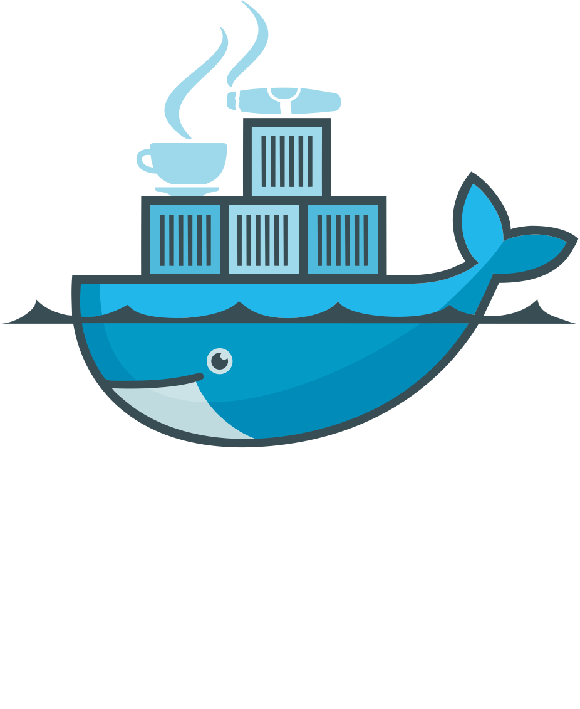
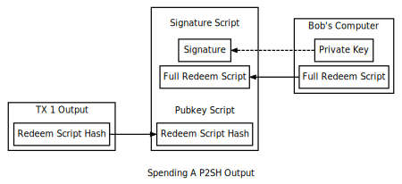
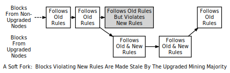

# Blockchain, DApps y Blockstack

## Conceptos básicos para empezar

----------------

### Estas diapositivas: [slides.cuban.tech/dapps.html](http://slides.cuban.tech/dapps.html)

----------------

### Información Wifi

Red: cubantech

Contraseña: meet-ups

----------------

## Esbozo

- Máquinas de estado replicadas (denominadas RSM)
- Herramientas de infraestructura, gestión y administración
- Relación entre RSM y Blockchain
- Reglas de ejecución y consenso
- Teoría General de DApps
- Vista general de Blockstack
- RSM de DApp independiente de blockchain con VirtualChain

Notas sobre la red Bitcoin P2P entre

----------------

## Máquinas de Estado - Estados


----------------

## Máquinas de estado - Entradas


----------------

## Máquinas de Estado - Transición


----------------

## El problema de la escalabilidad


--

## Estadísticas de Bitcoin


----------------

## Servicios distribuidos como máquinas de estado

- Tolerancia a fallos más allá de los procesadores de un solo nodo
- Réplicas de un único servidor ejecutado en procesadores separados
- Protocolos para interacciones de clientes con réplicas
- Aislamiento físico y eléctrico para fallos independientes del servidor
- Asumamos que la máquina de estado determinista
  - .... incluso si Turing completo es posible

----------------

## El enfoque de la máquina de estado

- <span style="color: yellow">Implantar réplicas del software</span>
- Recibir las solicitudes de los clientes (las entradas)
- Pedir las entradas
- Ejecute la transición de SM una y otra vez
- Supervisar las réplicas en busca de diferencias de estado o de salida.

----------------

## El enfoque de la máquina de Estado

### Desplegar software en múltiples nodos

[](http://docker.cuban.tech)

[docker.cuban.tech](http://docker.cuban.tech)

- Repositorios de paquetes de software
  - por ejemplo[bitcoind @ Debian](https://packages.debian.org/bitcoind),[Blockstack apt repo](https://packages.blockstack.com), ....
- Contenedores y registros
  - Por ejemplo,[Lisk](https://hub.docker.com/u/lisk/),[Blockstack](https://hub.docker.com/u/blockstack), .... Docker Hub
- Herramientas CM (Ansible, Puppet, Chef, Habitat, ....)

----------------

## Estado de CM - Q1 2017


----------------

## El enfoque de máquina de estado

- Implantar réplicas del software
- <span style="color: yellow">Recibir las peticiones del cliente (es decir, las entradas) </span>
- Pedir las entradas
- Ejecute la transición de SM una y otra vez
- Supervisar las réplicas en busca de diferencias de estado o de salida.

----------------

## El enfoque de la máquina estatal

### Recibir las peticiones de los clientes

- Múltiples soluciones
- p. ej., transacciones Bitcoin

----------------

## Bitcoin - Anatomía de las transacciones

### Meta-datos importantes (excepto[transacciones en la base de monedas](https://bitcoin.org/en/glossary/coinbase-transaction))

<small> </small>

- ID de transacción (global)
- Número de versión (evolución del protocolo)
- Hora de cierre
  - La primera vez que se puede añadir TX a la cadena de bloques
  - Transacciones con bloqueo temporal que sólo son válidas en el futuro.
  - Cancelaciones

--

## Bitcoin - Anatomía de las transacciones

### Entradas y salidas

<small> </small>

- Resultado(s) : Índice de arreglo implícito
  * Cantidad (satoshis)
  * Guión Pubkey ( Desbloquear para gastar)
- Insumos(s)
  * Salida gastada (ID de transacción + Índice de salida)
  * Número de secuencia (relacionado con la hora de cierre)
  * Script de firma (parámetros para desbloquear el script Pubkey)

> Bitcoin es un libro de contabilidad de distribución pública.

--

## Bitcoin - Transacción de muestra

<small> blocktrail.com </small>


--

## Bitcoin - Envío de transacciones

##### Configuración de pago a clave pública (P2PKKH)


- Curva (elíptica) ECDSA secp256k1
  - Generación de claves públicas determinantes (hash)

--

## Bitcoin - Envío de transacciones

##### Configuración de pago a hash de clave publica (P2SH)


- Redimir el hash del script en lugar del hash de la clave pública
  * Soporta [PubKey scripts opcodes](https://bitcoin.org/eb/developer-reference#opcodes)

--

## Bitcoin - Envío de transacciones

###### Finalize TX


- El remitente crea UTXO con el script PubKey
  * ... usando el hash de clave pública del receptor
- Transacción de emisiones del remitente (red P2P)
- Los mineros lo añaden a un bloque (... más detalles más adelante...)
- Cartera : Cantidad de UTXO como saldo utilizable

--

## Bitcoin - Gastar salidas P2PKH


- ID de transacción de búsqueda e índice para UTXO
- El remitente crea la entrada de transmisión y también agrega:
  * Número de secuencia
  * Firma y PubKey (script params)

--

## Bitcoin - Gastar salidas P2SH



- ID de transacción de búsqueda e índice para UTXO
- El remitente crea la entrada de transmisión y también agrega:
  * Número de secuencia
  * Firma y PubKey (script params)

--

## Bitcoin - Salidas de gastos

###### Last steps

- El remitente prepara el UTXO para el destinatario (como antes)
- Transacción de emisiones del remitente (red P2P)
- Los mineros lo añaden a un bloque
  - Validación del guión ( A-ha!)
- Cartera : Actualizar saldo

--

## Bitcoin - Script público P2PKH estándar

##### Línea de tiempo de la pila de ejecución


---

# Red P2P

Un monstruo muy peculiar

--


## Red P2P

##### Descubrimiento entre iguales - DNS de semillas de Bitcon

```
SECCIÓN DE PREGUNTAS
;semilla.bitcoin.sipa.be IN A

SECCIÓN DE RESPUESTAS
semilla.bitcoin.sipa.be.   60 EN UN 192.0.2.113
semilla.bitcoin.sipa.be.   60 EN UN 198.51.100.231
semilla.bitcoin.sipa.be.   60 EN UN 203.0.113.183
```

- Conecte al puerto `8333` (red principal) o `18333` (red de prueba)
- Seguido de mensajes `addr` que anuncian las direcciones de los compañeros

--

## Red P2P

##### Conectando con sus pares

- Enviar [mensaje `version`](https://bitcoin.org/en/developer-reference#version)
  * número de versión local, bloque y hora actual
- El par responde con su propio mensaje de "versión
- Enviar `getaddr` y recibir `addr` de nuevos pares (descubrimiento)

--

## Red P2P

##### Transacciones de radiodifusión

- Envíe [mensaje de invitación](https://bitcoin.org/en/developer-reference#inv) a un par.
- Esperar el mensaje `getdata`
- Enviar datos de la transacción en un mensaje `tx`.
- Los pares reenvían transacciones a otros pares
- Los nodos completos realizan un seguimiento de las transacciones no confirmadas en [memory pool](https://bitcoin.org/en/developer-guide#memory-pool)

> ...continuará...

---

## El enfoque de la máquina de estado

- Implantar réplicas del software
- Recibir las solicitudes de los clientes (es decir, las entradas)
- <span style="color: yellow">Ordenar las entradas </span>
- Ejecute la transición de SM una y otra vez
- Supervisar las réplicas en busca de diferencias de estado o de salida.

---

## El enfoque de la máquina de estado

##### Pedido de entradas

- Soluciones mutiple
- [Blockchain](https://en.wikipedia.org/wiki/Blockchain_database) ?
- Transacciones Bitcoin!

--

## Bitcoin - Gastos de transacción


Ordenamiento causal : Cadena de propiedad

---

## El enfoque de la máquina de Estado

- Implantar réplicas del software 
- Recibir las solicitudes de los clientes (es decir, las entradas)
- Pedir las entradas
- <span style="color: yellow">Ejecutar la transición de SM una y otra vez.</span>
- Supervisar las réplicas en busca de diferencias de estado o de salida.

---

## El enfoque de la Máquina de Estado

##### Ejecutar la Máquina de Estado


- Ejecutar las entradas en el orden seleccionado en cada réplica.

--

## Bitcoin - Propagación de transacciones


---

## Bitcoin blockchain

##### Metas de diseño

- Libro mayor público
  - Transacciones ordenadas y con sello de tiempo
- Almacenamiento distribuido sobre Bitcoin [nodos completos](https://bitcoin.org/en/glossary/node)
- Proteger contra
  - [double spending](https://bitcoin.org/en/glossary/double-spend)
  - modificación de registros de transacciones anteriores

--

## Bitcoin blockchain

###### Panorama general


--

## Cabecera del bloque Bitcoin

- **Versión**: 4 bytes
- **Características de la cabecera del bloque anterior**: 32 bytes
- **Hash de raiz Merkle**: 32 bytes
- **Tiempo**: 4 bytes
- **nBits**: 4 bytes
- **nonce**: 4 bytes

--

## Bitcoin Bloque 493387

<small> blocktrail.com </small>

[](https://www.blocktrail.com/BTC/block/000000000000000000ad396808fdc05052655d8a80aee7ffc538b71828ea03d3)

--

## Bitcoin Block 493387 - Transacciones

La transacción de Coinbase es lo primero

[](https://www.blocktrail.com/BTC/block/000000000000000000ad396808fdc05052655d8a80aee7ffc538b71828ea03d3)

---

## Proofs

- Métrico
  * Demostrar interés legítimo, irreversibilidad
  * Tomar decisiones sobre cambios en un DApp
- Modificar bloques pasados es más difícil que añadir nuevos bloques.
- Ejemplos comunes
  * **Prueba de trabajo** (PoW)
  * **Prueba de participación** (PoS)
  * **Prueba de espacio** (PoSpace)
  * **Prueba de colaboración** (PoC)
  * **Prueba de réplica** (PoR)
- Se puede utilizar en paralelo
  * p.ej.[PeerCoin](http://peercoin.net) se basa en PoW + PoS

--

## Prueba de trabajo

- *Conductor* . : Cantidad de trabajo computacional (CPU, GPU, NPU,...) que contribuyó al funcionamiento del DApp.
- Recursos intensos (energía, refrigeración,...)
- El mecanismo para establecer el consenso a través del PoW se denomina comúnmente minería.

> <small> *Bitcoin* utiliza este enfoque para su funcionamiento diario. </small>

--

## Proof of stake

- *Conductor* : nuevas monedas según el número de monedas (stake) que poseas.
- Puede ser abusado por aquellos que tienen suficientes monedas.
- Normalmente se combina con otras pruebas

> <small> *OmniLayer* se basa en el mecanismo POS. </small>

--

## Prueba de capacidad

- *Conductor* : asignación de cantidades no triviales de memoria o almacenamiento necesarias para resolver un problema (funciones difíciles de memorizar).
- Alternativa más ecológica al PoW

> <small> Se utiliza PoStorage en PermaCoin, SpaceMint,[BurstCoin](https://en.wikipedia.org/wiki/Burstcoin) </small>.

--

## Prueba de colaboración

- Validación colaborativa de nodos (en breve CVNs)
  *[Decide](https://chain.fair-coin.org/download/FairCoin2-white-paper-V1.1.pdf) qué nodo crea el siguiente bloque
  * Aprobar CVN mediante la firma digital de un dato que contenga la identificación del ganador.
  * Con las firmas requeridas, reúna TX y cree un nuevo bloque.
- Sin recompensa (dinero nuevo) por la creación del bloque (cuota pequeña)
- El consumo de energía es bajo (CVNs en una Raspberry3)

> <small>FairCoin (fork de Bitcoin 0.12) implementa PoC desde el 18 de julio de 2017</small>.

---

## Árbol de Merkle - Transacciones de Recoleccion


**Modos de funcionamiento**: [SPV clients](https://bitcoin.org/en/glossary/simplified-payment-verification) vs[nodo completo](https://bitcoin.org/en/glossary/node)

---

## Red P2P (contd.)

##### Descarga del bloque inicial

- Primera ejecución : El nodo sólo contiene[bloque 0](https://bitcoin.org/en/glossary/genesis-block)
- Elija un par remoto (también conocido como nodo de sincronización)
- Descargar desde el bloque 1 a la punta actual de la mejor cadena de bloques del nodo de sincronización
  * Bloques primero (hasta la versión 0.9.3)
  * Encabezados primero (desde 0.10.0 en adelante)

---

## Bitcoin mining

- Añadir nuevos bloques a la cadena de bloques
- Dificultar la modificación del historial de traducción
- Estrategias
  * Minería en solitario
  * Minería colectiva

---

## Minería Bitcoin - Minería en solitario


- Minero genera nuevos bloques por su cuenta
- Reclama completamente el premio de bloqueo y las comisiones de transacción
- Grandes pagos
- Mayor varianza (mayor tiempo entre ellos)

---

## Bitcoin mining - Minería en grupo


- Grupo de mineros comparte recursos con otros mineros
- Encuentra los bocks más a menudo en los objetivos de bits más fáciles
- Producto compartido entre los mineros
  * Correlacionado con la potencia relativa del hash PoW
- Pagos pequeños
- Menor varianza (es decir, menor tiempo entre pagos)

--

## SlushPool

<small>[slushpool.com/home/](https://slushpool.com/home/) </small>


<small> Monedas acuñadas ``+1M BTC` extraídas desde diciembre de 2010. `ZCASH` desde el 20 de abril de 2017</small>

--

## SlushPool

###### Hash rate


--

## SlushPool

##### Distribución de las tarifas de Hash


--

## Bitmain - AntMiner

<small>[bitmaintech.com](https://bitmaintech.com/) </small>


<small> Monedas acuñadas : `BTC` </small>

--

## Bitmain - AntPool

<small>[bitmaintech.com](https://bitmaintech.com/) </small>


--

## Pool de BTCC

<small>[pool.btcc.com](https://pool.btcc.com/) </small>


<small> Monedas acuñadas : `BTC` </small>

---

## Hardware minero Bitcoin

##### Capacidad instalada - 2017/11/13

<div style="width: 500px; display: inline-block; margin-left: auto; magin-right: auto">  </div>)

- <small> 6,4 EHash/s, 80.704.290,84 PFLOPS </small>
- <small> 10.000 toneladas métricas de hardware. Suficiente material para construir otra torre Eiffel. </small>

--

## Hardware minero Bitcoin - Energía


Circuitos integrados específicos para aplicaciones específicas, también conocidos como ASIC

--

## Consumo de energía de Bitcoin PoW

<small>... según[BitcoinEnergyConsumption.com](https://BitcoinEnergyConsumption.com)</small>


- Proyectado para ser comparable al de Dinamarca en 2020 

---

## P2P network (contd.)

###### Bloqueo de la transmisión - Empuje no solicitado

- Miner incluye el bloque minado en el nuevo[`block` message](https://bitcoin.org/en/developer-reference#block)
- Miner envía un mensaje a sus pares de nodos completos

> <small> desde la versión 0.12.0 </small>

--

## Red P2P

###### Bloque de transmisión - Retransmisión de bloque estándar

- Método estándar
- Miner envía un mensaje `inv` a todos los pares (SPV y nodo completo)
  - Incluye inventario referido al bloque
- **Par BF** &rArr; `getdata` solicitando el bloque completo
  - Miner &rArr; Mensaje de `bloque`
- **Par HF** &rArr; `getheaders` (pocos encabezados en la mejor cadena de bloques)
  - Miner &rArr; Mensajes de `encabezados`
- **Clientes de SPV** &rArr; `getdata` solicitando un bloque Merkle
  - Miner &rArr; `merkleblock` seguido de algunos mensajes `tx`.

> <small> desde la versión 0.12.0 </small>

--

## Red P2P

###### Block broadcasting - Anuncio de encabezados directos

- Se usa si los pares señalan con `sendheaders` durante el cacheo.
- Miner envía un mensaje de `cabecera` desde un nuevo bloque
- **HF peer** &rArr; Validación parcial y envío de `getdata`
- Miner &rArr; `block` o `merkleblock`.

> <small> desde la versión 0.12.0 </small>

---

## El enfoque de la máquina de estado

- Implantar réplicas del software 
- Recibir las solicitudes de los clientes (es decir, las entradas)
- Pedir las entradas
- Ejecute la transición de SM una y otra vez
- <span style="color: yellow">Supervisar las réplicas en busca de diferencias de estado o de salida.</span>

---


## El enfoque de la máquina de estado

###### Envío de salidas

- Cada réplica genera salida
  * Las réplicas no defectuosas siempre producirán la misma salida
- Se filtran las salidas defectuosas
  * Consenso
- Envío de la salida correcta al cliente

--

## Consenso

- Consenso de Nakamoto
- [Paxos](https://en.wikipedia.org/wiki/Paxos_%28computer_science%29)
- Sistemas de quórum
- [Raft](https://raft.github.io/)
- [Obelisk](https://blog.skycoin.net/statement/obelisk-the-skycoin-consensus-algorithm/)

---

## Bitcoin - Consenso de Nakamoto

##### Bifurcación ocasional vs bifurcación extendida


- Bloques simultáneos extraídos, los nodos eligen al ganador
- Los compañeros prefieren bifurcaciones con un mayor PoW
  * Bifurcacion mas larga
  * Altura máxima del bloque: distancia hasta[bloque 0] (https://bitcoin.org/en/glossary/genesis-block)

--

## Bitcoin - Consenso de Nakamoto

##### Bifurcación suave



- Cuándo?
  * Muy a menudo, por ejemplo, mineros concurrentes.
  * Las reglas de consenso mejoradas rechazan los bloques que antes eran válidos.
    + [UASF](https://bitcoin.org/en/glossary/uasf) flag day vs.[MASF](https://bitcoin.org/en/glossary/uasf) Señalización de la mayoría de las tasas de hash

--

## Bitcoin - Consenso de Nakamoto

##### Resolución de Bifurcacion suave

- Eliminar bloques (rancios y huérfanos) en bifurcaciones de bajo POW.
- Iterar sobre las transacciones en bloques rancios y huérfanos
  * Descartarlo si TX pertenece a otro bloque de la bifurcacion PoW más alta.
  * Moverlo de nuevo a TX mempool de lo contrario
    + para ser incluido en un futuro bloque por este minero
    + Transmisión (¿opcional?) a la red P2P

--

## Bitcoin - Consenso de Nakamoto

##### Bifurcacion rígidas


- ¿Cuándo?
  * Extender la cadena de bloqueo para prevenir ataques de terceros 51%.
  * Consenso mejorado Aceptar los bloques rechazados anteriormente
  * Partición de red

--

## Bitcoin - Corolarios de bifurcaciones rígidas

- Advertencia en [`getnetworkinfo`] (https://bitcoin.org/en/developer-reference#getnetworkinfo) y ejecute el comando `-alertnotify` si está configurado.
  * +6 bloques PoW que la mejor cadena válida
  * Repetición de bloque y TX con números de versión más altos de lo esperado.
- [Coinbase transaction](https://bitcoin.org/en/glossary/coinbase-transaction) sólo se puede gastar después de 100 bloques.
- [Clientes del SPV](https://bitcoin.org/en/glossary/simplified-payment-verification) pueden ponerse en contacto con diferentes nodos completos
  * Descartar cadenas con un PoW más débil

---

## Bitcoin - Balance de clientes


Software para billetera: Sumar UTXO para determinar el balance

---

## Tolerancia a fallos (en teoría)

- Tolerancia para F fallos independientes aleatorios
  * errores de memoria, fallo del disco duro, ....
  * Requiere réplicas `2F + 1`
- La réplica fallida puede detenerse sin generar salidas
  * Sólo se requieren réplicas `F + 1`
  * .... ningún sistema existente alcanza este límite
- [Byzantine failures](https://en.wikipedia.org/wiki/Byzantine_fault_tolerance)
  * Fallas aleatorias, espurias &rArr; `2F + 1`
  * ataques maliciosos e inteligentes &rArr; `3F + 1`

--

## Nodo Bitcoin

##### Requisitos mínimos

- Escritorio o portátil (Windows, Mac OS X o Linux)
- 125 GB de espacio en disco duro, 2 GB de RAM
- Internet de banda ancha con upload &ge; 400 Kbps (50 KB/s)
  * Conexión no medida, o límites de carga elevados, respetar los límites de carga.
  * 100 GB IBD
  * &asymp; 20 gigabytes de descarga al mes
  * Carga de +200 GB al mes
- +6 horas al día con el nodo completo en funcionamiento
- +8 conexiones y pares de sincronización activos

--

## Nodo Bitcoin

> La mayoría de la gente ordinaria **NO** debería estar ejecutando un nodo completo.
> Necesitamos nodos completos que estén siempre encendidos, que tengan más de 8 conexiones.
> *(si sólo tienes 8, entonces eres parte del problema, no parte de la solución)*,
> y tener una conexión de banda ancha a Internet.

Gavin Andresen, Jefe Científico de la Fundación Bitcoin, en[Reddit post] (http://www.reddit.com/r/Bitcoin/comments/1scd4z/im_running_a_full_node_and_so_should_you/cdw3lrh?context=3)

---

# Teoría General de DApps

---

## Definición de un DApp - Código abierto

- Debe funcionar de forma autónoma
- Ninguna entidad que controle la mayoría de sus tokens
- Datos y registros en una cadena de bloques pública y descentralizada.

> <small>Las aplicaciones **Bitcoin** son de código abierto, ninguna entidad controla Bitcoin y sus registros son abiertos y públicos. </small>

---

## Definición de un DApp - Generación de tokens

- El propósito de un token es permitir el acceso a la aplicación DApp.
- Debe generar tokens de acuerdo con un algoritmo estándar
  - Posiblemente distribuir tokens al inicio de la operación.
- Las fichas deben ser necesarias para el uso de la aplicación.
- Contribución de los usuarios premiados mediante pago en los tokens de la aplicación.

> <small>Por ejemplo, **Bitcoin** genera bitcoins (tokens) con un algoritmo predeterminado que no se puede modificar. Los Tokens son necesarios para que Bitcoin funcione. Los mineros de Bitcoin son recompensados con bitcoins por sus contribuciones a la seguridad de la red Bitcoin. </small>

---

## Definición de un DApp - Consenso

- El Protocolo podrá adaptarse en respuesta a
  * mejoras propuestas
  * retroalimentación del mercado
- Cambios decididos por consenso mayoritario de sus usuarios.

> <small>Por ejemplo, todos los cambios a **Bitcoin** deben ser aprobados por un consenso mayoritario de sus usuarios a través del mecanismo de prueba de trabajo. </small>

---

## Clasificación de DApps - Tipo I

##### Según el uso de la cadena de bloque

- Tienen su propia cadena de bloques.

<small>*Bitcoin*, *Litecoin* y otras[alt-coins] (https://en.wikipedia.org/wiki/List_of_cryptocurrencies) </small>

---

## Clasificación de DApps - Tipo II

##### Según el uso de la cadena de bloque

- Utilice la cadena de bloques de una aplicación descentralizada de tipo I.
- Son protocolos
  * Fichas que son necesarias para su función.

> <small> *OmniLayer* (anteriormente *Master Protocol*) y *Blockstack* son ejemplos de aplicaciones descentralizadas de tipo II. </small>

--

## DApps tipo II

##### Transacciones de datos nulos de Bitcoin

- Incrustar datos adicionales en transacciones DApp tipo I
- Bitcoin[OP_RETURN](https://bitcoin.org/en/developer-reference#term-op-return) code
  * Rendimientos probables de la poda
  * Los mineros de Bitcoin tendrán la opción de podar esos datos.

> Blockstack es un DApp tipo II

---

## Clasificación de DApps - Tipo III

##### Según el uso de la cadena de bloque

- Utilizan el protocolo de una aplicación descentralizada de tipo II.
- Son protocolos y tienen fichas que son necesarias para su función.

> <small>Las aplicaciones *Omni* (anteriormente *Mastercoin*), y *Blockstack* son ejemplos de aplicaciones descentralizadas de tipo III. </small>

---

## Pasos fundamentales de un DApp

- Publicación del libro blanco
- Distribución de fichas iniciales
- Delegación de la propiedad

---

## Secciones del informe de DApp

- Intenciones y objetivos de la DApp
- Planes de distribución de fichas
- Mecanismo para establecer el consenso
- Supervisión del DApp
- Gestión de recompensas de desarrolladores
- Descripción técnica de la DApp

---

## Distribución de fichas - Minería

- Los tokens se distribuyen a aquellos que contribuyen con más trabajo a la operación de un DApp.

> <small>Tomando como ejemplo *Bitcoin*, las bitcoins se distribuyen mediante un algoritmo predeterminado a los mineros que verifican las transacciones y mantienen la cadena de bloques Bitcoin. </small>

---

## Distribuir de tokens - Recaudación de fondos

- Los tokens se distribuyen a quienes financian el desarrollo inicial del DApp.

> <small>Tomando como ejemplo el *Master Protocol*, Mastercoins se distribuyó inicialmente a aquellos que enviaban bitcoins a una dirección determinada a razón de 100 Mastercoins por bitcoin enviado. Las bitcoins recolectadas se utilizaron para financiar el desarrollo de aplicaciones que promovieron el desarrollo del Protocolo Maestro. </small>

---

## Distribución de tokens - Desarrollo

- Los tokens se generan utilizando un mecanismo predefinido y sólo están disponibles para el desarrollo del DApp.

> <small>Además de su mecanismo de recaudación de fondos, el Protocolo Maestro utilizó el mecanismo de colaboración para financiar su desarrollo futuro. Algunas Mastercoins se distribuyen a través de un sistema de recompensas impulsado por la comunidad y basado en el mecanismo PoS.</small>

---

# Blockstack

---

## ¿Por qué Blockstack?

Internet ya tiene más de 40 años

- [Servicios críticos fuera de línea](https://www.wired.com/2016/10/internet-outage-ddos-dns-dyn/) por ataques como DDoS en servidores DNS
- Confianza implícita, por ejemplo, [TurkTrust CA emitió certificados de seguridad falsos para Google](http://cnet.co/2oArU6O)
- De escritorio a nube crea SPoF, por ejemplo [Yahoo! perdiendo datos para 500 millones de personas](http://nyti.ms/2oAqn0G.)

--

## ¿Por qué Blockstack?

##### Ryan Shea, cofundador de Blockstack

<video src="http://videos.cuban.tech/blockstack/Why%20has%20Blockstack%20built%20a%20decentralized%20internet--iwd_wd3waA.mp4" controls width="800"></video>

---

## ¿Qué es Blockstack?

- Un nuevo Internet para aplicaciones descentralizadas
- Código abierto
- Re-descentralizar Internet
- Los usuarios poseen sus datos

--

## Principio de diseño de confianza a confianza

##### Muneeb Ali, Director Técnico de Blockstack

<video src="http://videos.cuban.tech/blockstack/What%20is%20the%20trust-to-trust%20design%20principle-LwFGczn1hrA.mp4" controls width="800"></video>

---

## Metas Blockstack

- Nombramiento y Descubrimiento Descentralizado
  - Registrarse y utilizar nombres legibles por personas
  - Descubra los recursos de red sin tener que confiar en ninguna parte remota.
- Almacenamiento descentralizado
  - Almacenar datos sin revelarlos a terceros remotos.
- Rendimiento comparable

---

## Blockstack - Decisiones clave

- Sobrevivir a las fallas de las cadenas de bloqueo subyacentes
- Mantenga la complejidad y la lógica fuera de las cadenas de bloqueo
  - opuesto a NameCoin, Ethereum, etc. ...
- Índice escalable para datos globales

---

## Arquitectura Blockstack


---

## Blockstack layers

- Cadena de bloques virtual, encima de la cadena de bloques Bitcoin
- *Atlas*, una red de pares
  - Índice global de información de descubrimiento
- **Gaia**, sistema de almacenamiento descentralizado

> <small>Los usuarios no necesitan confiar en ninguna capa de datos </small>.

---

## Blockstack - Capa de cadena de bloques

<small> DApp tipo II </small>


--

## Blockstack - Transacciones de Nameops

[](https://explorer.blockstack.org/nameops/493935)

--

## Ejemplo de transacción de datos nulos de Blockstack

<small> NAME_REGISTRATION bluestack.id </small>

[](https://www.blocktrail.com/BTC/tx/702e76497a6061222208698c4d0fbed6ca768d10832e1b8da9184a8ea6f5ded8)

---

## Blockstack - Capa de cadena virtual

###### ¿Por qué?

- RSM coherentes con la bifurcacion* en las cadenas de bloques existentes
- Detección y recuperación de bifurcaciones
- Migración a través de la cadena
  - [Razones](https://blockstack.org/blog/why-blockstack-is-migrating-to-the-bitcoin-blockchain) para que Blockstack migre de Namecoin a Bitcoin

--

## Blockstack - Capa de cadena virtual

##### ...de acuerdo con Muneeb Ali, Director Técnico de Blockstack.

<video src="http://videos.cuban.tech/blockstack/What%20is%20a%20Virtual%20Chain%20What%20makes%20it%20a%20powerful%20solution%20for%20longevity%20and%20scalabilityity-LBft0c4RZcQ.mp4" controls width="800"></video>

--

## Blockstack - Cadena virtual

##### Filtrando y ordenando TXs de OP_RETURN

<style="display: bloque inline; color de fondo: #fff">  </div>(en inglés)

---

## Aplicaciones Blockstack - Explorer y AppStore


---

## Aplicaciones Blockstack - Clonación de iTunes


---

## Aplicaciones Blockstack - Afia


---

## Aplicaciones Blockstack - Casa


---

## Winding Up

- Gracias por venir!
- Nos encantaría conocer su opinión: [bit.ly/blockstack-cuba-feedback](http://bit.ly/blockstack-cuba-feedback)