## Digital Electronics
###### Part 1 - Logic circuits, gates, bistables

#### These slides: [slides.cuban.tech/digital-electronics-1.html](http://slides.cuban.tech/digital-electronics-1.html)

----------------

### Wifi Info

Network: cubantech

Password: meet-ups

----------------

---

# Huge thanks to our host

---

## Outline

- Boolean logic, gates, logic circuits.
- Multiplexors
- ALU
- Bistable
- Hands-on! Build an SR Latch

---

# Let's get started!

---

## Our hardware

---

## Our hardware

---

## Kits may be missing equipment

------------

If you have trouble finding a component, let us know and we'll get you a replacement

---

## Not working?

## Probably hardware!

---

## Components We're Covering

- Logic gates
- Multiplexors
- ALU
- Bistables

---

Feel free to select the components you like most and complete the challenges that most interest you

---

# Getting started

## Boolean logic

- Logic operation using 1's and 0's
- Join, intersection and complement operations

---

## Groups of logic circuits
  - CLC (Combinational Logic Circuit)
    - Asynchronous
  - SSC (Sequential Synchronous Circuit)
    - Synchronous, generally with only one clock signal

---

# Basic Gates

---

## Buffers

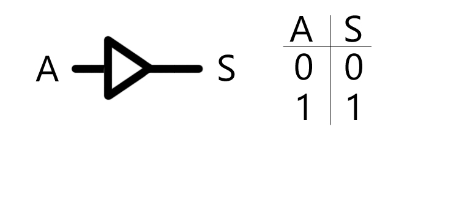

---

## NOT gate

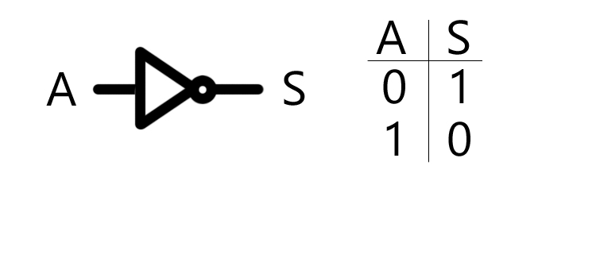

- The negated version of ***a*** is ***/a***

---

## AND gate

- ***a*** AND ***b*** = ***a*** \* ***b***

--

## AND properties

  - **a** \* **a** = **a**
  - **a** \* **1** = **a**
  - **a** \* **/a** = **0**
  - **a** \* **0** = **0**

---

## OR gate

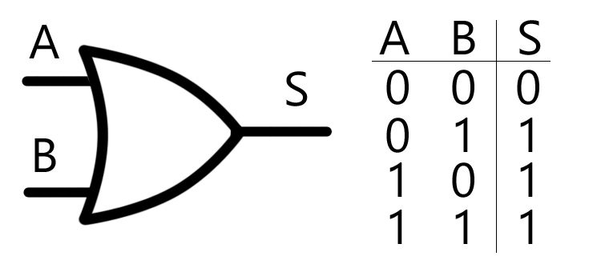

  - ***a*** OR ***b*** = ***a*** + ***b***

--

## OR properties
  - **a** + **a** = **a**
  - **a** + **0** = **a**
  - **a** + **1** = **1**
  - **a** + **/a** = **1**

---

## XOR gate

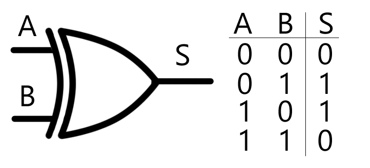

- ***a*** XOR ***b*** = ***a*** &#xA69A; ***b***

--

## XOR properties

  - **a** &#xA69A; **a** = **0**
  - **a** &#xA69A; **/a** = **1**
  - **a** &#xA69A; **0** = **a**
  - **a** &#xA69A; **1** = **/a**

---

## Universal gates

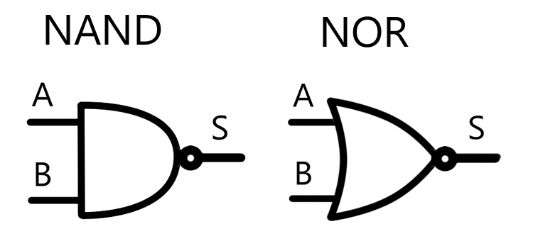

  - ***a*** NAND ***b*** = /(***a*** \* ***b***)
  - ***a*** NOR ***b*** = /(***a*** + ***b***)

--

## Why are they universal?

- Universal gates can replace ALL the other gates
- You can build any digital circuit using only NAND or NOR gates

--

## De Morgan laws

  - **/**(**a** + **b**) = **/a** \* **/b**
  - **/**(**a** \* **b**) = **/a** + **/b**

---

## Creating the table truth from a circuit

--

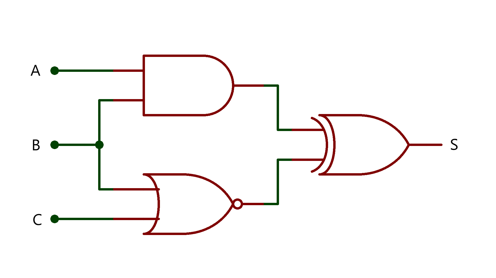

--

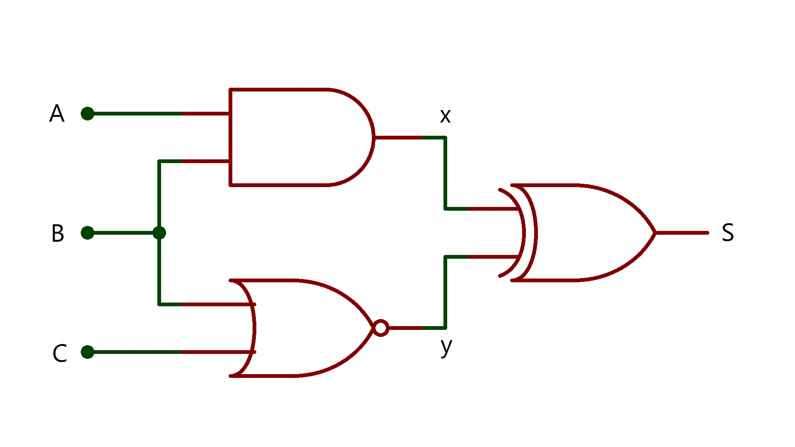

--

  - x = a * b

  - y = /(b + c)

--

  - S = x &#xA69A; y

  - S = (a * b) &#xA69A; /(b + c)

--

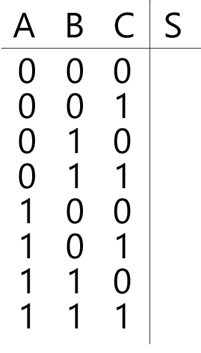

--

---

## Building the circuit from the truth table

--

### Canonical expressions

  - Sum of products or product of sums
  - Every term of the expression is a canonical term
  - A canonical term always contains ***ALL*** the inputs (or the negated inputs) exactly once

--

## Canonical expressions (example)

  - A, B and C: inputs
  - S = (A + B + C) \* (/A + B + /C)
  - S = (A \* /B \* /C) + (/A \* /B \* C) + (A \* /B \* C)

--

## How to extract the canonical expression

  - Decide wether the canonical expression will be:
    * a sum of products
    * a product of sums

--

## A sum of products (minterm)

  - Select all the combinations with S = 1
  - If the value of an input in that combination is equal to S, then it will appear unchanged in the canonical term.
  - If is different to S, then we put the negated version of that input.

--

## A sum of products (example)

--

## A sum of products (example)

### The combinations of ABC with S = 1
  - 0 0 0
  - 1 0 0
  - 1 1 0
  - 1 1 1

--

## A sum of products (example)

Lets take the combination **1 0 0**

  * A = 1 (is equal to S => unchanged)
  * B = 0 (is not equal to S => negated)
  * C = 0 (is not equal to S => negated)

So the canonical term will be: **A \* /B \* /C**

--

## A sum of products (example)

For the combination **1 1 0** the canonical term is: **A \* B \* /C**

  - The sum of canonical products for the table is: 
    * (**/A \* /B \* /C**) + (**A \* /B \* /C**) + (**A \* B \* /C**) + (**A \* B \* C**)

--

## The circuit of the canonical expression:

--

## A product of sums (maxterm)

  - Similar to the minterm but we take S = 0
  - The product of canonical sums for the table is:
    * (A + B + /C) \* (A + /B + C) \* (A + /B + /C) \* (/A + B + /C)

--

## How to decide whether to use maxterm or minterm expressions?

  - If the truth table contains more 1's than 0's in S, then use maxterm
  - Otherwise use minterm
  - The circuit obtained using the reverse way, is also valid but bigger

--

# Using only universal gates

--

## Lets take the last circuit

--

## Add a little modification

--

## From here...

  - NOT can be obtained from the property:
    - **/a** = **/(a + a)**
  - Using the De Morgan's laws...

--

## We obtain this...

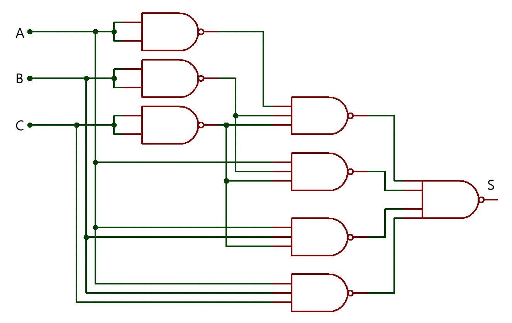

---

## Challenge #1
### Lets create an 1-bits adder (half adder)
  - A + B

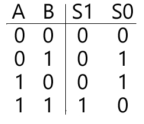

---

## Multiplexors
  - A multiplexor is a *Channel selector*
  - Select one of multiple inputs and put it on the output
  - With *n* selection inputs you can address up to 2n signals.

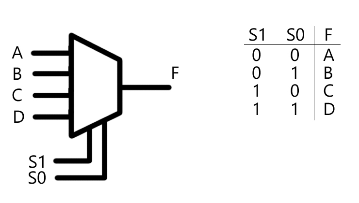

--

## 1-bit multiplexor with 1 selection input

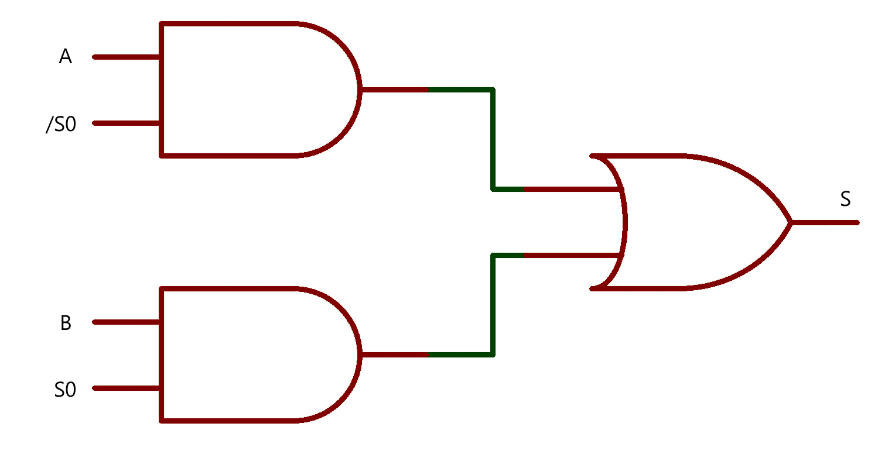

---

## ALU (Arithmetic-Logic Unit)

  - Is a circuit that allows you to *select* between operations
  - The ALU can perform arithmetical or logical operations

--

## ALU

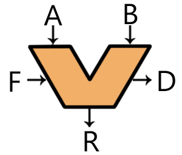

--

## 1-bit ALU

  - Performs **XOR**, **AND**, **OR** and **SUM**

--

## Modern Overview

  - Intel Core i9 uses 7 ALUs per core
  - Each ALU is different depending on the use
  - Some ALUs performs only logic operations and simple arithmetic operations
  - Some other ALUs performs complex operations like product or division
  - They use the Skylake microarchitecture with support for up to AVX-512
  - ALUs are used not only for variables but for compute the memory addressing

---

## Bistables
  - A Bistable is a circuit that can be in one of two states for an undefined amount of time
  - Can ***store*** information

---

## Latches
  - Asynchronous bistable
  - SR-type
  - D-type

--

## SR Latch

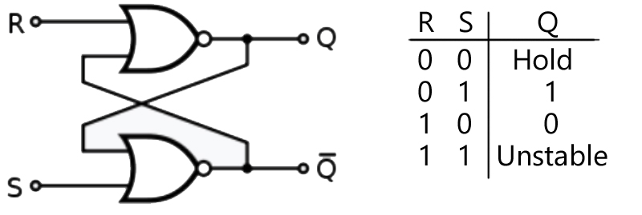

--

## D Latch

--

## Building an SR Latch

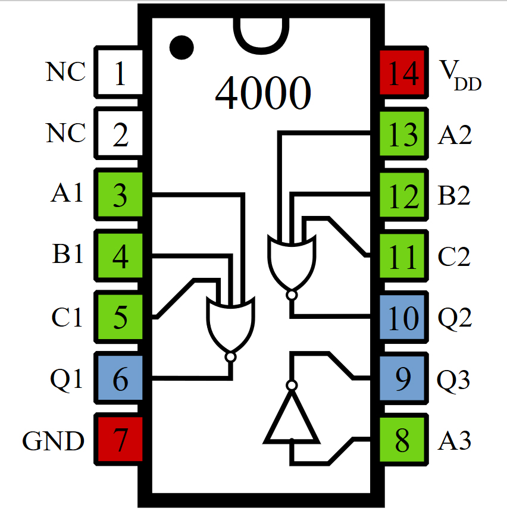

--

## Circuital diagram
  - Step 1 (Power supply)

  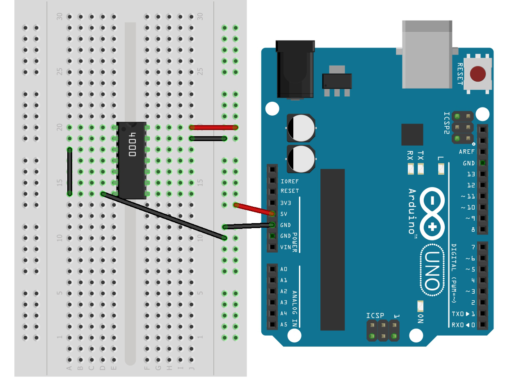

--

## Circuital diagram
  - Step 2 (Connecting inputs)
  
  

--

## Circuital diagram
  - Step 3 (SR latch feedback)
  
  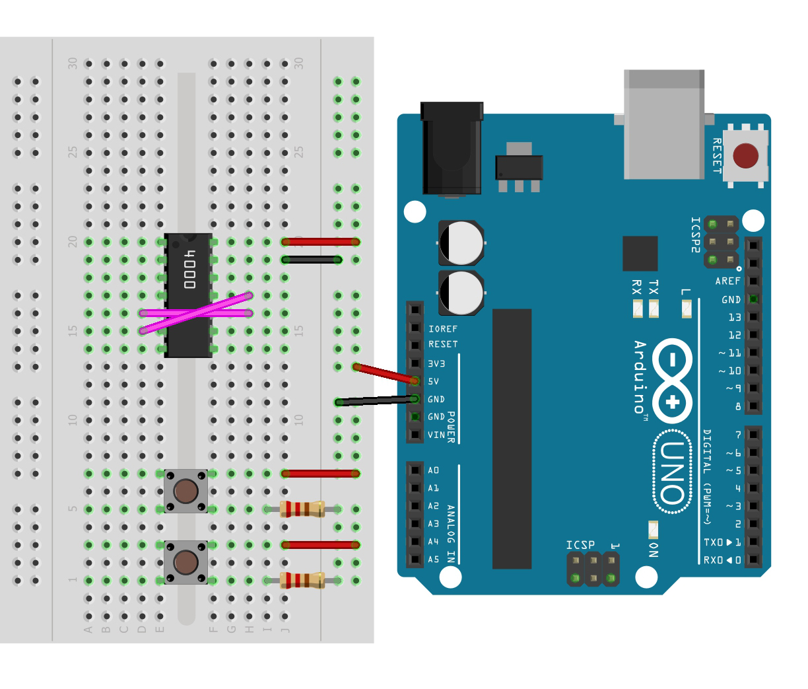

--

## Circuital diagram
  - Step 4 (Connecting LEDs)
  
  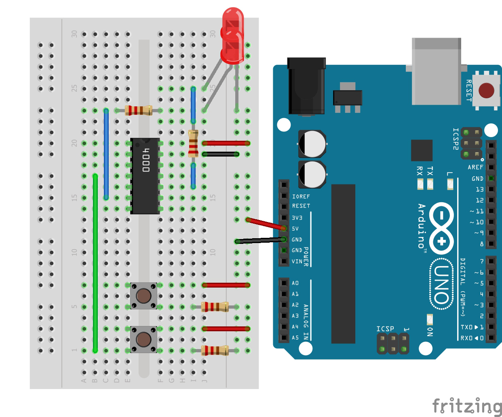

--

## Circuital diagram
  - Result

  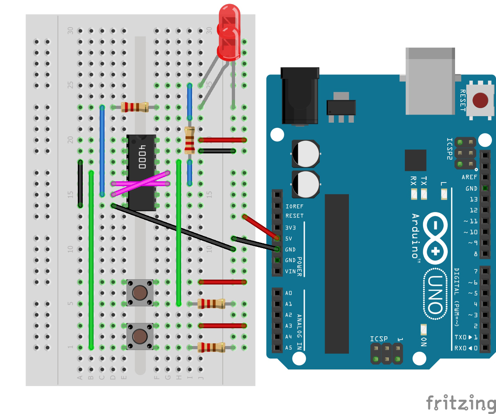

---

## Flip-Flop
  - Synchronous bistable
  - D-type
  - JK-type
  - T-type

--

## D-type Flip-Flop

  - Is based on the D Latch
  - The **Enable** input is replaced by a rising edge detector (Clock input) 

--

## D-type Flip-Flop

---

## Applications of the Flip-Flops
  - Registers
  - Shift Registers
  - Synchronous Systems Design (using Finite State Machine technique)
  - Storage
  - Counters
  - Microprocessors

---

## Upcoming events
  - Digital electronics (part 2)
    * Karnaugh Map
    * Finite State Machine

---

## Wrapping Up

- Thank you for coming!
