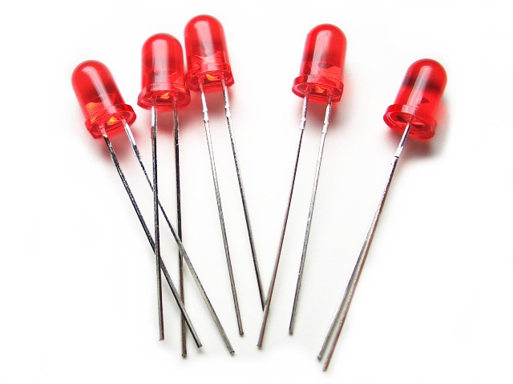
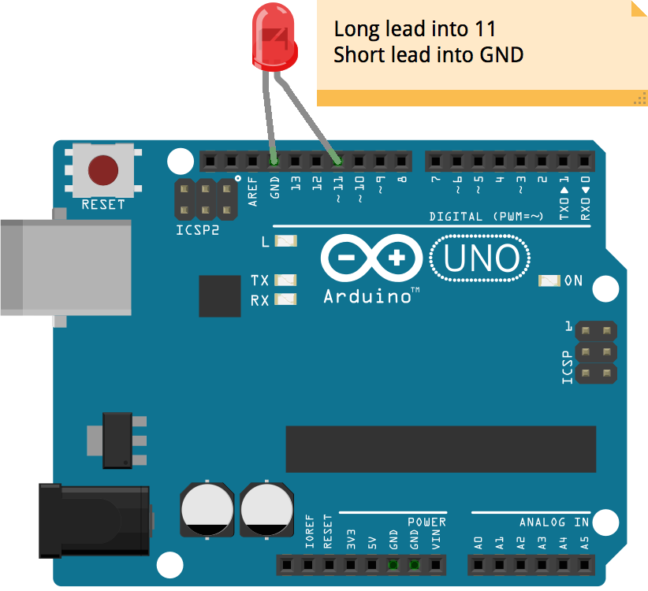
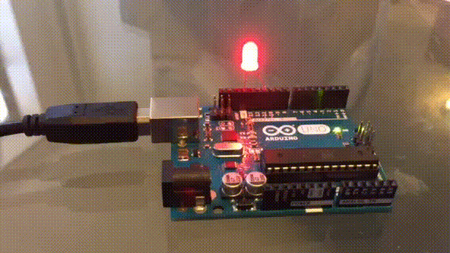
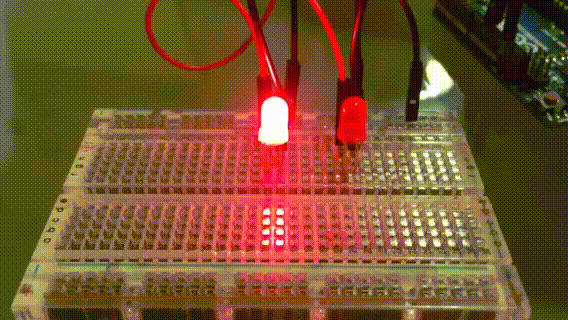
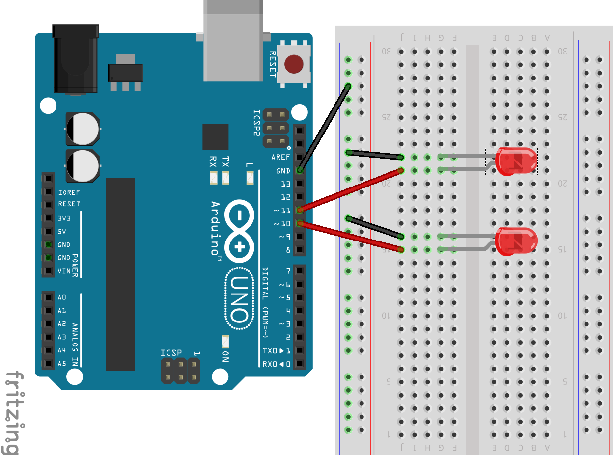

## Gobot Workshop

#### These slides: [slides.cuban.tech/gobot.html](http://slides.cuban.tech/gobot.html)

----------------

### Wifi Info

Network: cubantech

Password: meet-ups

----------------

### If you haven't already, install Go

##### [Download Go](https://golang.com/)

##### [Download Go from LAN](ftp://qnap01.local/Public/soft/go)

## Our community guidelines

[Be excellent to each other](https://github.com/nodeschool/havana/blob/master/Code_of_Conduct.md)

---

Upcoming CubanTech Events

- [CubanTech meetups](http://meetup.cuban.tech)
- [Docker Cuba meetups](http://docker.cuban.tech)
- [Blockstack Cuba meetups](http://blockstack.cuban.tech)
- [SciPyLA 2018](http://scipyla.org/conf/2018)
  * ##### Universidad de Sancti Spiritus, November 22nd - 25th 2017

---

# Huge thanks to our host

---

## What are Gobots?


---

## Golang + Robots = Gobots

---

# Let's get started!

---

## Our hardware

[](http://www.seeedstudio.com/depot/ARDX-The-starter-kit-for-Arduino-p-1153.html)

---

## Our hardware

[](http://www.seeedstudio.com/depot/ARDX-The-starter-kit-for-Arduino-p-1153.html)

---

## Kits may be missing equipment

------------

If you have trouble finding a component, let us know and we'll get you a replacement

---

## Not working?

## Probably hardware!

---

## Components We're Covering

- LEDs (Light Emitting Diodes)
- Buttons

---

Feel free to select the components you like most and complete the challenges that most interest you

---

# Getting started

--

## Install Go if you haven't already

[Download Go from the Internet](https://golang.org/)

[Download Go from LAN](ftp://qnap01.local/Public/soft/go)

--

## Make project directory

```sh
mkdir gobots
cd gobots
```

--

## Install Gobot

```sh
go get -d -u gobot.io/x/gobot/...
```

---

# Getting started

## Standard Firmata

- Allows Gobot to communicate with the Arduino over USB
- Most of the Arduinos already have Standard Firmata installed from previous workshops
- Let's check to make sure your Arduino already has Standard Firmata installed!

---

## Connect the arduino


---

Create the file

1. Go to your gobots directory
2. Create a file called test.go
3. Copy the code below to it and save

```go
package main

import (
  "time"
  "gobot.io/x/gobot"
  "gobot.io/x/gobot/drivers/gpio"
  "gobot.io/x/gobot/platforms/firmata"
)

func main() {

  firmataAdaptor := firmata.NewAdaptor("/dev/ttyACM0");
  led := gpio.NewLedDriver(firmataAdaptor, "13");

  work := func() {

    gobot.Every(1 * time.Second, func() {

      led.Toggle();

    });

  };

  robot := gobot.NewRobot("bot",
    []gobot.Connection{firmataAdaptor},
    []gobot.Device{led},
    work,
  );

  robot.Start();

}
```

---

Run the code

```sh
go run test.go
```

---

## This LED should be blinking every 1 second


---

If it works, continue on! &rarr;

------------

If not, press &darr; for instructions on flashing your Arduino with Standard Firmata

--


## How to flash your Arduino with Standard Firmata (Plus)

1. Download the [Arduino IDE](https://www.arduino.cc/en/main/software)
2. Make sure your Arduino is connected via USB
3. Open the Arduino IDE
4. Select: `File > Examples > Firmata > StandardFirmataPlus`
5. Select: `Tools > Board > Arduino/Genuino Uno`
6. Select: `Tools > Port > <your Arduino>`
7. Click the Upload Button 
8. Retry making that LED blink

---

## Components We're Covering

- <span style="color:yellow"> LEDs (Light Emitting Diodes) </span>
- Buttons

---

## LEDs

#### <span class="red-led">LIGHT</span> <span class="green-led">EMITTING</span> <span class="blue-led">DIODES</span>



---

## Identifying LED Pins

- Long pin is positive (and goes to power)
- Short pin is negative (and goes to ground)


---

## Build This



---

Save this to a file and run it

```go
package main

import (
  "time"
  "gobot.io/x/gobot"
  "gobot.io/x/gobot/drivers/gpio"
  "gobot.io/x/gobot/platforms/firmata"
)

func main() {

  firmataAdaptor := firmata.NewAdaptor("/dev/ttyACM0");
  led := gpio.NewLedDriver(firmataAdaptor, "11");

  work := func() {

    gobot.Every(500 * time.Millisecond, func() {

      led.Toggle();

    });

  };

  robot := gobot.NewRobot("bot",
    []gobot.Connection{firmataAdaptor},
    []gobot.Device{led},
    work,
  );

  robot.Start();

}
```
`node blinky.go`

---

## If successful, you should see this



---

## Changing the Blink Rate

- You probably noticed the light blinks about every .5 seconds
- Change the code to blink at a different rate and then rerun it to make sure it works
- If you're stuck, press &darr; to see a potential solution

--

```go
package main

import (
  "time"
  "gobot.io/x/gobot"
  "gobot.io/x/gobot/drivers/gpio"
  "gobot.io/x/gobot/platforms/firmata"
)

func main() {

  firmataAdaptor := firmata.NewAdaptor("/dev/ttyACM0");
  led := gpio.NewLedDriver(firmataAdaptor, "13");

  work := func() {

    gobot.Every(3 * time.Second, func() {

      led.Toggle();

    });

  };

  robot := gobot.NewRobot("bot",
    []gobot.Connection{firmataAdaptor},
    []gobot.Device{led},
    work,
  );

  robot.Start();

}
```

`node blinky.go`

---

## Breadboards: Solderless wiring

#### Breadboards allow us to quickly wire components together for prototyping


---

## Breadboards: Electrical Connections

- #### Here you can see how the different rows and columns are connected.
- #### If unclear, don't hesitate to do some Googling or ask a volunteer to explain them further.


## Use your breadboard and a couple of wires (color doesn't matter) to build this


---

Now run one of your programs from before and make sure the LED still blinks

---


## LED Challenges

Now that you've got the basics of LEDs, you can either move on to the next component, or work on some LED challenges

- Press &rarr; to move on to the next component
- Press &darr; to scroll through the LED challenges

--

## LED Challenges

*Try to solve them yourself before looking at the solution!*

Press &darr; to scroll through the following challenges (and potential solutions)

1. Multiple Lights
2. Binary Counter

--

### 1. Multiple Lights

Have 2 (or more) lights alternate blinking



--

### Potential Multiple Lights Solution - Hardware



--

### Potential Multiple Lights Solution - Code

```go
package main

import (
  "time"
  "gobot.io/x/gobot"
  "gobot.io/x/gobot/drivers/gpio"
  "gobot.io/x/gobot/platforms/firmata"
)

func main() {

  firmataAdaptor := firmata.NewAdaptor("/dev/ttyACM0");
  led1 := gpio.NewLedDriver(firmataAdaptor, "13");
  led2 := gpio.NewLedDriver(firmataAdaptor, "12");

  work := func() {

    first := true

    gobot.Every(1 * time.Second, func() {

      if first == true {
        led1.On();
        led2.Off();
        first = false;
      } else {
        led1.Off();
        led2.On();
        first = true
      }

    });

  };

  robot := gobot.NewRobot("bot",
    []gobot.Connection{firmataAdaptor},
    []gobot.Device{led1, led2},
    work,
  );

  robot.Start();

}
```

---

## Buttons


---

## Build This


---

## Save this to a file and run it

```go
package main

import (
  "fmt"
  "gobot.io/x/gobot"
  "gobot.io/x/gobot/drivers/gpio"
  "gobot.io/x/gobot/platforms/firmata"
)

func main() {

  firmataAdaptor := firmata.NewAdaptor("/dev/ttyACM0");
  button := gpio.NewButtonDriver(firmataAdaptor, "2")
  led := gpio.NewLedDriver(firmataAdaptor, "13")

  work := func() {

    button.On(gpio.ButtonPush, func(data interface{}) {
      led.On();
      fmt.Println("Button Pressed!");
    });

    button.On(gpio.ButtonRelease, func(data interface{}) {
      led.Off();
      fmt.Println("Button Released!");
    });

  };

  robot := gobot.NewRobot("bot",
    []gobot.Connection{firmataAdaptor},
    []gobot.Device{button, led},
    work,
  );

  robot.Start();

}
```

`go run button.go`

---

Try pressing, releasing, and holding the button

You should see some output like this in the console

```

>> Button Pressed!
Button Released!
Button Pressed!
Button Released!
Button Pressed!
Button Released!
```

---

The LED should go on when you press and off when you release.

---

## Button Challenges

Now that you've got the basics of buttons, you can either move on to the next component, or work on some button challenges

- Press &rarr; to move on to the next component
- Press &darr; to scroll through the button challenges

--

## Button Challenges

*Try to solve them yourself before looking at the solution!*

Press &darr; to scroll through the following challenges (and potential solutions)

1. Light Switch
2. Holiday Lights
3. Passcode

--

### 1. Light Switch

Have pressing a button alternate turning an LED on and off

--

### Potential Light Switch Solution - Hardware


--

### Potential Light Switch Solution - Code

```go
package main

import (
  "fmt"
  "gobot.io/x/gobot"
  "gobot.io/x/gobot/drivers/gpio"
  "gobot.io/x/gobot/platforms/firmata"
)

func main() {

  firmataAdaptor := firmata.NewAdaptor("/dev/ttyACM0");
  button := gpio.NewButtonDriver(firmataAdaptor, "2")
  led := gpio.NewLedDriver(firmataAdaptor, "13")

  work := func() {

    isOn := false;

    button.On(gpio.ButtonPush, func(data interface{}) {
      if isOn == true {
        led.Off();
        isOn = false;
      } else {
        led.On();
        isOn = true
      }
    });

  };

  robot := gobot.NewRobot("bot",
    []gobot.Connection{firmataAdaptor},
    []gobot.Device{button, led},
    work,
  );

  robot.Start();

}
```

--

Uh oh! We ran out of slides! Feel free to try out some of the other components in your kit while we add more!

---

## Wrapping Up

- Thank you for coming!
- We'd love your feedback: [bit.ly/nodebots-feedback](http://bit.ly/nodebots-feedback)
- Please put away kits (you can buy your own [here](http://www.seeedstudio.com/depot/ARDX-The-starter-kit-for-Arduino-p-1153.html))


