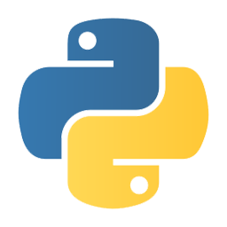

# Reuniones CubanTech

## [meetup.cuban.tech](http://meetup.cuban.tech)

- [Introducción al taller de PyDay Django parte 3](intro_20180729.html)
  - [CubanTech Encuentro #37](http://docker.cuban.tech/events/251517589/) - La Habana, Cuba 2018/07/29
- [Bienvenido a Raspberry Jam](intro_2018080303.html)
  - [CubanTech Encuentro #31](http://meetup.cuban.tech/events/247616068/) - La Habana, Cuba 2018/03/03
- [Introducción a la reunión de Neo4J PyDay](intro_20180113.html)
  - [CubanTech Encuentro #28](http://meetup.cuban.tech/events/246212946/) - La Habana, Cuba 2018/01/13
- [Introducción a PyDay y reunión de cumpleaños #1](intro_20171222.html)
  - [CubanTech Encuentro #26](http://meetup.cuban.tech/events/245032996/) - La Habana, Cuba 2017/12/22

----------------

## Reuniones CubanTech

### [meetup.cuban.tech](http://meetup.cuban.tech)

- [Introducción a Blockstack Cuba Encuentro #1](intro_20171119.html)
  *[Blockstack Cuba Encuentro #1](http://blockstack.cuban.tech/events/244120891/) - La Habana, Cuba 2017/11/19
- [Introducción a las reuniones](intro_20170121.html)
  *[CubanTech Encuentro #17](http://docker.cuban.tech/events/241708287/) - Isla de la Juventud, Cuba 2017/08/19
  *[CubanTech Encuentro #4](http://docker.cuban.tech/events/236654894/) - Santa Clara, Cuba 2017/01/21

---

## [docker.cuban.tech](http://docker.cuban.tech)

--

- [Introduccion a Docker Celebración del Cumpleaños #4](intro_20170304.html)
  *[CubanTech Encuentro #8](http://docker.cuban.tech/events/238007254/) - La Habana, Cuba 2017/03/04
- [Introducción a Docker para programadores y DevOps](docker-intro.html)
  - Conferencia inaugural y laboratorios para el Festival de Software, Universidad de Sancti Spiritus, Cuba 2017/03/21
- [Laboratorio practico de Docker para dispositivos ARM IoT - Raspberry Pi & ODROID](docker-stuff/hypriot)
  - FLISoL 2017, Joven Club, La Habana, Cuba 2017/04/22
  - [CubanTech Encuentro #14](http://docker.cuban.tech/events/240871128/) - Tutorial práctico de Hypriot Joven Club, Cienfuegos, Cuba 2017/06/16
  *[CubanTech Encuentro #15](http://docker.cuban.tech/events/240872505/) - Tutorial práctico de Hypriot, La Habana, Cuba 2017/07/22

---

## PYTHON CUBA

### Siga Nuestro [meetups](http://meetup.cuban.tech)

--

- Estado de Python . Aplicaciones
  - PyDay #1 , La Habana
- Introducción a Brython. Ejemplo de aplicación Tizen
  - Joven Club, Cienfuegos, Cuba
- [Introducción a MicroPython en ESP8266](micropython.html)
  - [CubanTech Encuentro #13](http://meetup.cuban.tech/events/240871291/) - PyDay Joven Club, Cienfuegos, Cuba 2017/06/16
  - [CubanTech Encuentro #19](http://meetup.cuban.tech/events/242499554/) - PyDay Isla de la Juventud, Cuba 2017/08/20
- [Python y Pandas para periodismo de datos](pandas-ddj.html)
  - [CubanTech Encuentro #16](http://meetup.cuban.tech/events/240372001/)- PyDay La Habana Cuba 2017/07/29

---

## NODEBOTS CUBA

### Siga Nuestro [meetups](http://meetup.cuban.tech)

--

- [Nodebots con CubanTech](nodebots.html)
  - [CubanTech Encuentro #3](#) - Holgu&iacute;a Cuba 2016/12/25
  - [CubanTech Encuentro #18](http://meetup.cuban.tech/events/241706888/) - Isla de la Juventud Cuba 2017/08/21
  - [CubanTech Encuentro #20](http://meetup.cuban.tech/events/242652841/) - La Habana Cuba 2017/08/26

---

## SKYFLEET MEETUPS

### Siga Nuestro [meetups](http://meetup.cuban.tech)

--

- [Blockchain, DApps y Skycoin](skycoin.intro.html)
  - [CubanTech Encuentro #35](http://meetup.cuban.tech/events/251519052) - La Habana, Cuba, 2018/06/16 
  - [CubanTech Encuentro #36](http://meetup.cuban.tech/events/251523453) - Isla de la Juv., Cuba, 2018/07/02 
- [Explicación de la API de REST de Skycoin](skycoin.libs.html)
  - [CubanTech Encuentro #52](http://meetup.cuban.tech/events/259974015) - La Habana, Cuba, 06/04/2010

---

## BLOCKSTACK CUBA

### [blockstack.cuban.tech](http://blockstack.cuban.tech)

--

- [Blockchain, DApps y Blockstack](dapps.html)
  - [Blockstack Cuba Encuentro #1](http://blockstack.cuban.tech/events/244120891), La Habana, Cuba, 2017/11/19 

---

## Los que hacen DIY Cuba

### Siga Nuestros [meetups](http://meetup.cuban.tech)

--

- [Electrónica digital - parte 1](https://slides.cuban.tech/digital-electronics-1.html)
  - [CubanTech Encuentro #45](https://www.meetup.com/CubanTech/events/258279078/) - La Habana, Cuba 2019/01/27
