## Introducción a MicroPython

#### Estas diapositivas: [slides.cuban.tech/micropython.html](http://slides.cuban.tech/micropython.html)

---

### Información Wifi

Red: cubantech

Contraseña: meet-ups

--

- Las diapositivas están basadas en una[charla](http://todayispotato.github.io/micropython-talk/#/25) de[Lars de Ridder](https://github.com/todayispotato)
- El taller se basa en gran medida en[Nodebots con el taller CubanTech](http://slides.cuban.tech/nodebots.html)
- ... que se basa en gran medida en un taller de[NY-Javascript](http://www.meetup.com/NY-Javascript) (ver[bit.ly/nyjs-nodebots](http://bit.ly/nyjs-nodebots))
- ... que se basa en gran medida en un taller de[Francis Gulotta](https://twitter.com/reconbot) y[Rick Waldron](https://twitter.com/rwaldron)
- Puede encontrar las diapositivas para ese taller en[gul.ly/3tjj](http://gul.ly/3tjj)
- Puedes inscribirte en uno de sus talleres en la página[Nodebots NYC Meetup page](http://www.meetup.com/nodebots/)

---

## Las pautas de nuestras comunidad

[Sé excelente el uno con el otro](https://github.com/nodeschool/havana/blob/master/Code_of_Conduct.md)

---

Próximos Eventos CubanTech

- [CubanTech meetups](http://meetup.cuban.tech)
- [Encuentros en Cuba](http://docker.cuban.tech)
- [Blockstack Cuba meetups](http://blockstack.cuban.tech)

---

# Un gracias Enorme a nuestro anfitrión

---

## Así que, MicroPython

¿Quién había oído hablar de él antes?

¿Y quién lo usó antes?

¿Por algo serio?

para algo que está funcionando ahora mismo?

---

## Microcontroladores + Python = MicroPython


MicroPython es una implementación rápida y sencilla del lenguaje de programación Python (versión 3) que está optimizado para funcionar en un microcontrolador.

--

## En serio...?

- Puesta en marcha en noviembre de 2013
- Arranque inicial terminado en abril de 2015
  - &pound; 97,803 primera campaña
  - +&pound; 200,000 en total
- Código abierto :[github.com/micropython](https://github.com/micropython)

---

## Pero, ¿por qué?

- Comunidad existente (que te incluye a ti)
- Fácil de aprender, con potentes funciones
- Buena separación entre int y float (a diferencia de JS/Lua)
- Operaciones binarias nativas en 1's y 0's (a diferencia de Lua)
- Ideal para la creación rápida de prototipos
- Puente entre el mundo web y el mundo de la internet de las cosas IoT
- Muchas oportunidades para la optimización!

--

## ...y por qué no CPython?

Principalmente debido al uso de RAM. Ejemplos:

- Preasignación de 257 + 5 ints = 4k RAM
- Llamadas a métodos: led.on() crea un objeto de método encuadernado = 20 bytes de RAM

--

## Requisitos teóricos mínimos del sistema

128kb ROM / 8kb RAM (después de restar otro software)

##### Puerto UNIX alrededor de 280kb flash

---

# ¿Cómo que Micro?

--

## Principalmente optimizaciones de RAM

- Muchas cadenas predefinidas en ROM (led, on, read, ...)
- Llamadas a métodos optimizados
- Todo lo que puede estar en ROM, está en ROM
- Recolección de basura: Marcar y barrer (sin conteos de referencia)

--

## Punteros etiquetados

Un puntero etiquetado es un puntero (concretamente una dirección de memoria) con datos adicionales asociados a él.

- Entero - xxxx xxxx xxxx xxxx xxx1
- Cadena - xxxx xxxx xxxx xxxx xx10
- Objeto - xxxx xxxx xxxx xxxx xx00

---

# Estado actual de MicroPython

---

## Desarrollo

- Un desarrollador a tiempo completo, dos colaboradores principales
- Financiado en parte por la Agencia Espacial Europea
- Puesta en marcha en mayo de 2016 para el soporte adecuado de los zócalos ESP8266
- Parece que está madurando

---

## ¿Está lista la producción?

Depende de tu placa

Pero es increíble para la creación de prototipos!

O para incrustar en juegos y aplicaciones

--

## ¿Incrustar a Python en juegos?


... ha ocurrido antes, sin embargo no MicroPython ....

--

### Python embebido para videojuegos

##### Civilización IV


Toda la lógica interna, incluida la IA. La API está disponible.

--

### Python embebido para videojuegos

##### El templo del mal elemental

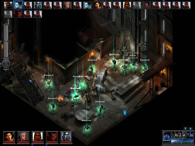

Casi todo excepto el motor de renderizado,[según Steve Moret](http://www.pygame.org/interview/stevemoret.shtml)

--

### Python embebido para videojuegos

##### El Comandante del Puente de Star Trek


Scripts de las misiones

--

### Python embebido para videojuegos

##### Crystal Space


Toda la lógica interna, incluida la IA. La API está disponible.

--

### Python embebido para videojuegos

##### Battlefield 2


Juego, resultados, estadísticas del equipo

---

# Algunas tablas apoyadas

---

## El PyBoard

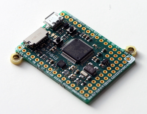

- Implementación de la referencia
- Inicialmente sólo en la pirámide, ahora en múltiples chips
- ARM 32bit Cortex M4 @ 168Mhz, 1Mb flash, 192kb RAM
- Acelerómetro, RTC, 4 LEDs, 2 interruptores, 30 GPIO

---

## BBC Micro:Bit

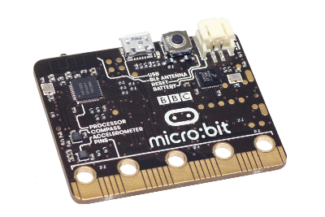

16kb RAM, 256kb flash, Cortex M0 @ 16 MHz

--

## BBC Micro:Bit

Suministrado a _1 millón_ de niños en edad escolar

- Editor de Python en línea
- Aplicación móvil para cargar código
- Toneladas de documentación, material didáctico, etc.

--

### ...viene con:


- Editor gráfico de arrastrar y soltar

--

## BBC Micro: Especificaciones de bits

- 25 LED
- Dos botones programables
- Acelerómetro y magnetómetro
- Bluetooth
- 5 GPIO

--

## Cómpralo ahora! ... :)

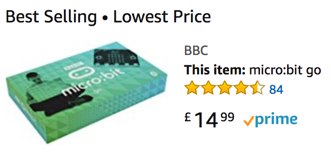

El envío es gratuito para pedidos en el Reino Unido \o/

---

## The WiPy

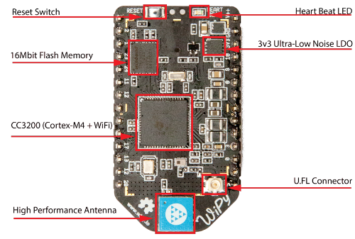

256kb RAM, 2Mb flash, 25 GPIO, Cortex M4 @ 80 MHz

#### "Pequeño y ligero para encajar en cualquier cavidad"

---

## LoPy

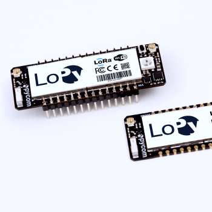

LoRa + Python

--

## LoRa ... hmmm ?

[](https://www.lora-alliance.org/)

- Plataforma inalámbrica de largo alcance y bajo consumo
- Elección de la tecnología predominante para la creación de redes de Internet de las cosas(IoT) en todo el mundo.
- +500 miembros
- LoRaWAN<sup>&#153;</sup> Implementación de protocolos
  - Especificación WAN de bajo consumo (LPWAN) para dispositivos inalámbricos que funcionan con baterías.

---

## Feather M0 Express

|                                                                          |                                                                                    |
| ------------------------------------------------------------------------ | ---------------------------------------------------------------------------------- |
| [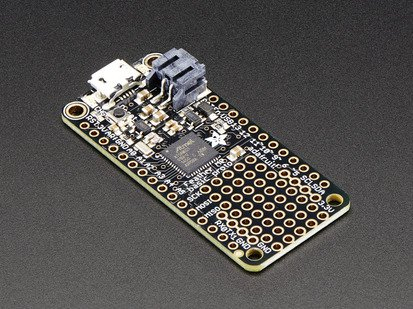](https://www.adafruit.com/product/3403) | <div style="width: 400px; display:inline-block">  </div> |

--

## Feather M0 con radio

|                                                                                |                                                                                                                                         |
| ------------------------------------------------------------------------------ | --------------------------------------------------------------------------------------------------------------------------------------- |
| 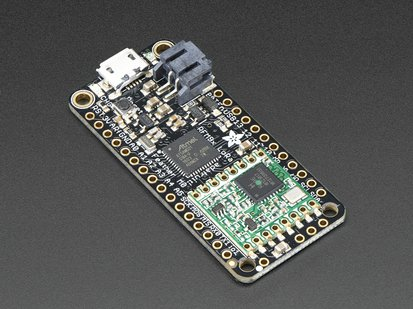                                                   | 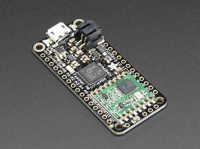                                                                                                        |
| <small> RFM59 LoRA - [900 MHz](https://www.adafruit.com/product/3178) </small> | <small> Packet Radio [433 MHz](https://www.adafruit.com/product/3177), [868 or 915 MHz](https://www.adafruit.com/product/3176) </small> |

--

## Feather M0 wireless

|                                                                |                                                            |
| -------------------------------------------------------------- | ---------------------------------------------------------- |
| 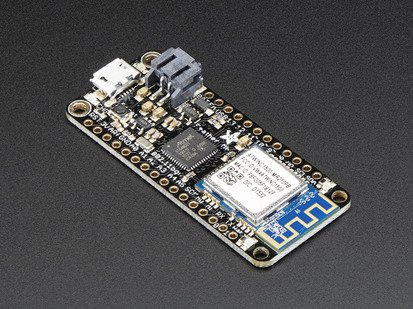                             | 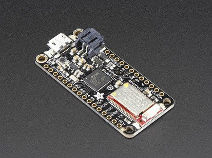                          |
| <small> [WiFi](https://www.adafruit.com/product/3010) </small> | <small> [Bluetooth](https://www.adafruit.com/product/2995) |

--

## Feather M0 Express - especificaciones

- Memoria USB [cargador de arranque UF2](https://learn.adafruit.com/adafruit-feather-m0-express-designed-for-circuit-python-circuitpython/uf2-bootloader)
- ATSAMD21G18 @ 48MHz con lógica/potencia de 3.3V
- 256 KB de FLASH + 32 KB de RAM
- Cristal de 32.768 KHz para la generación de relojes y RTC
- Regulador de 3.3V con salida de corriente máxima de 500mA
- Soporte nativo para USB (cargador de arranque USB, depuración de puertos serie)

--

## Feather M0 Express - especificaciones

- 20 pines GPIO (salidas PWM para todos)
- Serial de hardware, I2C, soporte SPI
- 6 entradas analógicas de 12 bits
- 1 x salida analógica de 10 bits (DAC)
- Construido en cargador lipoly 100mA (con LED)
- Pin #13 LED rojo

---

## ESP8266 y NodeMCU

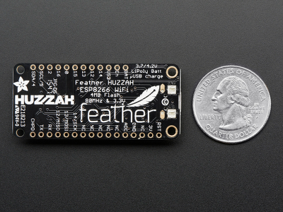

... también funciona con los chips ESP8266 (es decir, muchos)

---

## NodeMCU v1 pinout

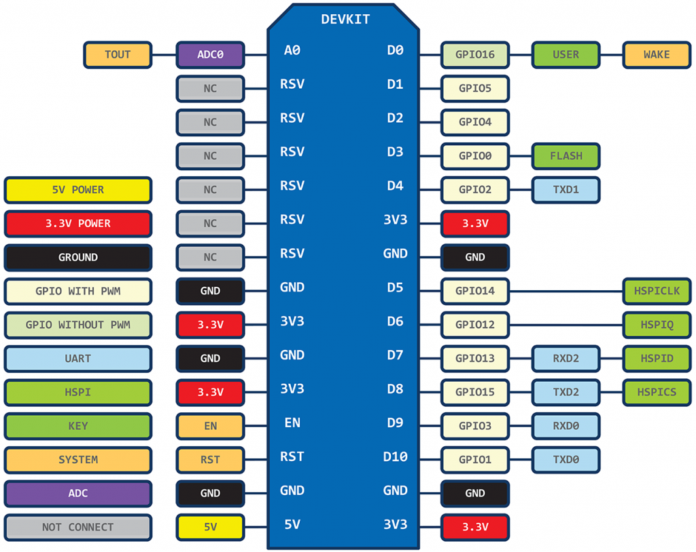

--

## Dispositivo AMICA NodeMCU

|                               |                                 |
| ----------------------------- | ------------------------------- |
| 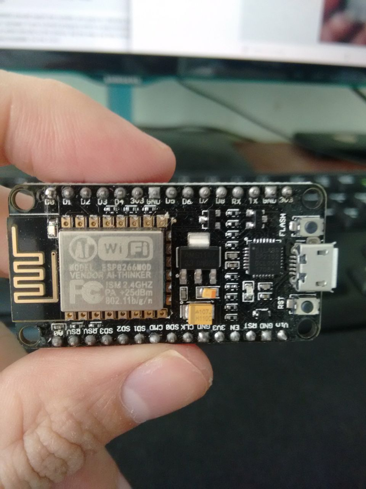 | 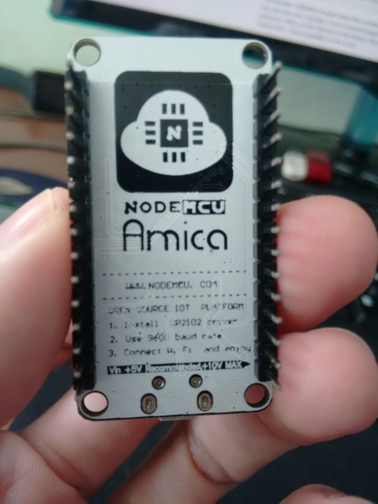 |

---

## NodeMCU v2 pinout

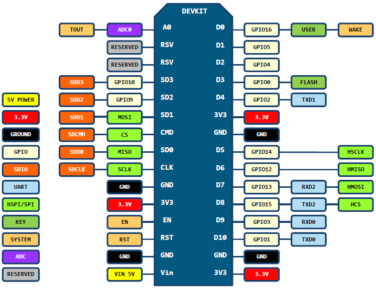

--

## NodeMCU devkit - DOIT

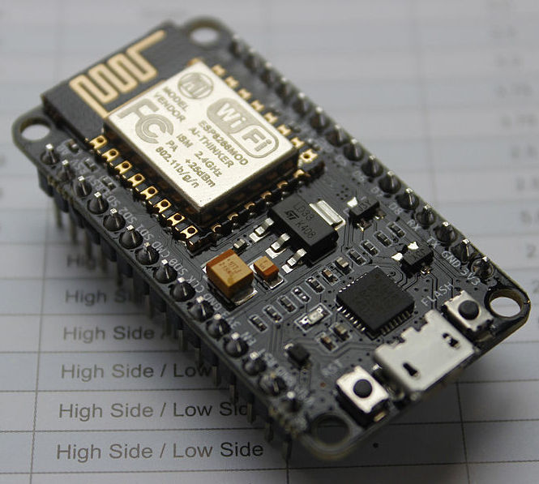

--

## Dispositivo NodeMCU - Makerfocus D1 mini

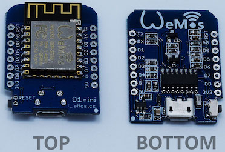

---

## NodeMCU v3 pinout

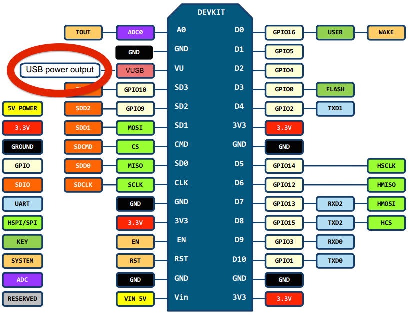

--

## Geekcreit&reg; LoLin NodeMCU devkit

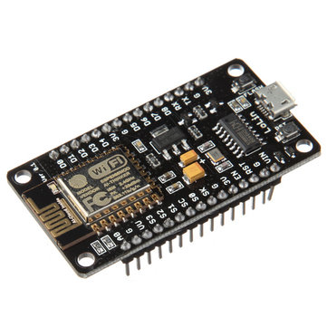

---

## Adafruit Feather Huzzah ESP8266

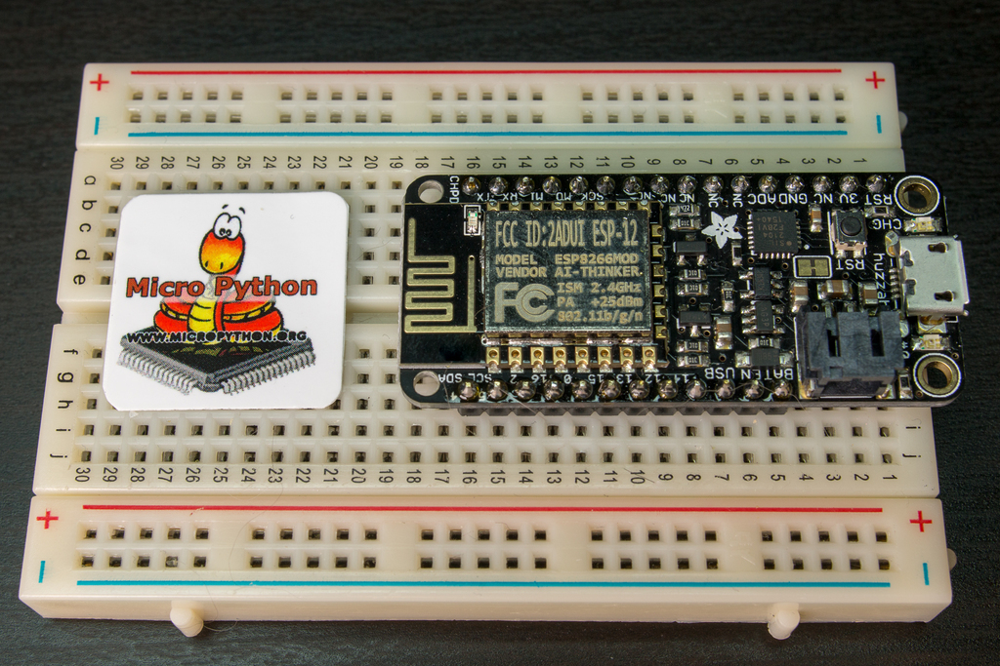

--

## Feather HUZZAH - Cargador lipoly 100mA

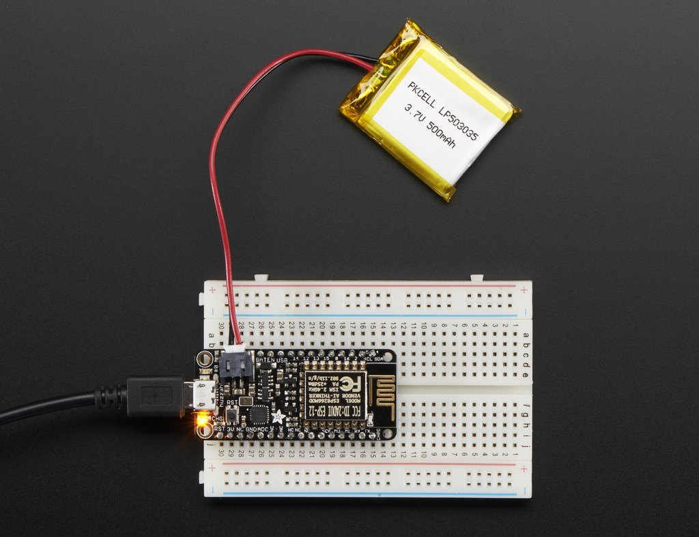

--

## Feather HUZZAH ESP8266 - especificaciones

- ESP8266 @ 80MHz o 160 MHz
- Lógica/potencia de 3.3V, salida de corriente máxima de 500mA
- 4MB de FLASH (32 MBit)
- CP2104 Convertidor USB-Serial a bordo
  - 921600 velocidad de transmisión máxima para la carga
- 9 pines GPIO
  - también se puede utilizar como I2C y SPI
- 1 x entradas analógicas 1,0V máx.

--

## Feather HUZZAH ESP8266 -[pinout](https://learn.adafruit.com/adafruit-feather-huzzah-esp8266/pinouts)

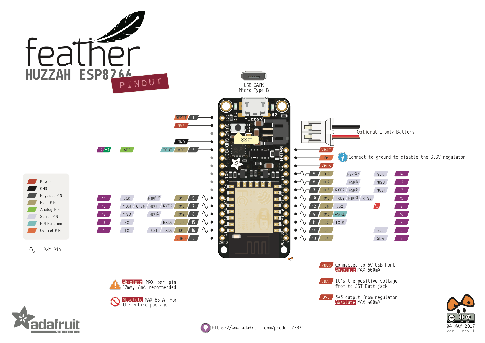

---

## Adafruit HUZZAH ESP8266 Breakout

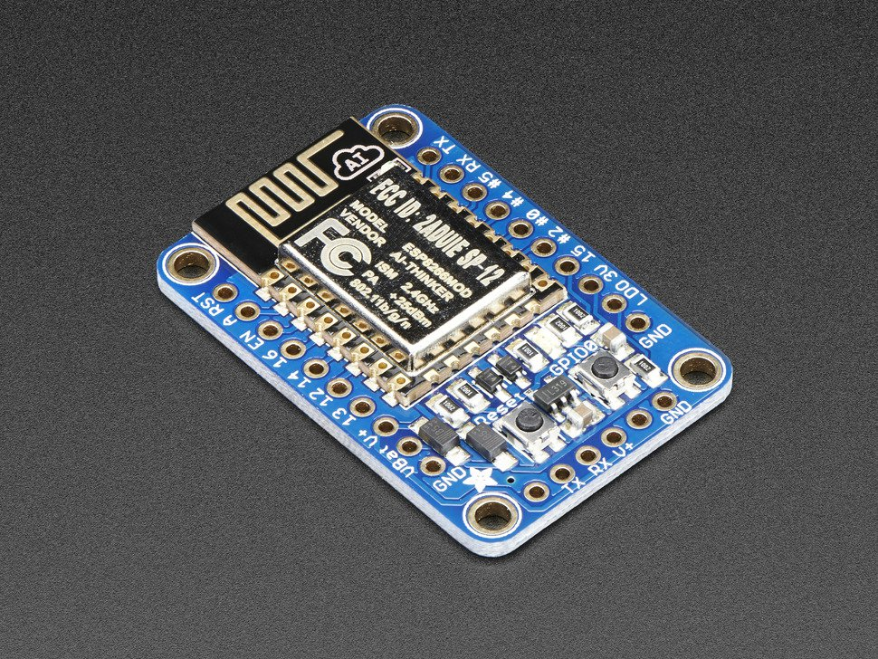

--

## HUZZAH ESP8266 Breakout - especificaciones

- 1 x Entrada analógica (1,0 V máx.)
- 9 x GPIO (3.3V lógico)
  - También se utiliza para I2C o SPI
- 2 x pines UART
- 2 x 3-6V entradas de alimentación
  - Restablecer, habilitar, deshabilitar LDO
  - Salida de 3.3V

--

## HUZZAH ESP8266 Breakout - pines de alimentacion

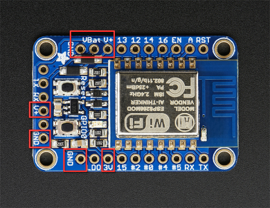

- regulador de voltaje (se pega a 4V a 6V)
  - [Diodos Schottky](https://en.wikipedia.org/wiki/Schottky_diode) para tensiones variables
- **VBat** Batería Lipoly
- **V+** : 5V (FTDI/cabecera en serie)

--

## HUZZAH ESP8266 Breakout - pines en serie

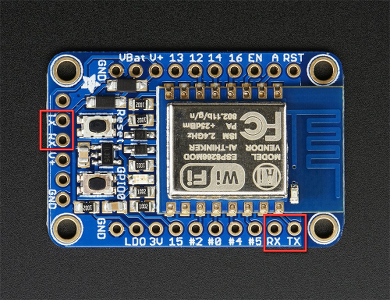

- TX ( 3.3V) y RX ( 5V)

--

## HUZZAH ESP8266 Breakout - Pines GPIO

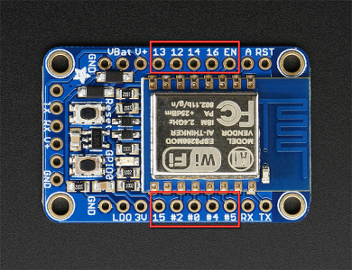

- No hay pull-up en **#0**
- Lógica de 3.3V
  - Corriente máxima consumida: 12mA.
- [Hoja de especificaciones completa](http://www.adafruit.com/datasheets/ESP8266_Specifications_English.pdf)

--

## HUZZAH ESP8266 Breakout - otros pines

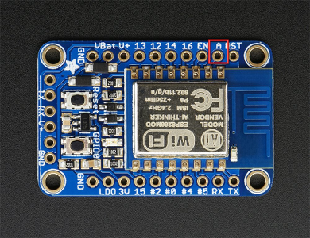

- **A** : entrada analógica ( 0 - 1,0V)
- **LDO** : conectar a **GND** para apagar el regulador de 3.3V
- **RST** ( 5V) **EN** ( 3.3V)
  - hasta **GND** para reiniciar el ESP8266

---

## CircuitPython

|                                 |                            |
| ------------------------------- | -------------------------- |
| 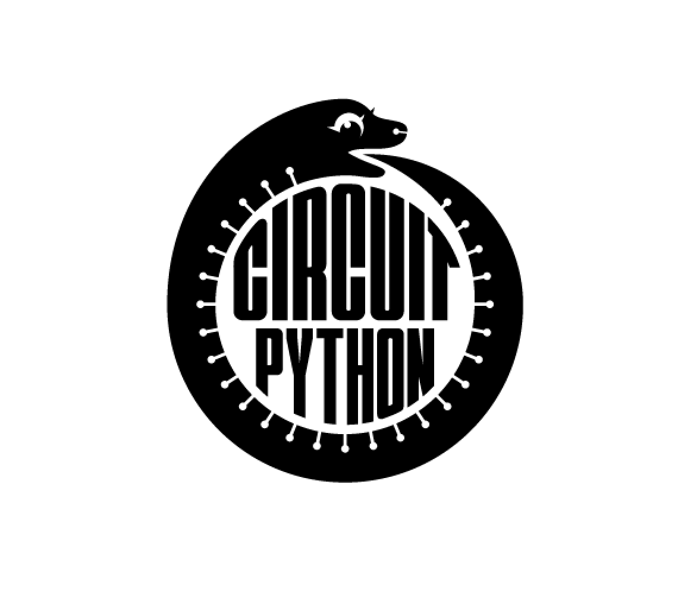 |  |

---

## Circuito Playground Express

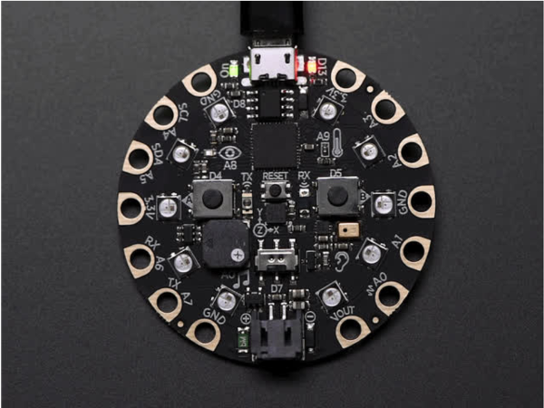

--

#### .... viene con

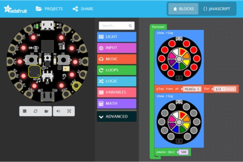

- Editor gráfico de arrastrar y soltar
- Editor en línea de Python y Javascript
- Toneladas de [documentación](http://adafru.it/wpE), material didáctico, etc.

--

### Placa Circuito Playground Express - características

- ATSAMD21 ARM Procesador Cortex M0
  - 3.3V y 48MHz
- 2 MB de almacenamiento SPI Flash
- Puerto MicroUSB
  - Programación y depuración
  - Puerto serie
  - teclado, ratón
  - joystick o MIDI

--

### Placa Circuito Playground Express - otras características

- 10 x mini NeoPixels
- 1 x sensor de movimiento (LIS3DH)
  - Acelerómetro de tres ejes
  - Detección de golpes y caídas libres
- 1 x Sensor de temperatura (termistor)
- 1 x Sensor de luz (fototransistor).
  - Sensor de color y sensor de pulso.

--

### Placa Circuito Playground Express - más características

- 1 x micrófono MEMS
- 1 x Mini-altavoz con amplificador clase D
- 2 x Pulsadores
- Receptor y transmisor de infrarrojos
  - Recibir y transmitir cualquier código de control remoto
  - Enviar mensajes entre Circuitos Playground Expresses
  - Sensor de proximidad.

--

### Placa Circuito Playground Express - aún más características

- 8 x pines de entrada/salida fáciles de pinza de cocodrilo

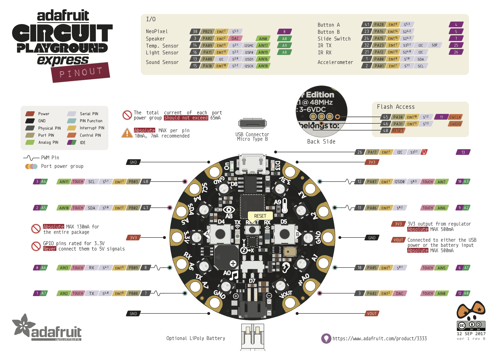

---

## Trinket M0

<small class="lg"> 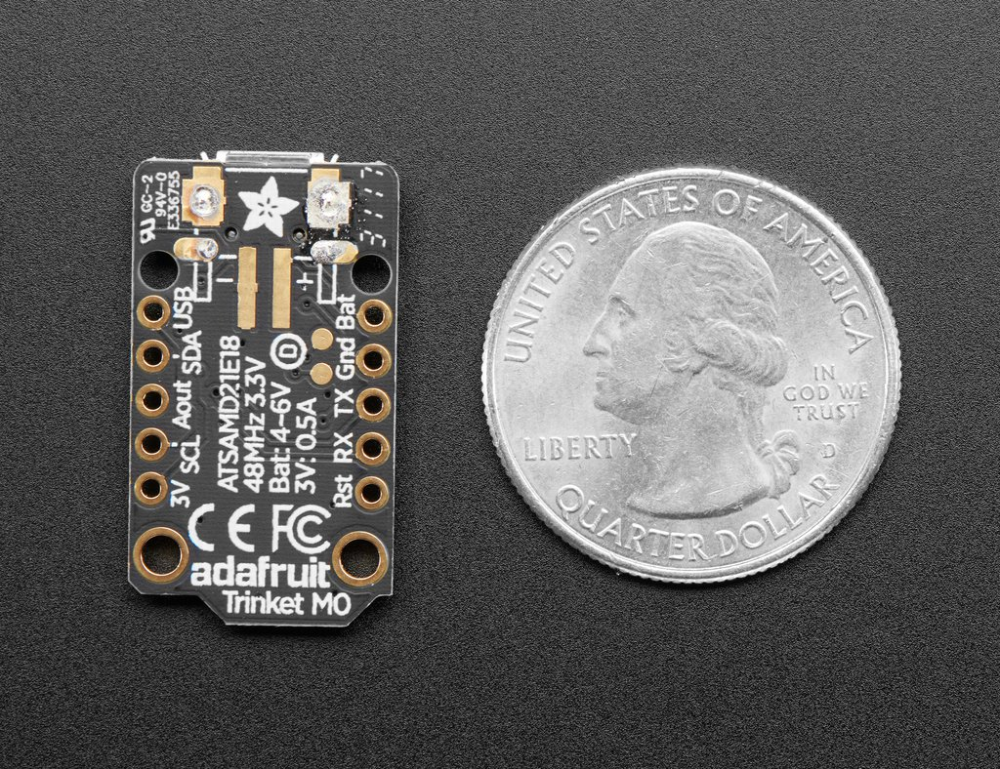 </small>

Tarjeta programable CircuitPython de bajo costo!

<small> .... preinstalado nada más sacarlo de la caja! </small>

--

## Trinket M0 - características <span style="color:yellow">(vs Trinket)</span>

- El mismo tamaño, factor de forma y pinout que el Trinket clásico
- ATSAMD21E18 Microcontrolador de 32 bits Cortex M0+ Atmel ATSAMD21 <span style="color:yellow">(ATtiny85 8-bit AVR)</span>
  - Procesador a 32 bit de 48 MHz <span style="color:yellow">(+6x mas rápido)</span>
- 256KB Flash <span style="color:yellow">(8KB &rArr; 32x)</span>, 32 KB RAM <span style="color:yellow">(512B &rArr; 64x)</span>

--

## Trinket M0 - USB

- USB nativo soportado por todos los sistemas operativos <span style="color:yellow">(falta en Trinket)</span>
  - Arduino IDE
  - Consola serie CircuitPython USB
  - Teclado/ratón HID
  - .... incluso una pequeña unidad de disco para almacenar scripts Python.

--

## Trinket M0 - otras características

<small class="lg"> 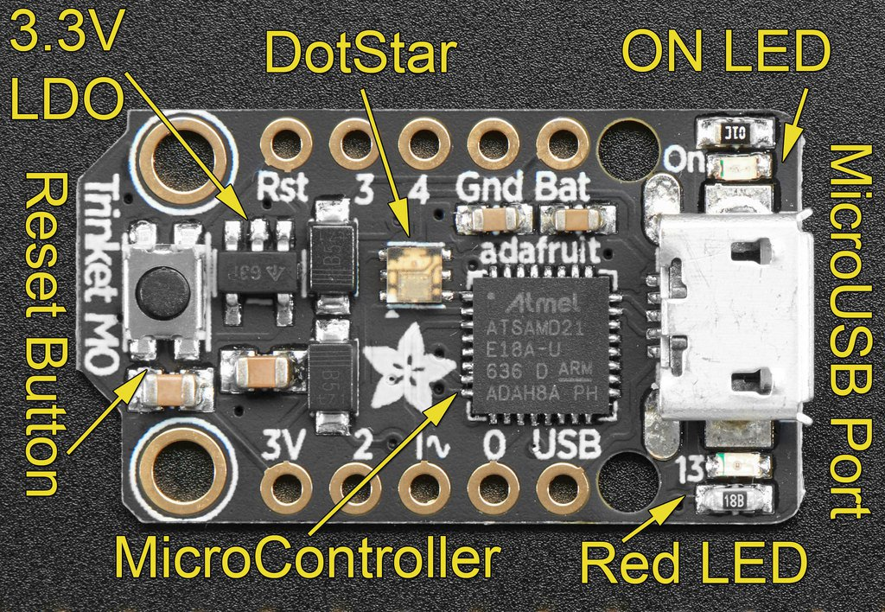 </small>

- Conector USB Micro B
- 3 LED incorporados (RGB DotStar LED, LED rojo #13, LED ON)
- Botón de reinicio

--

## Trinket M0 - Parte trasera

<small class="lg">  </small>

- Entrada de batería (unida al pin BAT) para soldar en un conector JST PH y alimentarlo con una batería externa.
  - Batería de polímero de litio o paquetes de baterías JST 3xAAA
- Protecciones : polaridad inversa, sobrecorriente y térmica.
- Conmutación entre USB y batería (tensión máxima)

---

## Concluyendo ....

> <small> Especificaciones de la caja de tu tabla y mantenerlas abiertas.</small>

--

## Adafruit Feather Huzzah ESP8266


--

## Circuito Playground Express


--

## PyBoard v1.1


--

## PyBoard v1.0

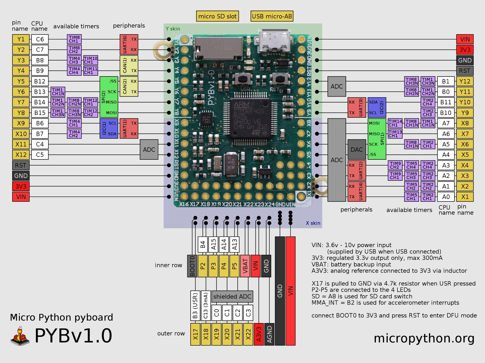

--

## PyBoard Lite AC v1.0

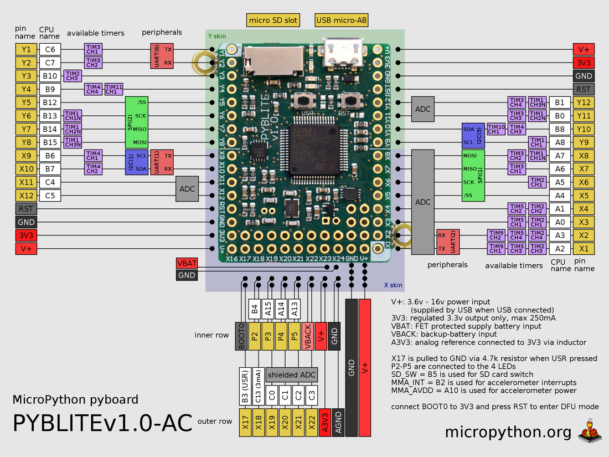

--

## PyBoard Lite v1.0


--

## Trinket M0

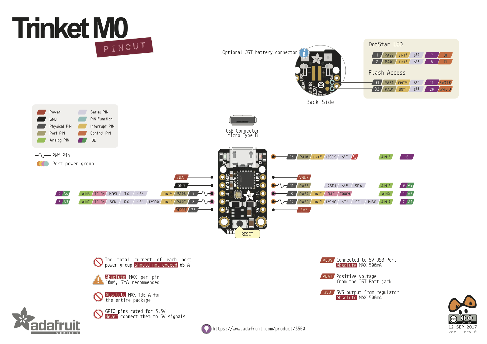

--

## NodeMCU v3 (e.g. LoLin wemos.cc)

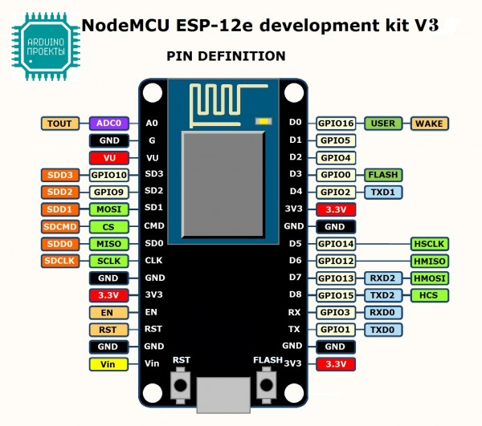

--

## NodeMCU v2 (por ejemplo, DoIT.am)

<div style="display:inline-block; background: #fff">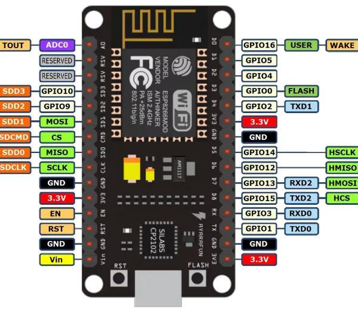 </div>

--

## NodeMCU v1 (por ejemplo, Amica devkit)

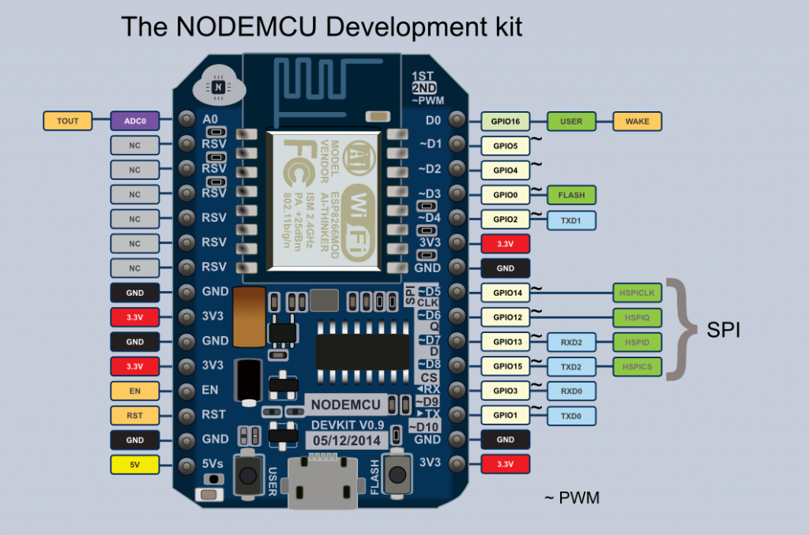

---

## Introducción a PyBoard

Zero conf


---

## Cómo empezar ESP8266

```sh
pip install esptool
```

Desde que la Versión 1.3 soporta tanto Python 2.7 como 3.4 <br/> (o superior)

--

### Identificar USB - GNU/Linux

```sh
Monitor de udevadm --udev
imprimirá los eventos recibidos:
UDEV - el evento que udev envía después del procesamiento de reglas

UDEV  [1504678146.578976] add      /devices/pci0000:00/0000:00:1d.0/usb2/2-1/2-1.2 (usb)
UDEV  [1504678146.746860] add      /module/usbserial (module)
UDEV  [1504678146.747288] add      /bus/usb-serial (bus)
UDEV  [1504678146.747855] add      /bus/usb/drivers/usbserial (drivers)
UDEV  [1504678146.748149] add      /bus/usb/drivers/usbserial_generic (drivers)
UDEV  [1504678146.748241] add      /bus/usb-serial/drivers/generic (drivers)
UDEV  [1504678146.772466] add      /module/ch341 (module)
UDEV  [1504678146.772783] add      /bus/usb-serial/drivers/ch341-uart (drivers)
UDEV  [1504678146.774556] add      /bus/usb/drivers/ch341 (drivers)
UDEV  [1504678146.774614] add      /devices/pci0000:00/0000:00:1d.0/usb2/2-1/2-1.2/2-1.2:1.0 (usb)
UDEV  [1504678146.775507] add      /devices/pci0000:00/0000:00:1d.0/usb2/2-1/2-1.2/2-1.2:1.0/ttyUSB0 (usb-serial)
UDEV  [1504678146.803046] add      /devices/pci0000:00/0000:00:1d.0/usb2/2-1/2-1.2/2-1.2:1.0/ttyUSB0/tty/ttyUSB0 (tty)
```

--

### Identificar USB - Mac OS X

```sh
ls /dev/cu*serial*
/dev/cu.wchusbserial1410
```

--

## Borrar y desplegar firmware

```sh
esptool.py --port /dev/ttyUSB0 borrar_flash
esptool.py --port /dev/ttyUSB0 --baud 460800 write_flash --flash_size=detect 0 esp8266-20170526-v1.9.bin
```

- Especifique el nombre del dispositivo identificado anteriormente después de `--port`
- Reduzca la velocidad de transmisión si se producen errores al parpadear (por ejemplo, hasta 115200).

--

## ...si todavía no funciona...

Para algunas tarjetas NodeMCU especifique la opción `-fm dio`.

```sh
esptool.py --port /dev/ttyUSB0 --baud 460800 write_flash --flash_size=detect -fm dio 0 esp8266-20170526-v1.9.bin
```

---

## Introducción - cargador de arranque UF2

- Descargar archivo de imagen UF2
  - por ejemplo [el último CPX CircuitPython UF2](https://github.com/adafruit/circuitpython/releases/download/2.1.0/adafruit-circuitpython-circuitplayground_express-2.1.0.uf2) para Circuito Playground Express
- Conecte la tarjeta al ordenador mediante un cable de datos USB
- [**OPTIONAL**] Restablece tu tabla.
  - Por ejemplo, haga doble clic en el botón Reset situado en el centro del CPX.

--

## Modo de cargador de arranque UF2


- Comprueba que tu placa está en modo bootloader
  - p.ej. todos los LEDs se ponen verdes en el CPX

--

## Unidad de arranque UF2


- Aparece una nueva unidad de disco
  - El nombre puede variar, por ejemplo, `CPLAYBOOT` para CPX.

--

## UF2 flasheando


- Copiar (arrastrar) el archivo de imagen en la unidad de arranque

---

## Cómo empezar - BOSSAC

- Descargue archivos de imagen BIN, por ejemplo,[último BIN para CPX](https://adafruit-circuit-python.s3.amazonaws.com/index.html?prefix=bin/circuitplayground_express/)
- Descargar [última versión de bossac](https://github.com/shumatech/BOSSA/releases/latest)
  - `mingw32` para Windows, `apple-darwin` para Mac OSX, y varias opciones `linux`.

--

## Flash con BOSSAC

```sh
$ bossac -e -w -v -R ~/Downloads/adafruit-circuitpython-circuitplayground_express-1.0.0.0.bin
```

`e` borra el chip, `w` escribe el archivo dado, `v` verifica la escritura y `r` resetea la placa.

---

## REPL sobre el puerto serie

- Enchufe el cable mini-USB (placa) a USB (portátil)
- Identificar el dispositivo USB
- Conectar a través de una conexión en serie

--

### Identificar y conectar a través de USB - GNU/Linux

<small>

```sh
$ udevadm monitor --udev
monitor will print the received events for:
UDEV - the event which udev sends out after rule processing

UDEV  [1504678146.578976] add      /devices/pci0000:00/0000:00:1d.0/usb2/2-1/2-1.2 (usb)
UDEV  [1504678146.746860] add      /module/usbserial (module)
UDEV  [1504678146.747288] add      /bus/usb-serial (bus)
UDEV  [1504678146.747855] add      /bus/usb/drivers/usbserial (drivers)
UDEV  [1504678146.748149] add      /bus/usb/drivers/usbserial_generic (drivers)
UDEV  [1504678146.748241] add      /bus/usb-serial/drivers/generic (drivers)
UDEV  [1504678146.772466] add      /module/ch341 (module)
UDEV  [1504678146.772783] add      /bus/usb-serial/drivers/ch341-uart (drivers)
UDEV  [1504678146.774556] add      /bus/usb/drivers/ch341 (drivers)
UDEV  [1504678146.774614] add      /devices/pci0000:00/0000:00:1d.0/usb2/2-1/2-1.2/2-1.2:1.0 (usb)
UDEV  [1504678146.775507] add      /devices/pci0000:00/0000:00:1d.0/usb2/2-1/2-1.2/2-1.2:1.0/ttyUSB0 (usb-serial)
UDEV  [1504678146.803046] add      /devices/pci0000:00/0000:00:1d.0/usb2/2-1/2-1.2/2-1.2:1.0/ttyUSB0/tty/ttyUSB0 (tty)

$ picocom /dev/ttyUSB0 -b115200
```

</small>

... no siempre `ttyUSB0` e.g. `ttyACM0`.

--

### Identificar y conectar a través de USB - Mac OS X

```sh
$ ls /dev/cu*serial*
/dev/cu.wchusbserial1410

$ screen /dev/cu.wchusbserial1410 115200 -L
MicroPython v1.9-8-gfcaadf92 on 2017-05-26; ESP module with ESP8266
Type "help()" for more information.
>>>
```

... El nombre del dispositivo puede no ser `/dev/cu.wchusbserial1410`.

--

### Conectar a través de USB - Windows PuTTY

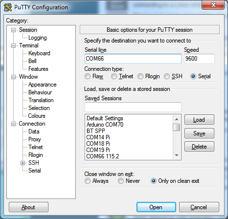

.... ajustar la velocidad a `115200` (en lugar de `9600`)

--

### Conectar a través de USB - Windows TeraTerm

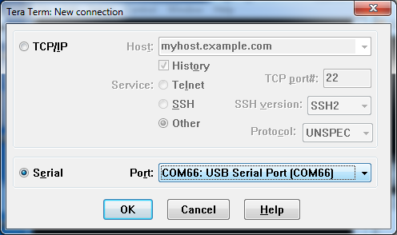

---

# Perdona...

# ¿Qué es MicroPython?

---

## ¡Es Python! (3.4-ish)

```python
>>> print('Hola mundo!')
Hola mundo!

>>> with open('cubantech.txt', 'w') as f:
>>>     f.write('Hola CubanTech!')

>>> with open('cubantech.txt', 'r') as f:
>>>     for l in f:
>>>         print l
Hola CubanTech!

>>> try:
>>>     1/0
>>> except ZeroDivisionError as e:
>>>     print("Oh, you!")
Oh, you!
```

---

## ...pero no todo.

```python
>>> import functools
Traceback (most recent call last):
    File "<stdin>", line 1, in <module>
ImportError: no module named 'functools'
>>> import this
Traceback (most recent call last):
    File "<stdin>", line 1, in <module>
ImportError: no module named 'this'
```

---

## Módulos soportados

- `sys`
- `time`
- `struct`
- `machine` - Funciones de la máquina relacionadas con la placa
- `micropython` - internos
- Los puertos específicos proporcionan ganchos específicos, REPL y módulos personalizados

---

## Biblioteca estándar externa

Escrito en Python (¿recuerdas PyPy?)

```sh
$ micropython -m upip install micropython-functools
$ ./micropython
MicroPython v1.7-116-g8dd704b on 2016-04-19; linux version
Use Ctrl-D to exit, Ctrl-E for paste mode
>>> import functools
>>> dir(functools)
['__name__', 'reduce', 'partial', 'update_wrapper', '__file__', 'wraps']
https://github.com/micropython/micropython-lib
```

---

## Soporta sintaxis asíncrona/en espera

```python
async def ping_pygrunn():
    return await ping_server('pygrunn.org')
```

---

# APIs de hardware

<small> .... para PyBoard y chips STM </small>

--

## Sus micro-superpoderes incluyen:

- Desactivar interrupciones
- Activar y desactivar GC
- Escribir ensamblador en línea
- Emitir código de byte o código máquina

--

## Ensamblador en línea - Devolver un valor

```python
>>> @micropython.asm_thumb
... def fun():
...     movw(r0, 42)
...
>>> print(fun())
```

¿Cuál es el resultado?

--

## Ensamblador en línea - periféricos

```python
@micropython.asm_thumb
def led_on():
    movwt(r0, stm.GPIOA)
    movw(r1, 1 << 13)
    strh(r1, [r0, stm.GPIO_BSRRL])
```

Encienda el LED rojo del PyBoard (es decir, PA13 high)

> - <small>`stm` - Constantes de PyBoard </small>
> - <small>`stm.GPIOA` - desplazamiento de dirección de memoria a GPIOA </small>
> - <small> `movwt` mueve un 32-bit al registro (`movw` + `movt`) </small>
> - <small>`GPIO_BSRRL` - STM32 Bit Registro de Cambio/reinicio </small>

--

## Ensamblador en línea - Argumentos

```python

>>> @micropython.asm_thumb
... def asm_add(r0, r1):
...     add(r0, r0, r1)
...
>>> asm_add(1, 2)
3
```

- Hasta 4 argumentos
- Deben llamarse `r0`, `r1`, `r2` y `r3`.

--

## Ensamblador en línea - Flash LED r0 veces

```python

@micropython.asm_thumb
def flash_led(r0):
    # get the GPIOA address in r1
    movwt(r1, stm.GPIOA)

    # get the bit mask for PA14 (the pin LED #2 is on)
    movw(r2, 1 << 14)
    b(loop_entry)
    label(loop1)

    # turn LED on
    strh(r2, [r1, stm.GPIO_BSRRL])

    # delay for a bit
    movwt(r4, 5599900)
    label(delay_on)
    sub(r4, r4, 1)
    cmp(r4, 0)
    bgt(delay_on)

    # turn LED off
    strh(r2, [r1, stm.GPIO_BSRRH])

    # delay for a bit
    movwt(r4, 5599900)
    label(delay_off)
    sub(r4, r4, 1)
    cmp(r4, 0)
    bgt(delay_off)

    # loop r0 times
    sub(r0, r0, 1)
    label(loop_entry)
    cmp(r0, 0)
    bgt(loop1)
```

- `label(x)` - asignar etiqueta
- `b(x)` rama incondicional
- `bgt(x)`, `blt(x)`, ... rama condicional

--

## Emisor de código nativo

```python

@micropython.native
def foo(self, arg):
    # code
```

Aproximadamente el doble de rápido, pero más grande binario

--

## Viper es Python incrustada en tiempo real

```python

@micropython.viper
def foo(self, arg: int) -> int:
    # code
```

- Ahora en realidad llamado Zerynth y algo confuso
- No totalmente conforme con las normas de Código Python
- Produce instrucciones para la máquina

---

# Vamos entonces!

---

## Nuestro hardware

[](http://www.seeedstudio.com/depot/ARDX-The-starter-kit-for-Arduino-p-1153.html)

--

## Nuestro hardware

[](http://www.seeedstudio.com/depot/ARDX-The-starter-kit-for-Arduino-p-1153.html)

---

## A los kits les puede faltar equipo

---

Si tiene problemas para encontrar un componente, háganoslo saber y le conseguiremos un reemplazo.

---

## ¿No funciona?

## ¡Probablemente hardware!

---

Siéntase libre de seleccionar los componentes que más le gusten y completar los retos que más le interesen.

---

## Componentes que estamos cubriendo

- <span style="color:yellow"> Programación en red con ESP8266 </span>
- LEDs (diodos emisores de luz)
- Botones
- Servos
- Aplicaciones de internet de las cosas IOT con MQTTT

---

## Redes (MicroPython en ESP8266)

- Punto de acceso WiFi (AP)
  - ESSID es de la forma MicroPython-xxxxxxxx (dirección MAC de su dispositivo)
  - Restablecimiento de fábrica Contraseña `micropythoN`
  - Dirección IP `192.168.4.1`
- Interfaz de la estación

---

## Módulo de red

```python
>>> import network
>>> sta_if = network.WLAN(network.STA_IF)
>>> ap_if = network.WLAN(network.AP_IF)

```

---

## Estado de activación de la interfaz (red)

```python
>>> sta_if.active()
False
>>> ap_if.active()
True
>>> ap_if.config('essid')
MicroPython-04320781
>>> ap_if.config(essid='micropy012')
>>> ap_if.ifconfig()
('192.168.4.1', '255.255.255.0', '192.168.4.1', '8.8.8.8')
```

Los valores devueltos son: Dirección IP, máscara de red, pasarela, DNS.

--

## Configuración de red - Parámetros

| Parámetro  | Tipo   | Descripción                                          |
| ---------- | ------ | ---------------------------------------------------- |
| _mac_      | bytes  | Dirección MAC (bytes)                                |
| _essid_    | string | Nombre del punto de acceso WiFi (cadena)             |
| _channel_  | int    | Canal WiFi (entero)                                  |
| _hidden_   | bool   | Si el ESSID está oculto                              |
| _authmode_ | enum   | Modo de autenticación soportado (ver `dir(network)`) |
| _password_ | string | Contraseña de acceso WiFi                            |

---

## Configuración de red

```python
>>> sta_if.active(True)
>>> sta_if.connect('cubantech', 'meet-ups')
>>> sta_if.isconnected() # Podria llevar un tiempo
True
>>> sta_if.ifconfig()
('192.168.0.2', '255.255.255.0', '192.168.0.1', '8.8.8.8')

```

---

## Instala WebREPL si aún no lo has hecho

##### ...de Internet.

```sh
git clone https://github.com/micropython/webrepl
```

[Descargar WebREPL de Internet](https://github.com/micropython/webrepl)

##### ...de CubanTech LAN

```sh
git clone ssh://git@git.cuban.tech:2222/micropython/webrepl.git
```

[Descargar WebREPL desde LAN](http://git.cuban.tech/micropython/webrepl/repository/archive.tar.gz?ref=master)

---

## Configurar el acceso a WebREPL (a través de USB)

```python
import webrepl_setup
```

- Siga las instrucciones y avisos en pantalla
- Reinicie su dispositivo MicroPython.

---

## WebREPL

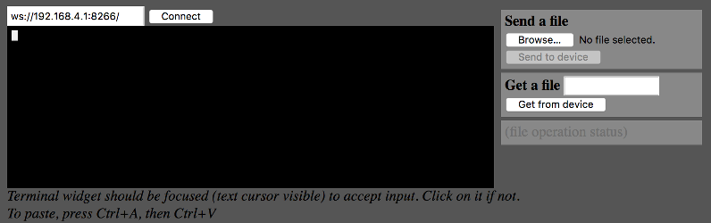

- Conectar al punto de acceso del ESP8266
- Lanzar WebREPL
  - Abra `webrepl.html` en su navegador
- Haga clic en el botón "Conectar
- Escribe la contraseña con `webrepl_setup` cuando se te pida

---

## Tenemos WiFi

```python
>>> import socket
```

¡¡¡Tenemos sockets!!!!

---

## Servidor HTTP simple

Estado de todos los pines GPIO

```python
import machine
pins = [machine.Pin(i, machine.Pin.IN) for i in (0, 2, 4, 5, 12, 13, 14, 15)]
html = """<!DOCTYPE html>
<html>
    <head> <title>ESP8266 Pins</title> </head>
    <body>
        <h1>ESP8266 Pins</h1>
        <table border="1"> <tr><th>Pin</th><th>Value</th></tr> %s </table>
    </body>
</html>
"""

import socket
addr = socket.getaddrinfo('0.0.0.0', 80)[0][-1]
s = socket.socket()
s.bind(addr)
s.listen(1)
print('listening on', addr)
while True:
    cl, addr = s.accept()
    print('client connected from', addr) cl_file = cl.makefile('rwb', 0)
    while True:
        line = cl_file.readline()
        if not line or line == b'\r\n':
            break
    rows = ['<tr><td>%s</td><td>%d</td></tr>' % (str(p), p.value()) for p in pins] response = html % '\n'.join(rows)
    cl.send(response)
    cl.close()
```

---

## Componentes que estamos cubriendo

- Programación en red con ESP8266
- <span style="color:yellow"> LEDs (diodos emisores de luz) </span>
- Botones
- Servos
- Aplicaciones de Internet de las cosas (IoT) con MQTTT

---

## LEDs

#### <span class="redled">Luz</span> <span class="green-led">Emitiendo</span> <span class="blue-led">Diodos</span>


---

## Pines de identificación de LEDs

- El pin largo es positivo (y se pone en marcha)
- El pin corto es negativo (y va a tierra)


---

## Breadboards: Cableado sin soldadura

#### Los Breadboards nos permiten cablear rápidamente los componentes para hacer prototipos


---

## Breadboards: Conexiones eléctricas

- #### Aquí puedes ver cómo se conectan las diferentes filas y columnas.
- #### Si no está claro, no dudes en buscar en Google o pedirle a un voluntario que te lo explique.


## Usa tu breadboard y un par de cables (el color no importa) para construir esto


---

## Construye esto - Feather HUZZAH ESP8266

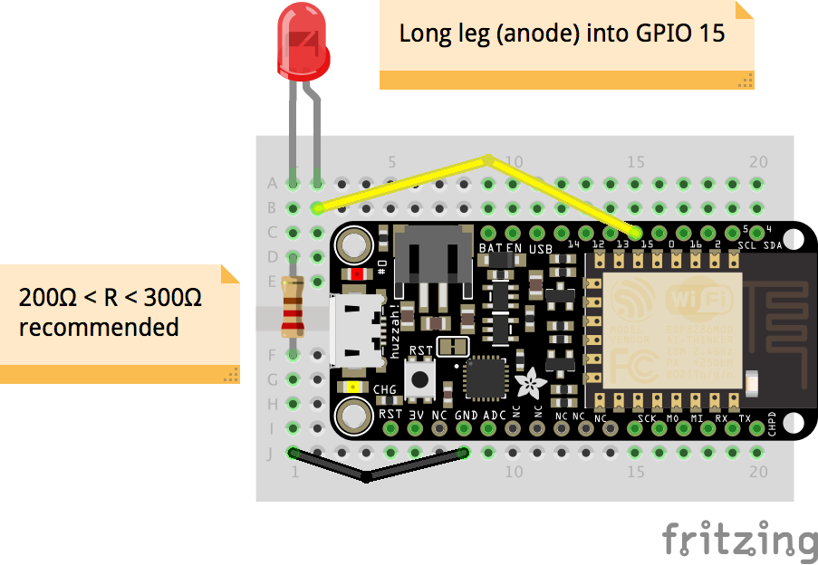

--

## Alternativa - PyBoard

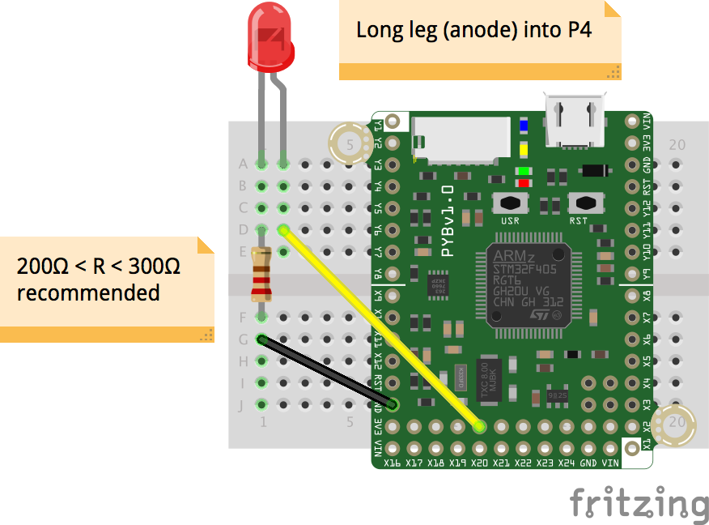

--

## Alternativa - NodeMCU v3

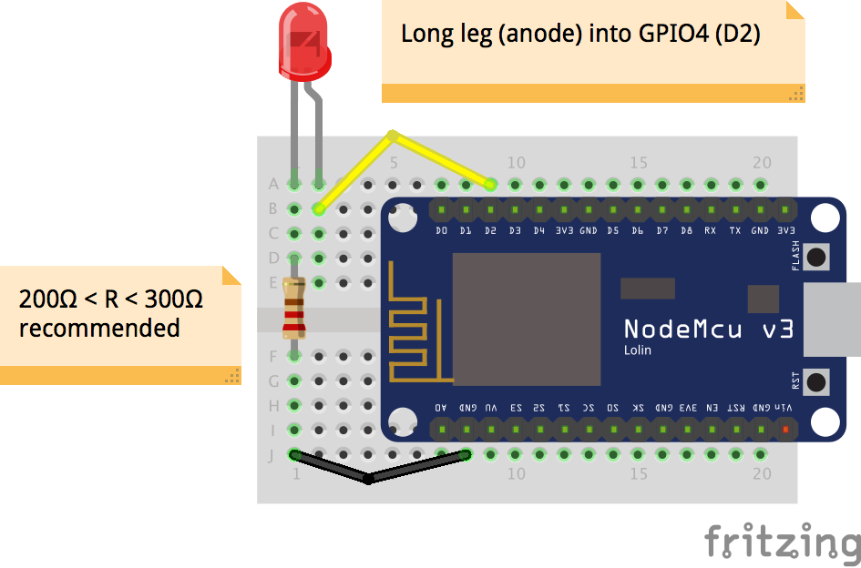

---

Ejecutar esta en (USB o web) REPL

```python
import machine
import time

pin_id = 4  # NodeMCU
            # PyBoard = 'A14'
            # Huzzah Feather = 15
led = machine.Pin(pin_id, machine.Pin.OUT)
while True:
    led.high()
    time.sleep(0.5)
    led.low()
    time.sleep(0.5)
```

salida del Bucle con `Ctrl-c`

--

## LEDs incorporados (PyBoard)

| Nombre físico | Nombre de la CPU | Descripción del LED |
| ------------- | ---------------- | ------------------- |
| P2            | B4               | LED azul            |
| P3            | A15              | LED amarillo        |
| P4            | A14              | LED verde           |
| P5            | A13              | LED rojo            |

--

## LEDs incorporados (Huzzah)

- LED rojo en el pin 0
- LED azul en el pin 2

---

## Si tiene éxito, deberías ver esto


---

## Cambio de la frecuencia de parpadeo

- Probablemente notó que la luz parpadea cada 0,5 segundos.
- Cambie el código para que parpadee a una velocidad diferente y luego vuelva a ejecutarlo para asegurarse de que funciona.
- Si está atascado, presione &darr; para ver una solución potencial

--

```python
import machine
import time

pin_id = 4  # NodeMCU
            # PyBoard = 'A14'
            # Huzzah Feather = 15
led = machine.Pin(pin_id, machine.Pin.OUT)
while True:
    led.high()
    time.sleep(3.0)
    led.low()
    time.sleep(3.0)
```

---

## Desafíos del LED

Ahora que tiene los fundamentos de los LEDs, puede pasar al siguiente componente o trabajar en algunos desafíos de los LEDs.

- Pulse &rarr; para pasar al siguiente componente
- Pulse &darr; para desplazarse por los desafíos de los LEDs

--

## Desafíos del LED

_¡Intenta resolverlos tú mismo antes de mirar la solución!_

Pulse &darr; para desplazarse por los siguientes retos (y posibles soluciones)

1. Múltiples luces
2. Luces navideñas
3. Contador binario

--

### 1. Múltiples luces

Haga que 2 (o más) luces se alternen parpadeando


--

### Solución Potencial de Múltiples Luces - Hardware


--

### Solución Potencial de Múltiples Luces - Código

```js
var five = require("johnny-five");
var board = new five.Board();

board.on("ready", function() {
  var led1 = new five.Led(10);
  var led2 = new five.Led(11);
  var flag = false;

  setInterval(function() {
    if (flag) {
      led1.on();
      led2.off();
    } else {
      led1.off();
      led2.on();
    }

    flag = !flag;
  }, 500);
});
```

--

### 2. Luces navideñas

#### Haz que un LED (o varios LEDs) pasen por diferentes configuraciones, como hacen algunas luces navideñas. Debería cambiar el ajuste cada pocos segundos. A continuación se muestran algunos ejemplos de configuración. Puede ver un ejemplo en la siguiente diapositiva.

- Apagado
- Sólido
- Parpadeando
- Pulsos (desvanecimiento hacia adentro y hacia afuera)
- Diferentes velocidades de parpadeo, pulsación o alternancia
- Alternando qué luces están encendidas

--

### 2. Luces navideñas


--

### Potencial solución de luces navideñas - Hardware


--

### Potencial solución para las luces navideñas - Código

```js
var five = require("johnny-five");
var board = new five.Board();

board.on("ready", function() {
  var led = new five.Led(11);
  var setting = 0;

  setInterval(function() {
    led.stop(); // If we call pulse, we need to stop it
    switch (setting) {
      case 0:
        led.pulse();
        break;
      case 1:
        led.off();
        break;
      case 2:
        led.on();
        break;
    }
    setting = (setting + 1) % 3;
  }, 3000);
});
```

--

### 2. Luces navideñas (bonos)

1. Exponer una función a la REPL que le permite cambiar a la siguiente configuración desde la REPL
2. Añada un botón que, al pulsarlo, pase a la siguiente configuración (Nota: debe completar las diapositivas del componente de botones antes de intentarlo).

--

### Potencial solución de Bonus 1 para luces navideñas - Hardware


--

### Posible solución de bonificación por luces navideñas 1 - Código

```js
var five = require("johnny-five");
var board = new five.Board();

board.on("ready", function() {
  var led = new five.Led(11);
  var setting = 0;

  function changeSetting() {
    led.stop(); // Si llamamos al pulso, tenemos que detenerlo
    switch (setting) {
      case 0:
        led.pulse();
        break;
      case 1:
        led.off();
        break;
      case 2:
        led.on();
        break;
    }
    setting = (setting + 1) % 3;
  }

  this.repl.inject({
    cs: changeSetting // Ahora podemos llamar a cs() desde el REPL
  });
});
```

--

### Potencial solución para luces navideñas Bonus 2

¡Estás por tu cuenta en esto!

--

### 3. Contador binario

Usando 3 LEDs, cuente de 0 a 7 en binario como se muestra a continuación. Encendido(On) representa 1 y Apagado(off) repesentes 0.


--

### Solución de contador binario potencial - Hardware


--

### Solución de contador binaria potencial (alt 1) - Código

```js
var five = require("johnny-five");
var board = new five.Board();

board.on("ready", function() {
  var led1 = new five.Led(9);
  var led2 = new five.Led(10);
  var led3 = new five.Led(11);
  var num = 0;

  setInterval(function() {
    var binary = num.toString(2);

    binary.slice(-1) === "1" ? led1.on() : led1.off();
    binary.slice(-2, -1) === "1" ? led2.on() : led2.off();
    binary.slice(-3, -2) === "1" ? led3.on() : led3.off();

    num = (num + 1) % 8;
  }, 1000);
});
```

--

### Solución de contador binaria potencial (alt 2) - Código

```js
var five = require("johnny-five");
var board = new five.Board();

board.on("ready", function() {
  var leds = [new five.Led(9), new five.Led(10), new five.Led(11)];
  var num = 0;

  setInterval(function() {
    var mask = 1;

    for (var i = 0; i < leds.length; ++i, mask <<= 1) {
      var led = led[i];
      num & mask ? led.on() : led.off();
    }

    num = (num + 1) % 8;
  }, 1000);
});
```

--

### 3. Contador binario (Bono)

Permite al usuario introducir un número a través de la REPL y mostrarlo en binario en los LEDs.

--

### Solución potencial de bono de contador binario

¡Estás por tu cuenta en esto!

---

## Componentes que estamos cubriendo

- Programación en red con ESP8266
- LEDs (diodos emisores de luz)
- <span style="color: yellow">Botones </span>
- Servos
- Aplicaciones de IO con MQTTT

---

## Botones


---

## Construye Esto


---

## Guarda esto en un archivo y ejecútalo

```js
var five = require("johnny-five");
var board = new five.Board();

board.on("ready", function() {
  var button = new five.Button(2);

  button.on("press", function() {
    console.log("Button Pressed!");
  });

  button.on("hold", function() {
    console.log("Button Held!");
  });

  button.on("release", function() {
    console.log("Button Released!");
  });
});
```

`node button.js`

---

Intente presionar, soltar y mantener presionado el botón

Debería ver alguna salida como esta en el REPL

```

>> Botón pulsado!
Botón liberado!
Botón pulsado!
Botón liberado!
Botón pulsado!
Botón retenido!
Botón retenido!
Botón liberado!
```

---

## ¡Añadamos un LED!


---

## Guarda esto en un archivo y ejecútalo

```js
var five = require("johnny-five");
var board = new five.Board();

board.on("ready", function() {
  var led = new five.Led(11);
  var button = new five.Button(2);

  button.on("press", function() {
    led.on();
  });

  button.on("hold", function() {
    led.blink(50);
  });

  button.on("release", function() {
    led.stop().off();
  });
});
```

`node button_led.js`

---

El LED debe encenderse al presionar, apagarse al soltarlo y parpadear al mantenerlo presionado.

---

## Desafíos de los botones

Ahora que tiene los conceptos básicos de los botones, puede pasar al siguiente componente o trabajar en algunos desafíos de botones.

- Pulse &rarr; para pasar al siguiente componente
- Presione &darr; para desplazarse por los desafíos del botón

--

## Desafíos de los botones

_¡Intenta resolverlos tú mismo antes de mirar la solución!_

Pulse &darr; para desplazarse por los siguientes retos (y posibles soluciones)

1. Interruptor de luz
2. Clave de acceso
3. Luces navideñas

--

### 1. Interruptor de luz

Haga que al presionar un botón alternativamente encienda y apague un LED

--

### Solución de interruptor de luz potencial - Hardware


--

### Solución de interruptor de luz potencial - Código

```js
var five = require("johnny-five");
var board = new five.Board();

board.on("ready", function() {
  var led = new five.Led(11);
  var button = new five.Button(2);
  var on = false;

  button.on("press", function() {
    if (on) {
      led.off();
    } else {
      led.on();
    }

    on = !on;
  });
});
```

--

### 2. Clave de acceso

Dispone de 2 botones y 1 LED. Hágalo de manera que tenga que presionar los botones en cierto orden para encender el LED.

--

### Posible solución de código de acceso - Hardware


--

### Posible solución de código de acceso - Código

```js
var five = require("johnny-five");
var board = new five.Board();

board.on("ready", function() {
  var led = new five.Led(11);
  var button1 = new five.Button(2);
  var button2 = new five.Button(4);

  var passcode = "12112";
  var presses = "";

  button1.on("press", function() {
    presses += "1";
    if (presses.indexOf(passcode) > -1) {
      led.on();
    }
  });

  button2.on("press", function() {
    presses += "2";
    if (presses.indexOf(passcode) > -1) {
      led.on();
    }
  });
});
```

--

### 3. Luces navideñas

#### Haz que un LED (o varios LEDs) pasen por diferentes configuraciones, como hacen algunas luces navideñas. Debe cambiar el ajuste cada vez que se pulsa el botón. A continuación se muestran algunos ejemplos de configuración.

- Apagado
- Sólido
- Parpadeando
- Pulsos (desvanecimiento hacia adentro y hacia afuera)
- Diferentes velocidades de parpadeo, pulsación o alternancia
- Alternando qué luces están encendidas

--

### Potencial solución para las luces navideñas

¡Estás por tu cuenta en esto!

---

## Componentes que estamos cubriendo

- Programación en red con ESP8266
- LEDs (diodos emisores de luz)
- Botones
- <span style="color: yellow"> Servos </span>

---

## <span class="spin">S</span><span class="spin">E</span><span class="spin">R</span><span class="spin">V</span><span class="spin">O</span><span class="spin">S</span>


---

Toma tu servo y añádele uno de los adjuntos.


---

## Construye esto


---

## Guarda esto en un archivo y ejecútalo

```js
var five = require("johnny-five");
var board = new five.Board();

board.on("ready", function() {
  var servo = new five.Servo(11);

  this.repl.inject({
    servo: servo
  });
});
```

`node servo.js`

---

Escribe estos comandos en la REPL y observa cómo reacciona el servo

```js
> servo.to(10);   // muevete a 10 grados

> servo.to(200);  // muevete a 200 grados

> servo.value;    // Obtener posición actual

> servo.min();

> servo.max();

> servo.range;

> servo.center();

> servo.sweep();
```

---

## Servo Challenges

Ahora que tienes los fundamentos de los servos, puedes pasar al siguiente componente o trabajar en algunos desafíos de los servos.

Pulse &rarr; para pasar al siguiente componente
Pulse &darr; para desplazarse por los desafíos de los servos

--

## Servo Challenges

_¡Intenta resolverlos tú mismo antes de mirar la solución!_

Pulse &darr; para desplazarse por los siguientes retos (y posibles soluciones)

1. Rociador
2. Flechas
3. Botón

--

### 1. Rociador

Haz que el servo gire de un lado a otro como si fuera un aspersor.


--

### Solución potencial de rociadores - Hardware


--

### Solución potencial de rociadores - Código

```js
var five = require("johnny-five");
var board = new five.Board();

board.on("ready", function() {
  var servo = new five.Servo(11);
  var min = servo.range[0];
  var max = servo.range[1];
  var value = min;

  function step() {
    servo.to(value);
    value = (value + 45) % max;
    setTimeout(step, 500);
  }

  step();
});
```

--

### 2. Flechas

Haz que al presionar el botón de flecha izquierda gire el servo en una dirección y al presionar el botón de flecha derecha gire en la otra dirección.


--

### Solución de Flechas Potenciales - Hardware


--

### Solución de flechas potenciales - Código

```js
var five = require("johnny-five");
var keypress = require("keypress");
var board = new five.Board();

board.on("ready", function() {
  var servo = new five.Servo(11);

  process.stdin.on("keypress", function(ch, key) {
    if (key && key.name === "left") {
      servo.min();
    } else if (key && key.name === "right") {
      servo.max();
    }
  });

  process.stdin.setRawMode(true);
  process.stdin.resume();
});
```

--

### 3. Botón

Haz que el servo barra mientras se mantiene pulsado un botón


--

### Potencial Solución de Botón - Hardware


--

### Potencial Solución de Botón - Código

```js
var five = require("johnny-five");
var board = new five.Board();

board.on("ready", function() {
  var servo = new five.Servo(11);
  var button = new five.Button(2);

  button.on("press", function() {
    servo.sweep();
  });

  button.on("release", function() {
    servo.stop();
  });
});
```

---

Uh oh oh! Nos quedamos sin Diapositivas! Siéntase libre de probar algunos de los otros componentes de su kit mientras nosotros añadimos más!

---

## Liquidacion

- Gracias por venir!
- Nos encantaría conocer su opinión: [bit.ly/cubantech-nodebots-feedback](http://bit.ly/nodebots-feedback)
- Por favor, guarde los kits (puede comprar los suyos propios[aquí](http://www.seeedstudio.com/depot/ARDX-The-starter-kit-for-Arduino-p-1153.html))
