## Nodebots con CubanTech (<del>NYJS</del> ;)

#### Estas diapositivas: [slides.cuban.tech/nodebots.html](http://slides.cuban.tech/nodebots.html)

---

### Información Wifi

Red: cubantech

Contraseña: meet-ups

---

### Si aún no lo has hecho, instala Node

##### [Descarga Node](https://nodejs.org/en/download/)

##### [Descarga Node de LAN](ftp://qnap01.local/Public/soft/nodejs)

---

- Este taller se basa en gran medida en un taller de [NY-Javascript](http://www.meetup.com/NY-Javascript) (ver [bit.ly/nyjs-nodebots](http://bit.ly/nyjs-nodebots))
- ... que se basa en gran medida en un taller de [Francis Gulotta](https://twitter.com/reconbot) y [Rick Waldron](https://twitter.com/rwaldron)
- Puede encontrar las diapositivas para ese taller en [gul.ly/3tjj](http://gul.ly/3tjj)
- Puedes inscribirte en uno de sus talleres en la página [Nodebots NYC Meetup page](http://www.meetup.com/nodebots/)

---

## Nuestros lineamientos de la comunidad

[Ser excelente el uno con el otro](https://github.com/nodeschool/havana/blob/master/Code_of_Conduct.md)

---

Próximos Eventos CubanTech

- [Encuentros CubanTech](http://meetup.cuban.tech)
- [Encuentros Docker en Cuba](http://docker.cuban.tech)
- [Encuentros Blockstack Cuba](http://blockstack.cuban.tech)
- [SciPyLA 2019](http://conf.scipyla.org)

---

# Muchisimas gracias a nuestro anfitrión

---

## ¿Qué son los Nodebots?


---

## JavaScript + Robots = Nodebots

---

# ¡Comencemos!

---

## Nuestro hardware

[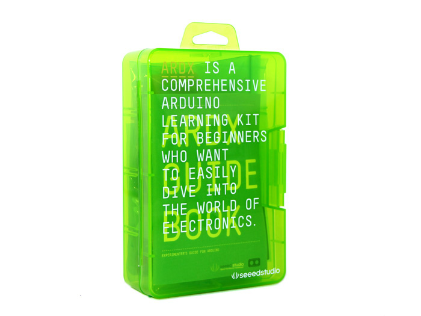](http://www.seeedstudio.com/depot/ARDX-The-starter-kit-for-Arduino-p-1153.html)

---

## Nuestro hardware

[](http://www.seeedstudio.com/depot/ARDX-The-starter-kit-for-Arduino-p-1153.html)

---

## A los Kits les puede faltar equipo

---

Si tiene problemas para encontrar un componente, háganoslo saber y le conseguiremos un reemplazo.

---

## ¿No funciona?

## ¡Probablemente hardware!

---

## Componentes que estamos cubriendo

- LEDs (diodos emisores de luz)
- Botones
- Servos

---

Siéntase libre de seleccionar los componentes que más le gusten y completar los retos que más le interesen.

---

# Empezando

--

## Instalar un nodo si aún no lo ha hecho

[Descarga node desde Internet](https://nodejs.org/en/download/)

[Descarga Node desde LAN](ftp://qnap01.local/Public/soft/nodejs)

--

## Crear directorio de proyectos

```sh
mkdir nodebots
cd nodebots
```

--

## Instala Johnny Five

```sh
npm install johnny-five
```

---

# Para Empezar

.... con ....


--

TODO : Instalación de Document Docker

---

## Estándar Firmata

- Permite a Johnny-Five comunicarse con el Arduino a través de USB
- La mayoría de los Arduinos ya tienen instalados los Estándar Firmatas de talleres anteriores
- Vamos a comprobar que tu Arduino ya tiene instalado el Estándar Firmata!

---

## Conecta el arduino

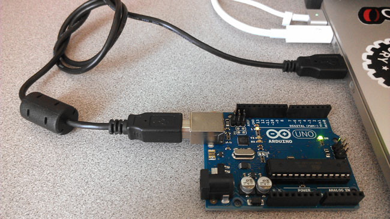

---

Crear el fichero

1. Ve a tu directorio de nodebots
2. Cree un archivo llamado test.js
3. Copie el código que aparece a continuación y guarde

```js
var five = require("johnny-five");
var board = new five.Board();

board.on("ready", function() {
  var led = new five.Led(13);

  led.blink(500);
});
```

---

Ejecute el código

```sh
node test.js
```

---

## Este LED debería estar parpadeando cada 0.5 segundos


---

Si funciona, ¡continúe! &rarr;

---

Si no es así, pulsa &darr; para obtener instrucciones sobre cómo flashear tu Arduino con Estándar Firmata

--

## Cómo flashear tu Arduino con Firmata estándar (mas)

1. Descargue el[Arduino IDE](https://www.arduino.cc/en/main/software)
2. Asegúrate de que tu Arduino está conectado vía USB
3. Abra el IDE de Arduino
4. Seleccione: Archivo > Ejemplos > Firmata > StandardFirmataPlus
5. Seleccione: Herramientas > Tablero > Arduino/Genuino Uno
6. Seleccione: Herramientas > Puerto > <tu Arduino>
7. Haga clic en el botón Upload 
8. Vuelva a intentar hacer que el LED parpadee

---

## Componentes que estamos cubriendo

- <span style="color:yellow"> LEDs (diodos emisores de luz) </span>
- Botones
- Servos

---

## LEDs

#### <span class="red-led">Luz</span> <span class="green-led">Emision</span> <span class="blue-led">Diodos</span>


---

## Identificación de Pines LED

- El pin largo es positiva (y pone en energía)
- El pin corto es negativo (y va a tierra)


---

## Construye Esto

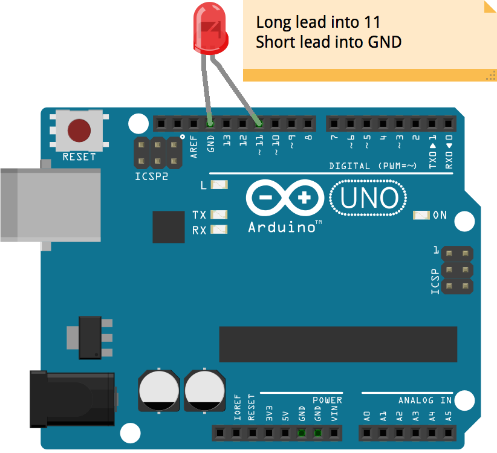

---

Guarde esto en un archivo y ejecútelo

```js
var five = require("johnny-five");
var board = new five.Board();

board.on("ready", function() {
  var led = new five.Led(11);

  // "blink" the led in 500ms on-off phase periods
  led.blink(500);
});
```

`node blinky.js`

---

## Si tiene éxito, deberías ver esto

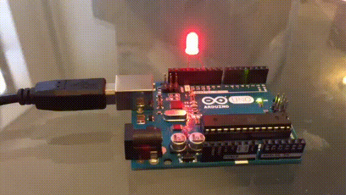

---

## Cambio de la frecuencia de parpadeo

- Probablemente notó que la luz parpadea cada 0,5 segundos.
- Cambie el código para que parpadee a una velocidad diferente y luego vuelva a ejecutarlo para asegurarse de que funciona.
- Si está atascado, presione &darr; para ver una solución potencial

--

```js
var five = require("johnny-five");
var board = new five.Board();

board.on("ready", function() {
  var led = new five.Led(11);

  // "blink" the led in 3000ms on-off phase periods
  led.blink(3000);
});
```

`node blinky.js`

---

## El REPL

- Significa Read Evaluate Print Loop (Leer Evaluar ciclo de impresión )
- Nos permite escribir el código en nuestro terminal y ver cómo afecta a nuestros robots.

---

## Escribe y ejecuta esto. Luego, continúe con la siguiente diapositiva.

```js
var five = require("johnny-five");
var board = new five.Board();

board.on("ready", function() {
  var led = new five.Led(11);

  this.repl.inject({
    led: led
  });
});
```

`node led-boss.js`

---

## Escriba estos comandos en el REPL y observe cómo cambia el LED

```
> led.on();

> led.off();

> led.blink();

> led.stop();

> led.pulse();
```

---

## Inyección REPL

La razón por la que podemos acceder al objeto led en el REPL es por este bit de código en el ejemplo anterior. Expone el objeto led a nuestra sesión REPL.

```js
this.repl.inject({
  led: led
});
```

---

## Breadboards: Cableado sin soldadura

#### Los Breadboards nos permiten cablear rápidamente los componentes para hacer prototipos

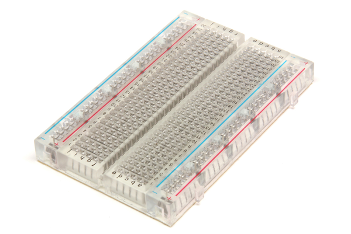

---

## Breadboards: Conexiones eléctricas

- #### Aquí puedes ver cómo se conectan las diferentes filas y columnas.
- #### Si no está claro, no dudes en buscar en Google o pedirle a un voluntario que te lo explique.

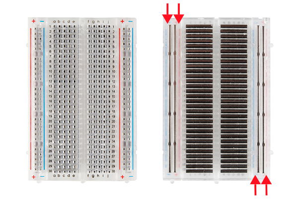

## Usa tu protoboard y un par de cables (el color no importa) para construir esto

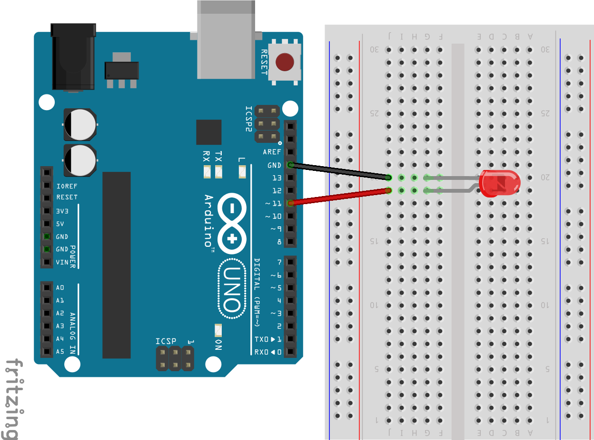

---

Ahora ejecute uno de sus programas anteriores y asegúrese de que el LED siga parpadeando

---

## Desafíos del LED

Ahora que tiene los fundamentos de los LEDs, puede pasar al siguiente componente o trabajar en algunos desafíos de los LEDs.

- Pulse &rarr; para pasar al siguiente componente
- Pulse &darr; para desplazarse por los desafíos de los LEDs

--

## Desafíos del LED

_¡Intenta resolverlos tú mismo antes de mirar la solución!_

Pulse &darr; para desplazarse por los siguientes retos (y posibles soluciones)

1. Múltiples luces
2. Luces navideñas
3. Contador binario

--

### 1. Múltiples luces

Haga que 2 (o más) luces se alternen parpadeando

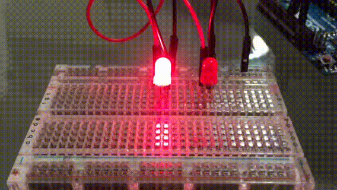

--

### Solución Potencial de Múltiples Luces - Hardware

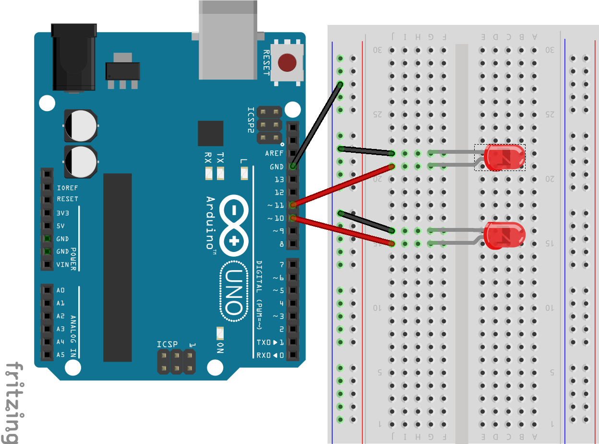

--

### Solución Potencial de Múltiples Luces - Código

```js
var five = require("johnny-five");
var board = new five.Board();

board.on("ready", function() {
  var led1 = new five.Led(10);
  var led2 = new five.Led(11);
  var flag = false;

  setInterval(function() {
    if (flag) {
      led1.on();
      led2.off();
    } else {
      led1.off();
      led2.on();
    }

    flag = !flag;
  }, 500);
});
```

--

### 2. Luces navideñas

#### Haz que un LED (o varios LEDs) pasen por diferentes configuraciones, como hacen algunas luces navideñas. Debería cambiar el ajuste cada pocos segundos. A continuación se muestran algunos ejemplos de configuración. Puede ver un ejemplo en la siguiente diapositiva.

- Apagado
- Sólido
- Parpadeando
- Pulsos (desvanecimiento hacia adentro y hacia afuera)
- Diferentes velocidades de parpadeo, pulsación o alternancia
- Alternando qué luces están encendidas

--

### 2. Luces navideñas


--

### Potencial solución de luces navideñas - Hardware


--

### Potencial solución para las luces navideñas - Código

```js
var five = require("johnny-five");
var board = new five.Board();

board.on("ready", function() {
  var led = new five.Led(11);
  var setting = 0;

  setInterval(function() {
    led.stop(); // Si llamamos al pulso, tenemos que detenerlo
    switch (setting) {
      case 0:
        led.pulse();
        break;
      case 1:
        led.off();
        break;
      case 2:
        led.on();
        break;
    }
    setting = (setting + 1) % 3;
  }, 3000);
});
```

--

### 2. Luces navideñas (bonos)

1. Exponer una función a la REPL que le permite cambiar a la siguiente configuración desde la REPL
2. Añada un botón que, al pulsarlo, pase a la siguiente configuración (Nota: debe completar las diapositivas del componente de botones antes de intentarlo).

--

### Potencial solución de Bonus 1 para luces navideñas - Hardware


--

### Posible solución de bonificación por luces navideñas 1 - Código

```js
var five = require("johnny-five");
var board = new five.Board();

board.on("ready", function() {
  var led = new five.Led(11);
  var setting = 0;

  function changeSetting() {
    led.stop(); // If we call pulse, we need to stop it
    switch (setting) {
      case 0:
        led.pulse();
        break;
      case 1:
        led.off();
        break;
      case 2:
        led.on();
        break;
    }
    setting = (setting + 1) % 3;
  }

  this.repl.inject({
    cs: changeSetting // Now we can call cs() from the REPL
  });
});
```

--

### Potencial solución de Bonus 2 para luces navideñas

¡Estás por tu cuenta en esto!

--

### 3. Contador binario

Usando 3 LEDs, cuente de 0 a 7 en binario como se muestra a continuación. Encendido(On) representa 1 y apagado(off) representa 0.


--

### Solución de contador binario potencial - Hardware


--

### Solución de contador binaria potencial (alt 1) - Código

```js
var five = require("johnny-five");
var board = new five.Board();

board.on("ready", function() {
  var led1 = new five.Led(9);
  var led2 = new five.Led(10);
  var led3 = new five.Led(11);
  var num = 0;

  setInterval(function() {
    var binary = num.toString(2);

    binary.slice(-1) === "1" ? led1.on() : led1.off();
    binary.slice(-2, -1) === "1" ? led2.on() : led2.off();
    binary.slice(-3, -2) === "1" ? led3.on() : led3.off();

    num = (num + 1) % 8;
  }, 1000);
});
```

--

### Solución de contador binaria potencial (alt 2) - Código

```js
var five = require("johnny-five");
var board = new five.Board();

board.on("ready", function() {
  var leds = [new five.Led(9), new five.Led(10), new five.Led(11)];
  var num = 0;

  setInterval(function() {
    var mask = 1;

    for (var i = 0; i < leds.length; ++i, mask <<= 1) {
      var led = led[i];
      num & mask ? led.on() : led.off();
    }

    num = (num + 1) % 8;
  }, 1000);
});
```

--

### 3. Contador binario (Bono)

Permite al usuario introducir un número a través de la REPL y mostrarlo en binario en los LEDs.

--

### Solución potencial de bono de contador binario

¡Estás por tu cuenta en esto!

---

## Componentes que estamos cubriendo

- LEDs (diodos emisores de luz)
- <span style="color: yellow">Botones </span>
- Servos

---

## Botones


---

## Construye esto

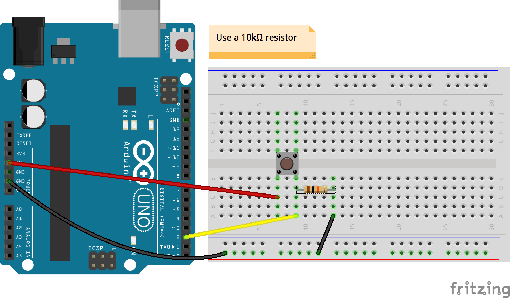

---

## Guarda esto en un archivo y ejecútalo

```js
var five = require("johnny-five");
var board = new five.Board();

board.on("ready", function() {
  var button = new five.Button(2);

  button.on("press", function() {
    console.log("Button Pressed!");
  });

  button.on("hold", function() {
    console.log("Button Held!");
  });

  button.on("release", function() {
    console.log("Button Released!");
  });
});
```

`node button.js`

---

Intente presionar, soltar y mantener presionado el botón

Debería ver alguna salida como esta en el REPL

```
>> Botón pulsado!
Botón liberado!
Botón pulsado!
Botón liberado!
Botón pulsado!
Botón retenido!
Botón retenido!
Botón liberado!
```

---

## ¡Añadamos un LED!

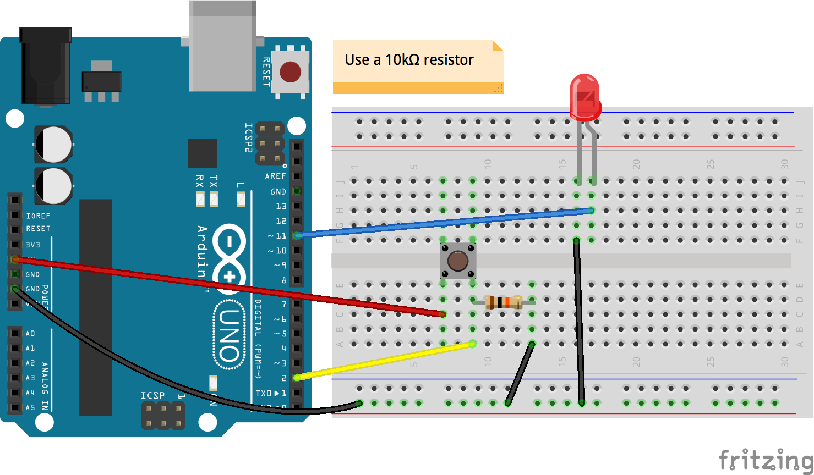

---

## Guarda esto en un archivo y ejecútalo

```js
var five = require("johnny-five");
var board = new five.Board();

board.on("ready", function() {
  var led = new five.Led(11);
  var button = new five.Button(2);

  button.on("press", function() {
    led.on();
  });

  button.on("hold", function() {
    led.blink(50);
  });

  button.on("release", function() {
    led.stop().off();
  });
});
```

`node button_led.js`

---

El LED debe encenderse al presionar, apagarse al soltarlo y parpadear al mantenerlo presionado.

---

## Desafíos de los botones

Ahora que tiene los conceptos básicos de los botones, puede pasar al siguiente componente o trabajar en algunos desafíos de botones.

- Pulse &rarr; para pasar al siguiente componente
- Presione &darr; para desplazarse por los desafíos del botón

--

## Desafíos de los botones

_¡Intenta resolverlos tú mismo antes de mirar la solución!_

Pulse &darr; para desplazarse por los siguientes retos (y posibles soluciones)

1. Interruptor de luz
2. Clave de acceso
3. Luces navideñas

--

### 1. Interruptor de luz

Haga que al presionar un botón alternativamente encienda y apague un LED

--

### Solución de interruptor de luz potencial - Hardware


--

### Solución de interruptor de luz potencial - Código

```js
var five = require("johnny-five");
var board = new five.Board();

board.on("ready", function() {
  var led = new five.Led(11);
  var button = new five.Button(2);
  var on = false;

  button.on("press", function() {
    if (on) {
      led.off();
    } else {
      led.on();
    }

    on = !on;
  });
});
```

--

### 2. Clave de acceso

Dispone de 2 botones y 1 LED. Hágalo de manera que tenga que presionar los botones en cierto orden para encender el LED.

--

### Posible solución de código de acceso - Hardware

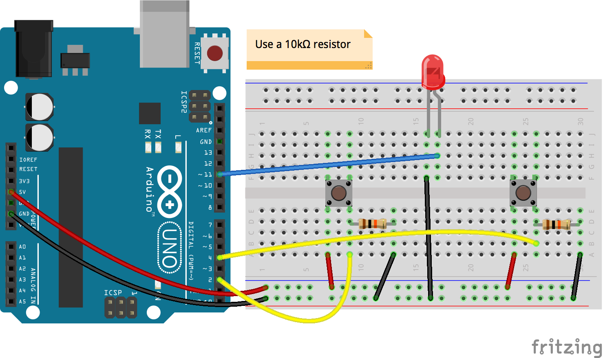

--

### Posible solución de código de acceso - Código

```js
var five = require("johnny-five");
var board = new five.Board();

board.on("ready", function() {
  var led = new five.Led(11);
  var button1 = new five.Button(2);
  var button2 = new five.Button(4);

  var passcode = "12112";
  var presses = "";

  button1.on("press", function() {
    presses += "1";
    if (presses.indexOf(passcode) > -1) {
      led.on();
    }
  });

  button2.on("press", function() {
    presses += "2";
    if (presses.indexOf(passcode) > -1) {
      led.on();
    }
  });
});
```

--

### 3. Luces navideñas

#### Haz que un LED (o varios LEDs) pasen por diferentes configuraciones, como hacen algunas luces navideñas. Debe cambiar el ajuste cada vez que se pulsa el botón. A continuación se muestran algunos ejemplos de configuración.

- Apagado
- Sólido
- Parpadeando
- Pulsos (desvanecimiento hacia adentro y hacia afuera)
- Diferentes velocidades de parpadeo, pulsación o alternancia
- Alternando qué luces están encendidas

--

### Potencial solución para las luces navideñas

¡Estás por tu cuenta en esto!

---

## Componentes que estamos cubriendo

- LEDs (diodos emisores de luz)
- Botones
- <span style="color: yellow">Servos </span>

---

## <span class="spin">S</span><span class="spin">E</span><span class="spin">R</span><span class="spin">V</span><span class="spin">O</span><span class="spin">S</span>

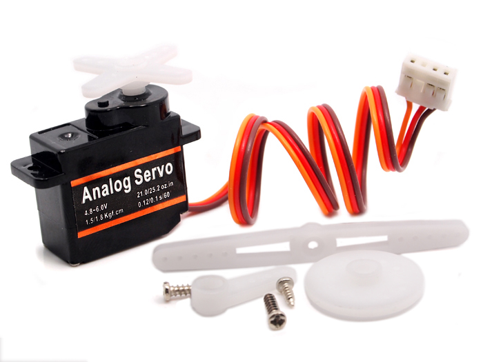

---

Toma tu servo y añádele uno de los adjuntos.


---

## Construye esto

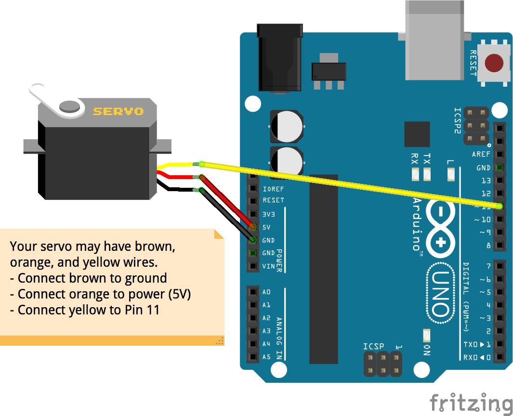

---

## Guarda esto en un archivo y ejecútalo

```js
var five = require("johnny-five");
var board = new five.Board();

board.on("ready", function() {
  var servo = new five.Servo(11);

  this.repl.inject({
    servo: servo
  });
});
```

`node servo.js`s

---

Escribe estos comandos en la REPL y observa cómo reacciona el servo

```js
> servo.to(10); // Mover a 10 grados

> servo.to(200); // Mover a 200 grados

> servo.value; // Obtener la posición actual

> servo.min();

> servo.max();

> servo.range;

> servo.center();

> servo.sweep();
```

---

## Servo Desafios

Ahora que tienes los fundamentos de los servos, puedes pasar al siguiente componente o trabajar en algunos desafíos de los servos.

Pulse &rarr; para pasar al siguiente componente
Pulse &darr; para desplazarse por los desafíos de los servos

--

## Servo Desafios

_¡Intenta resolverlos tú mismo antes de mirar la solución!_

Pulse &darr; para desplazarse por los siguientes retos (y posibles soluciones)

1. Rociador
2. Flechas
3. Botón

--

### 1. Rociador

Haz que el servo gire de un lado a otro como si fuera un aspersor.

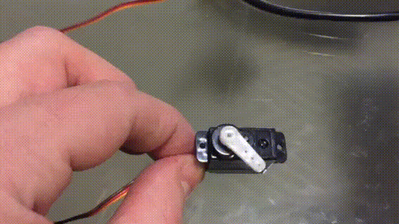

--

### Solución potencial de rociadores - Hardware


--

### Solución potencial de rociadores - Código

```js
var five = require("johnny-five");
var board = new five.Board();

board.on("ready", function() {
  var servo = new five.Servo(11);
  var min = servo.range[0];
  var max = servo.range[1];
  var value = min;

  function step() {
    servo.to(value);
    value = (value + 45) % max;
    setTimeout(step, 500);
  }

  step();
});
```

--

### 2. Flechas

Haz que al presionar el botón de flecha izquierda gire el servo en una dirección y al presionar el botón de flecha derecha gire en la otra dirección.


--

### Solución de Flechas Potenciales - Hardware


--

### Solución de flechas potenciales - Código

```js
var five = require("johnny-five");
var keypress = require("keypress");
var board = new five.Board();

board.on("ready", function() {
  var servo = new five.Servo(11);

  process.stdin.on("keypress", function(ch, key) {
    if (key && key.name === "left") {
      servo.min();
    } else if (key && key.name === "right") {
      servo.max();
    }
  });

  process.stdin.setRawMode(true);
  process.stdin.resume();
});
```

--

### 3. Botón

Haz que el servo barra mientras se mantiene pulsado un botón


--

### Potencial Solución de Botón - Hardware

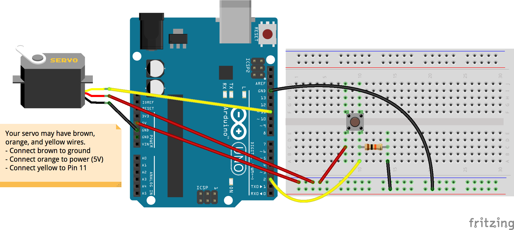

--

### Potencial Solución de Botón - Código

```js
var five = require("johnny-five");
var board = new five.Board();

board.on("ready", function() {
  var servo = new five.Servo(11);
  var button = new five.Button(2);

  button.on("press", function() {
    servo.sweep();
  });

  button.on("release", function() {
    servo.stop();
  });
});
```

---

Uh oh oh! Nos quedamos sin diapositivas! Siéntase libre de probar algunos de los otros componentes de su kit mientras nosotros añadimos más!

---

## Conclusiones

- Gracias por venir!
- Nos encantaría conocer su opinión: [bit.ly/nodebots-feedback](http://bit.ly/nodebots-feedback)
- Por favor, guarde los kits (puede comprar los suyos propios [aquí](http://www.seeedstudio.com/depot/ARDX-The-starter-kit-for-Arduino-p-1153.html))
