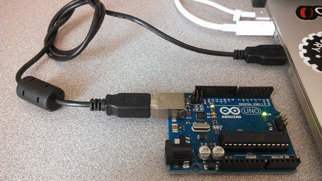
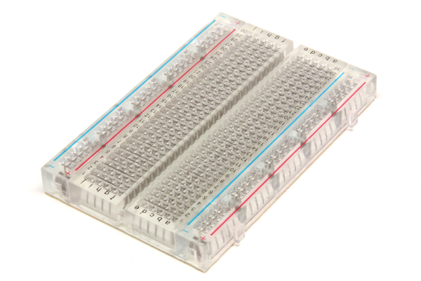
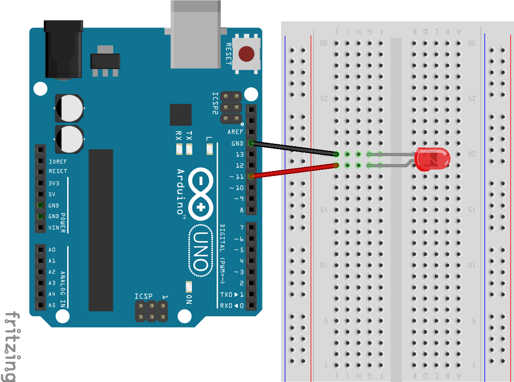
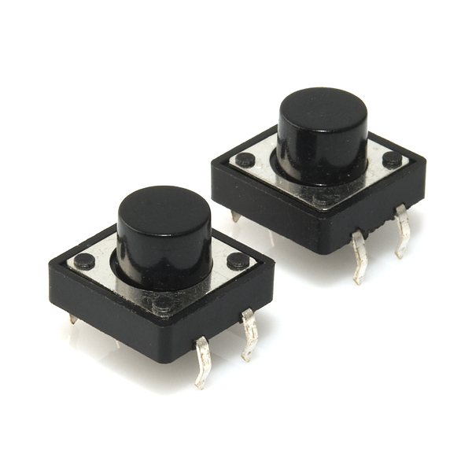
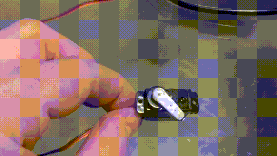
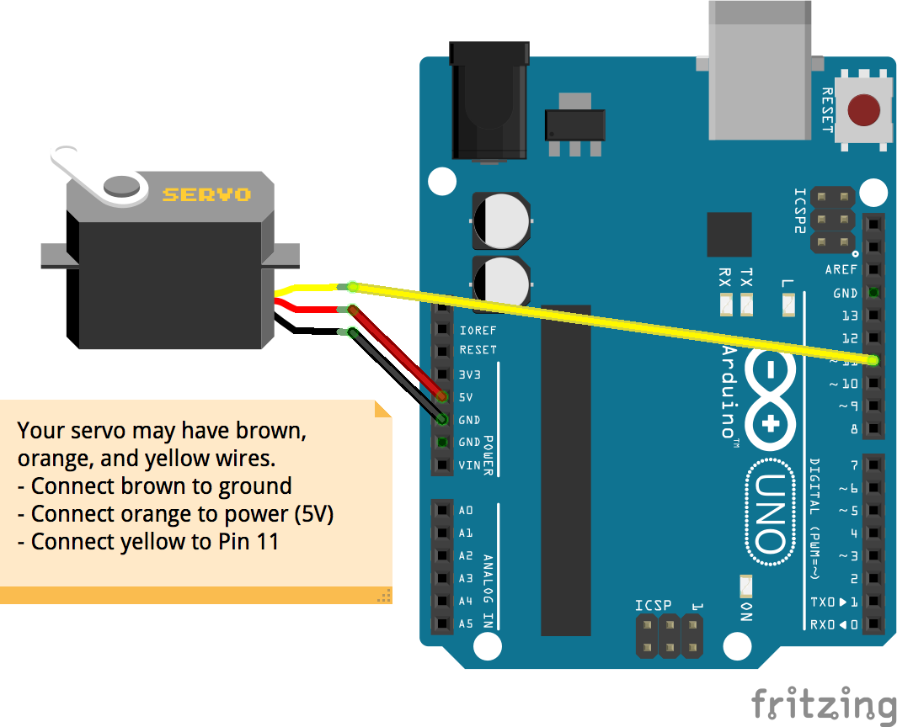

## Nodebots with CubanTech (<del>NYJS</del> ;)

#### These slides: [slides.cuban.tech/nodebots.html](http://slides.cuban.tech/nodebots.html)

----------------

### Wifi Info

Network: cubantech

Password: meet-ups

----------------

### If you haven't already, install Node

##### [Download Node](https://nodejs.org/en/download/)

##### [Download Node from LAN](ftp://qnap01.local/Public/soft/nodejs)

---

- This workshop is based heavily on a workshop by [NY-Javascript](http://www.meetup.com/NY-Javascript) (see [bit.ly/nyjs-nodebots](http://bit.ly/nyjs-nodebots))
- ... which is based heavily on a workshop by [Francis Gulotta](https://twitter.com/reconbot) and [Rick Waldron](https://twitter.com/rwaldron)
- You can find the slides for that workshop at [gul.ly/3tjj](http://gul.ly/3tjj)
- You can sign up for one of their workshops on the [Nodebots NYC Meetup page](http://www.meetup.com/nodebots/)

---

## Our community guidelines

[Be excellent to each other](https://github.com/nodeschool/havana/blob/master/Code_of_Conduct.md)

---

Upcoming CubanTech Events

- [CubanTech meetups](http://meetup.cuban.tech)
- [Docker Cuba meetups](http://docker.cuban.tech)
- [Blockstack Cuba meetups](http://blockstack.cuban.tech)
- [SciPyLA 2019](http://conf.scipyla.org)

---

# Huge thanks to our host

---

## What are Nodebots?


---

## JavaScript + Robots = Nodebots

---

# Let's get started!

---

## Our hardware

[](http://www.seeedstudio.com/depot/ARDX-The-starter-kit-for-Arduino-p-1153.html)

---

## Our hardware

[](http://www.seeedstudio.com/depot/ARDX-The-starter-kit-for-Arduino-p-1153.html)

---

## Kits may be missing equipment

------------

If you have trouble finding a component, let us know and we'll get you a replacement

---

## Not working?

## Probably hardware!

---

## Components We're Covering

- LEDs (Light Emitting Diodes)
- Buttons
- Servos

---

Feel free to select the components you like most and complete the challenges that most interest you

---

# Getting started

--

## Install Node if you haven't already

[Download Node from the Internet](https://nodejs.org/en/download/)

[Download Node from LAN](ftp://qnap01.local/Public/soft/nodejs)

--

## Make project directory

```sh
mkdir nodebots
cd nodebots
```

--

## Install Johnny Five

```sh
npm install johnny-five
```

---

# Getting started

... with ...


--

TODO : Document Docker install

---

## Standard Firmata

- Allows Johnny-Five to communicate with the Arduino over USB
- Most of the Arduinos already have Standard Firmata installed from previous workshops
- Let's check to make sure your Arduino already has Standard Firmata installed!

---

## Connect the arduino


---

Create the file

1. Go to your nodebots directory
2. Create a file called test.js
3. Copy the code below to it and save

```js
var five = require("johnny-five");
var board = new five.Board();

board.on("ready", function() {

  var led = new five.Led(13);

  led.blink(500);
});
```

---

Run the code

```sh
node test.js
```

---

## This LED should be blinking every .5 seconds



---

If it works, continue on! &rarr;

------------

If not, press &darr; for instructions on flashing your Arduino with Standard Firmata

--


## How to flash your Arduino with Standard Firmata (Plus)

1. Download the [Arduino IDE](https://www.arduino.cc/en/main/software)
2. Make sure your Arduino is connected via USB
3. Open the Arduino IDE
4. Select: `File > Examples > Firmata > StandardFirmataPlus`
5. Select: `Tools > Board > Arduino/Genuino Uno`
6. Select: `Tools > Port > <your Arduino>`
7. Click the Upload Button 
8. Retry making that LED blink

---

## Components We're Covering

- <span style="color:yellow"> LEDs (Light Emitting Diodes) </span>
- Buttons
- Servos

---

## LEDs

#### <span class="red-led">LIGHT</span> <span class="green-led">EMITTING</span> <span class="blue-led">DIODES</span>


---

## Identifying LED Pins

- Long pin is positive (and goes to power)
- Short pin is negative (and goes to ground)


---

## Build This


---

Save this to a file and run it

```js
var five = require("johnny-five");
var board = new five.Board();

board.on("ready", function() {

  var led = new five.Led(11);

  // "blink" the led in 500ms on-off phase periods
  led.blink(500);
});
```
`node blinky.js`

---

## If successful, you should see this


---

## Changing the Blink Rate

- You probably noticed the light blinks about every .5 seconds
- Change the code to blink at a different rate and then rerun it to make sure it works
- If you're stuck, press &darr; to see a potential solution

--

```js
var five = require("johnny-five");
var board = new five.Board();

board.on("ready", function() {

  var led = new five.Led(11);

  // "blink" the led in 3000ms on-off phase periods
  led.blink(3000);
});
```

`node blinky.js`

---

## The REPL

- Stands for Read Evaluate Print Loop
- Allows us to type code in our terminal and see it affect our robots

---

## Write and run this. Then, go on to the next slide.

```js
var five = require("johnny-five");
var board = new five.Board();

board.on("ready", function() {
  var led = new five.Led(11);

  this.repl.inject({
    led: led
  });
});
```

`node led-boss.js`

---

## Type these commands in the REPL and watch how the LED changes

```
> led.on();

> led.off();

> led.blink();

> led.stop();

> led.pulse();
```

---

## REPL Inject

The reason we're able to access the led object in the REPL is because of this bit of code in the previous example. It exposes the led object to our REPL session.

```js
this.repl.inject({
  led: led
});
```

---

## Breadboards: Solderless wiring

#### Breadboards allow us to quickly wire components together for prototyping



---

## Breadboards: Electrical Connections

- #### Here you can see how the different rows and columns are connected.
- #### If unclear, don't hesitate to do some Googling or ask a volunteer to explain them further.


## Use your breadboard and a couple of wires (color doesn't matter) to build this



---

Now run one of your programs from before and make sure the LED still blinks

---


## LED Challenges

Now that you've got the basics of LEDs, you can either move on to the next component, or work on some LED challenges

- Press &rarr; to move on to the next component
- Press &darr; to scroll through the LED challenges

--

## LED Challenges

*Try to solve them yourself before looking at the solution!*

Press &darr; to scroll through the following challenges (and potential solutions)

1. Multiple Lights
2. Holiday Lights
3. Binary Counter

--

### 1. Multiple Lights

Have 2 (or more) lights alternate blinking


--

### Potential Multiple Lights Solution - Hardware


--

### Potential Multiple Lights Solution - Code

```js
var five = require("johnny-five");
var board = new five.Board();

board.on("ready", function() {

  var led1 = new five.Led(10);
  var led2 = new five.Led(11);
  var flag = false;

  setInterval(function() {
    if (flag) {
      led1.on();
      led2.off();
    } else {
      led1.off();
      led2.on();
    }

    flag = !flag;
  }, 500);
});
```

--

### 2. Holiday Lights

#### Make an LED (or multiple LEDs) go through different settings like some holiday lights do. It should change the setting every few seconds. Below are some example settings. You can see an example on the next slide.

- Off
- Solid
- Blinking
- Pulsing (fading in and out)
- Different speeds of blinking, pulsing, or alternating
- Alternating which lights are on

--

### 2. Holiday Lights


--

### Potential Holiday Lights Solution - Hardware


--

### Potential Holiday Lights Solution - Code

```js
var five = require("johnny-five");
var board = new five.Board();

board.on("ready", function() {
  var led = new five.Led(11);
  var setting = 0;

  setInterval(function() {
    led.stop();  // If we call pulse, we need to stop it
    switch (setting) {
      case 0:
        led.pulse();
        break;
      case 1:
        led.off();
        break;
      case 2:
        led.on();
        break;
    }
    setting = (setting + 1) % 3;
  }, 3000);
});
```

--


### 2. Holiday Lights (Bonuses)

1. Expose a function to the REPL that allows you to switch to the next setting from the REPL
2. Add a button that when pressed will go to the next setting (N.B: you should complete the Button Component slides before attempting this)

--

### Potential Holiday Lights Bonus 1 Solution - Hardware


--

### Potential Holiday Lights Bonus 1 Solution - Code

```js
var five = require("johnny-five");
var board = new five.Board();

board.on("ready", function() {
  var led = new five.Led(11);
  var setting = 0;

  function changeSetting() {
    led.stop();  // If we call pulse, we need to stop it
    switch (setting) {
      case 0:
        led.pulse();
        break;
      case 1:
        led.off();
        break;
      case 2:
        led.on();
        break;
    }
    setting = (setting + 1) % 3;
  }

  this.repl.inject({
    cs: changeSetting  // Now we can call cs() from the REPL
  });
});
```

--

### Potential Holiday Lights Bonus 2 Solution

You're on your own for this one!

--

### 3. Binary Counter

Using 3 LEDs, count from 0 to 7 in binary as shown below. On represents 1 and off repesents 0.


--

### Potential Binary Counter Solution - Hardware


--

### Potential Binary Counter Solution (alt 1) - Code

```js

var five = require("johnny-five");
var board = new five.Board();

board.on("ready", function() {
  var led1 = new five.Led(9);
  var led2 = new five.Led(10);
  var led3 = new five.Led(11);
  var num = 0;

  setInterval(function() {
    var binary = (num).toString(2);

    binary.slice(-1)     === "1" ? led1.on() : led1.off();
    binary.slice(-2, -1) === "1" ? led2.on() : led2.off();
    binary.slice(-3, -2) === "1" ? led3.on() : led3.off();

    num = (num + 1) % 8;
  }, 1000);
});
```

--

### Potential Binary Counter Solution (alt 2) - Code

```js

var five = require("johnny-five");
var board = new five.Board();

board.on("ready", function() {
  var leds = [new five.Led(9), new five.Led(10), new five.Led(11)];
  var num = 0;

  setInterval(function() {
    var mask = 1;

    for (var i = 0; i < leds.length; ++i, mask <<= 1) {
      var led = led[i];
      num & mask? led.on() : led.off();
    }

    num = (num + 1) % 8;
  }, 1000);
});
```

--

### 3. Binary Counter (Bonus)

Allow the user to enter a number through the REPL and display it in binary on the LEDs

--

### Potential Binary Counter Bonus Solution

You're on your own for this one!

---

## Components We're Covering

- LEDs (Light Emitting Diodes)
- <span style="color: yellow">Buttons</span>
- Servos

---

## Buttons



---

## Build This


---

## Save this to a file and run it

```js
var five = require("johnny-five");
var board = new five.Board();

board.on("ready", function() {
  var button = new five.Button(2);

  button.on("press", function() {
    console.log("Button Pressed!");
  });

  button.on("hold", function() {
    console.log("Button Held!");
  });

  button.on("release", function() {
    console.log("Button Released!");
  });
});
```

`node button.js`

---

Try pressing, releasing, and holding the button

You should see some output like this in the REPL

```

>> Button Pressed!
Button Released!
Button Pressed!
Button Released!
Button Pressed!
Button Held!
Button Held!
Button Released!
```

---

## Let's add an LED!


---

## Save this to a file and run it

```js
var five = require("johnny-five");
var board = new five.Board();

board.on("ready", function() {
  var led = new five.Led(11);
  var button = new five.Button(2);

  button.on("press", function() {
    led.on();
  });

  button.on("hold", function() {
    led.blink(50);
  });

  button.on("release", function() {
    led.stop().off();
  });
});
```

`node button_led.js`

---

The LED should go on when you press, off when you release, and blink when you hold

---

## Button Challenges

Now that you've got the basics of buttons, you can either move on to the next component, or work on some button challenges

- Press &rarr; to move on to the next component
- Press &darr; to scroll through the button challenges

--

## Button Challenges

*Try to solve them yourself before looking at the solution!*

Press &darr; to scroll through the following challenges (and potential solutions)

1. Light Switch
2. Passcode
3. Holiday Lights

--

### 1. Light Switch

Have pressing a button alternate turning an LED on and off

--

### Potential Light Switch Solution - Hardware


--

### Potential Light Switch Solution - Code

```js
var five = require("johnny-five");
var board = new five.Board();

board.on("ready", function() {
  var led = new five.Led(11);
  var button = new five.Button(2);
  var on = false;

  button.on("press", function() {
    if (on) {
      led.off();
    } else {
      led.on();
    }

    on = !on;
  });
});
```

--

### 2. Passcode

Have 2 buttons and 1 LED. Make it so you have to press the buttons in a certain order to turn the LED on.

--

### Potential Passcode Solution - Hardware


--

### Potential Passcode Solution - Code

```js
var five = require("johnny-five");
var board = new five.Board();

board.on("ready", function() {
  var led = new five.Led(11);
  var button1 = new five.Button(2);
  var button2 = new five.Button(4);

  var passcode = "12112";
  var presses = "";

  button1.on("press", function() {
    presses += "1";
    if (presses.indexOf(passcode) > -1) {
      led.on();
    }
  });

  button2.on("press", function() {
    presses += "2";
    if (presses.indexOf(passcode) > -1) {
      led.on();
    }
  });
});
```

--

### 3. Holiday Lights

#### Make an LED (or multiple LEDs) go through different settings like some holiday lights do. It should change the setting every time the button is pressed. Below are some example settings.

- Off
- Solid
- Blinking
- Pulsing (fading in and out)
- Different speeds of blinking, pulsing, or alternating
- Alternating which lights are on

--

### Potential Holiday Lights Solution

You're on your own for this one!

---

## Components We're Covering

- LEDs (Light Emitting Diodes)
- Buttons
- <span style="color: yellow"> Servos </span>

---

## <span class="spin">S</span><span class="spin">E</span><span class="spin">R</span><span class="spin">V</span><span class="spin">O</span><span class="spin">S</span>


---

Take your servo and add one of the attachments to it


---

## Build This


---

## Save this to a file and run it

```js

var five = require("johnny-five");
var board = new five.Board();

board.on("ready", function() {

  var servo = new five.Servo(11);

  this.repl.inject({
    servo: servo
  });
});
```

`node servo.js`

---

Type these commands in the REPL and watch how the servo reacts

```js

> servo.to(10);   // Move to 10 degrees

> servo.to(200);  // Move to 200 degrees

> servo.value;    // Get current position

> servo.min();

> servo.max();

> servo.range;

> servo.center();

> servo.sweep();
```

---

## Servo Challenges

Now that you've got the basics of servos, you can either move on to the next component, or work on some servo challenges

Press &rarr; to move on to the next component
Press &darr; to scroll through the servo challenges

--

## Servo Challenges

*Try to solve them yourself before looking at the solution!*

Press &darr; to scroll through the following challenges (and potential solutions)

1. Sprinkler
2. Arrows
3. Button

--

### 1. Sprinkler

Make the servo rotate back and forth like a sprinkler



--

### Potential Sprinkler Solution - Hardware



--

### Potential Sprinkler Solution - Code

```js
var five = require("johnny-five");
var board = new five.Board();

board.on("ready", function() {

  var servo = new five.Servo(11);
  var min = servo.range[0];
  var max = servo.range[1];
  var value = min;

  function step() {
    servo.to(value);
    value = (value + 45) % max;
    setTimeout(step, 500);
  }

  step();
});
```

--

### 2. Arrows

Make pressing the left arrow button rotate the servo one way and pressing the right arrow button rotate the other way


--

### Potential Arrows Solution - Hardware


--

### Potential Arrows Solution - Code

```js

var five = require("johnny-five");
var keypress = require("keypress");
var board = new five.Board();

board.on("ready", function() {

  var servo = new five.Servo(11);

  process.stdin.on("keypress", function(ch, key) {
    if (key && key.name === "left") {
      servo.min();
    } else if (key && key.name === "right") {
      servo.max();
    }
  });

  process.stdin.setRawMode(true);
  process.stdin.resume();
});
```

--

### 3. Button

Have the servo sweep while a button is held down


-- 

### Potential Button Solution - Hardware


--

### Potential Button Solution - Code

```js

var five = require("johnny-five");
var board = new five.Board();

board.on("ready", function() {
  var servo = new five.Servo(11);
  var button = new five.Button(2);

  button.on("press", function() {
    servo.sweep();
  });

  button.on("release", function() {
    servo.stop();
  });
});
```

---

Uh oh! We ran out of slides! Feel free to try out some of the other components in your kit while we add more!

---

## Wrapping Up

- Thank you for coming!
- We'd love your feedback: [bit.ly/nodebots-feedback](http://bit.ly/nodebots-feedback)
- Please put away kits (you can buy your own [here](http://www.seeedstudio.com/depot/ARDX-The-starter-kit-for-Arduino-p-1153.html))


