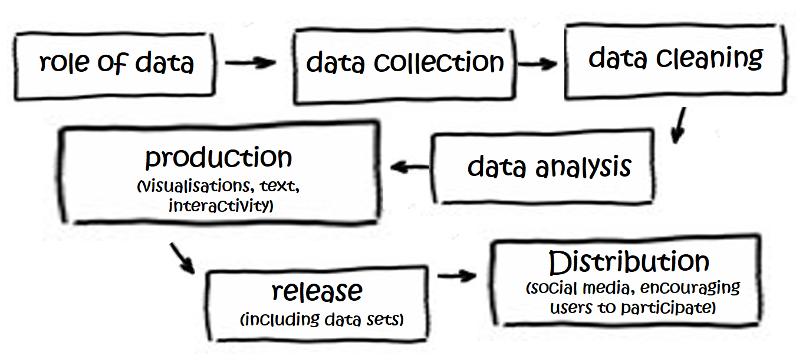
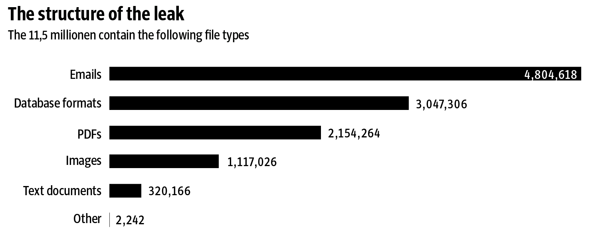

## Introducción a pandas y Jupyter Notebook
##### *para manipulación de datos en periodismo*

#### [CubanTech Meetup #16](http://www.), 29 de julio de 2017

###### [Barbara Maseda](https://www.linkedin.com/in/barbara-maseda-8006935a) / [@barbaramaseda](http://twitter.com/barbaramaseda)
###### [Rachel Domínguez](https://www.linkedin.com/in/racheld.rojas) / [@racheldrojas](http://twitter.com/racheldrojas)
###### [Olemis Lang](http://www.linkedin.com/in/olemis) / [@olemislc](http://twitter.com/olemislc)
###### [The CubanTech Group](http://cuban.tech) / [@TheCubanTech](http://twitter.com/TheCubanTech)

--

###### Esta presentación ha sido creada con [reveal.js](https://travis-ci.org/hakimel/reveal.js). Descargue las [diapositivas](http://slides.cuban.tech/uniss_20170321.html) / [código fuente](http://github.com/cubantech/slides.cuban.tech) / [imagen de Docker](http://hub.docker.com/r/tplcom/docker-presentation/).

###### Licencia [Attribution 4.0 International](http://creativecommons.org/licenses/by/4.0/).

---

* Periodismo de datos
* Jupyter Notebooks
* Python (pandas)

---

### Programa para el día de hoy

- Intro al evento
- Periodismo de datos y programación
  * Aplicaciones de Python en periodismo
- Jupyter Notebook
- Introducción a pandas

--

### Introducción a pandas
- Conceptos básicos
- Operaciones básicas
- Importación y exploración de datos
- Procesamiento y análisis de datos
- Actividad práctica
- Algunas operaciones más avanzadas
  * Tablas dinámicas
  * Crear un data frame desde cero
  * Combinar conjuntos de datos

---

### Proceso de producción

###### *Etapas de la producción de un proyecto de periodismo de datos según Aitamurto, Sirkkunen y Lehtonen (2011)*

--

*Flujo de trabajo en periodismo de datos. Mark McCormick. Tomado de “A data journalism workflow” de Simon Rogers (2013)*

--

 

 --

 

---

### Formato de datos

* pdf
* txt, odf, doc, 
* CSV, TSV, *SV
* xls, xlsx, ods 
* Html, xml
* Jpeg, png, tiff 
* gis
* db 
* Json
* geojson, osm, kml

---

### Tamaño de los datos

Hojas de cálculo limitadas a procesar 1 millón de filas
  * Excel (1.048.576 x 16384)
  * Calc (1.048.576 x 1024)

--

### Tamaño de los datos

* 2015 - Emails del servidor privado de Clinton - 50,547 páginas de         documentos - 7,570 enviados por Clinton 
* 2015 – Panama Papers
* 2016 – Informe Chilcot +2.6 millones de palabras

--

### Tamaño de los datos

---

Ranking del grupo de investigación IEEE Spectrum. 
Ver metodología [aquí](http://spectrum.ieee.org/ns/IEEE_TPL_2017/methods.html).

--

---

##### Principales librerías de Python para análisis de datos en 2017, según kdnuggets.com

* Numpy (Commits: +15000, Contributors: 522)
* SciPy (Commits: +17000, Contributors: 489)
* Pandas (Commits: 15089, Contributors: 762)
* Matplotlib (Commits: +21000, Contributors: 588)
* Seaborn (Commits: 17000, Contributors: 71)
* Bokeh (Commits: +15000, Contributors: 223)

--

--

---

##### Lenguajes de programación populares entre periodistas

* Python
* R
* JavaScript
* Pearl
* PHP
* Ruby

---

##### Ventajas de Python para periodistas

* Versátil
* Fácil de aprender
* Intuitivo / Sintaxis clara
* Buena documentación
* Muchas opciones de librerías
* Opciones de librerías para integración con tecnologías de terceros
* Amplia adopción en la industria

--

##### Desventajas

* Curva de aprendizaje 
* Incompatibilidad de versiones 2.x y 3.x

---

##### Liberías de Python populares en periodismo

* pandas
* numpy
* matplotlib
* re
* BeautifulSoup
* scrapy, tweepy
* NLTK
* SciKit-learn

---

##### pandas

### pandas = “PANel  DAta”

*Concepto de Estadística y Econometría que designa datos multidimensionales medidos en diferentes intervalos de tiempo*

--

### pandas

|    |    |
|::::|::::|
|Autor original   |  Wes McKinney |
|Desarrolladores   |  Comunidad |
|Última versión estable  |  0.20.2/ 4 de junio de 2017 |
|Respositorio  |  https://github.com/pydata/pandas, https://github.com/pydata/pandas.git |
|Lenguaje   |  Python |
|Sistema operativo  |  Multiplataforma |
|Licencia |  BSD |
|Sitio web  |  pandas.pydata.org |

--

### Características

* Dataframes para manipulación de datos con indexación integrada
* Herramientas para importar y exportar datos entre estructuras de datos en memoria y diferentes formatos de archivo
* Gestión integrada de datos en blanco
* Modificación y dinamización de conjuntos de datos

--

### Características (cont.)

* Subdivisión de grandes conjuntos de datos usando etiquetado e indexación
* Inserción y eliminación de columnas en estructuras de datos
* Agrupación y combinación de conjuntos de datos
* Funcionalidades para trabajo con series de tiempo

---

* Herramienta que permite utilizar código, texto, expresiones matemáticas, gráficos, e imágenes
* Interacción vía navegador

--

Jupyter = JUlia + PYThon + R

--

“Los cultores de la programación ilustrada pueden ser considerados ensayistas, cuya preocupación principal es la exposición y la excelencia del estilo. Estos autores, con diccionario en mano, eligen cuidadosamente los nombres de sus variables y explican lo que significa cada una. Se esfuerzan para crear un programa que sea comprensible porque sus conceptos se han introducido en un orden que se aviene mejor al entendimiento humano, usando una mezcla de métodos formales e informales que se refuerzan mutuamente.” 

*Tomado de Donald E. Knuth (2009), Literate Programming. The Computer Journal* 

---

--

--

--

--

