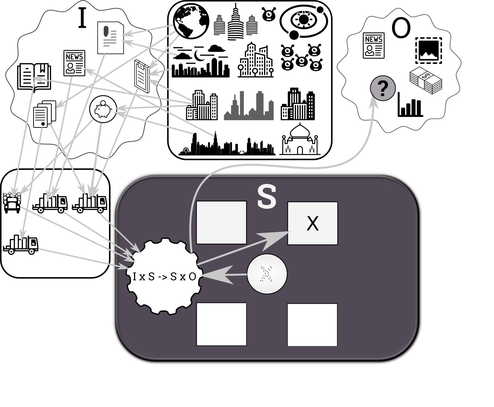
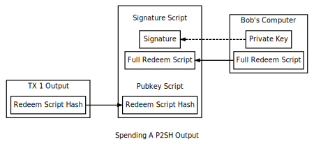
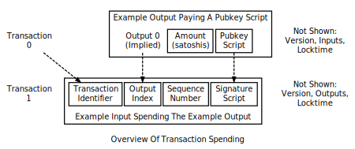
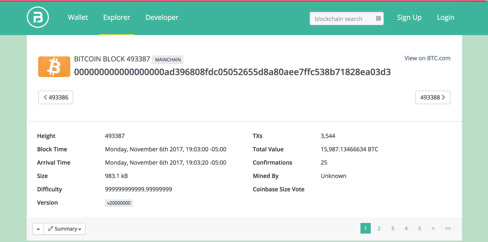
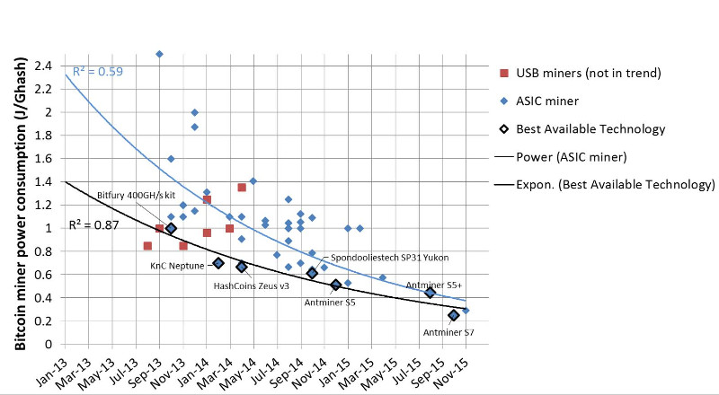
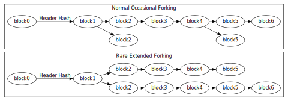

## Blockchain, DApps, y Skycoin
#### Conceptos básicos para comenzar

----------------

#### Esta presentación: [slides.cuban.tech/skycoin.intro.html](http://slides.cuban.tech/skycoin.intro.html)

----------------

### Información para la Wifi

Red: cubantech

Contraseña: meet-ups

---

## Agenda

- Máquinas de estado replicadas (RSM por sus siglas en Inglés)
- Infraestructura, herramientas de gestión y administración
- Relación entre RSM y Blockchain
- Reglas de ejecución y consenso
- Teoría General de las DApps
- Introducción a Skycoin

<small> Notas intercaladas sobre Skycoin, Bitcoin, y Ethereum </small>

--

[](http://www.skycoin.net)

- ¿Por qué Skycoin?
- Comprendiendo las transacciones Skycoin
- Valores principales
- Cinco pilares de Skycoin
- Ecosistema Skycoin
- ¿Próximo paso?

---

## ¿Está familiarizado con ... ?
##### Responda [aquí](http://forms.cuban.tech/skycoin.intro)

- Lenguaje de programación Go
- Blockchain
- Aplicaciones distribuidas
- Criptografía asimétrica y criptomonedas
- Contabilidad y economía
- Bitcoin, Ethereum, Skycoin

---

## Máquinas de Estado - Estados
##### Cuenta bancaria : balance (créditos, débitos, ...)


---

## Máquinas de Estado - Entradas
##### Cuenta bancaria : transacciones (etc ...)


---

## Máquinas de Estado - Transición
##### Transición : cambios en el balance (débito, crédito, ...)


--

## Máquinas de Estado
##### Ejemplo : Cuenta bancaria


--

## Máquinas de Estado
##### Ejemplo : ATM


---

## El problema de la escalabilidad



--

## Estadísticas de la blockchain de Bitcoin


---

## Servicios distribuidos como máquinas de estado

- Tolerancia de fallas más allá de los procesadores de un solo nodo
- Réplicas de un mismo servidor ejecutadas en procesadores independientes
- Protocolos para la interacción de los clientes con las réplicas
- Aislamiento físico y eléctrico para fallas de servidores independientes

--

## Consideraciones

- Vamos a asumir que serán máquinas de estado determinísticas
  * ... incluso si es posible Turing completo

---

## La Metodología de la Máquina de Estado

- <span style="color: yellow"> Desplegar réplicas del software </span>
- Recibir solicitudes de los clientes (entiéndase entradas)
- Ordenar las entradas
- Ejecutar indefinidamente la transición de la máquina de estado
- Monitorear las réplicas buscando diferencias en el Estado o la Salida

---

## La Metodología de la Máquina de Estado

##### Despliegue - Control de Versiones

|          |         |        |
|----------|---------|--------|
| <small> [](https://github.com/skycoin) </small> | <small> [](https://github.com/bitcoin/) </small> | <small> [](https://https://github.com/ethereum) </small> |
| <small> go </small> | <small> C / C++ </small> | <small> go </small>   |
| <small>[Skycoin @ Github](https://github.com/skycoin)</small> | <small>[Bitcoin @ Github](https://github.com/bitcoin/)</small> | <small>[Ethereum @ Github](https://github.com/ethereum)</small> |
|  |  | <small>[Ethers.io @ Github](https://github.com/ethers-io)</small> |

--

## La Metodología de la Máquina de Estado

##### Despliegue - Repositorios de paquetes de software

|          |         |
|----------|---------|
| <small> [](https://packages.debian.org/bitcoind) </small> | <small> [](https://packages.blockstack.com) </small> |
| [bitcoind @ Debian](https://packages.debian.org/bitcoind) | [Repo apt de Blockstack](https://packages.blockstack.com) |

--

## La Metodología de la Máquina de Estado

##### Despliegue - Virtualización

<small> [](http://docker.cuban.tech) </small>

<small> [docker.cuban.tech](http://docker.cuban.tech) </small>

- Contenedores y registros
  * p.e. [Skycoin](https://hub.docker.com/u/skycoin/), [Lisk](https://hub.docker.com/u/lisk/), [Blockstack](https://hub.docker.com/u/blockstack), ... @ Docker Hub
- Herramientas de gestión de contenedores (Ansible, Puppet, Chef, Habitat, ...)

--

## Estado de la gestión de contenedores - Primer trimestre 2017


---

## La Metodología de la Máquina de Estado

- Desplegar réplicas del software
- <span style="color: yellow"> Recibir solicitudes de los clientes (entiéndase entradas) </span>
- Ordenar las entradas
- Ejecutar indefinidamente la transición de la máquina de estado
- Monitorear las réplicas buscando diferencias en el Estado o la Salida

---

## La Metodología de la Máquina de Estado

##### Recibir solicitudes de los clientes

- Múltiples soluciones
- p.e. Transacciones

---

## Modelos de transacción - Cuenta
##### Ethereum, Ripple

- Todas las transacciones/objetos pertenecen a una única clave pública
- Se complica el diseño
- Se compromete la privacidad
  * Cuentas fácilmente rastreables y monitoreables

---

## Modelos de transacciones - Salida de transacciones no consumida (UTXO por sus siglas en Inglés) de Bitcoin


--

## Bitcoin - Anatomía de de las transacciones

##### Metadatos importantes (excepto [transacciones coinbase](https://bitcoin.org/en/glossary/coinbase-transaction))

<small>  </small>

- ID (global) de transacción
- Número de versión (evolución del protocolo)
- Fecha de fijación
  * Momento más inmediato en que la transacción puede ser agregada a la blockchain
  * Las transacciones fijadas en el tiempo solo son válidas en el futuro
  * Cancelaciones

--

## Bitcoin - Anatomía de las transacciones

##### Entradas y salidas

<small>  </small>

- Salida(s) : Índice de arreglo implícito
  * Monto (satoshis)
  * Script de Pubkey ( Desbloquear para consumir )
- Entrada(s)
  * Salida consumida (ID de transacción + Índice de salida)
  * Número de secuencia (relacionado con la fecha de fijación)
  * Script de firma (parámetros para desbloquear el script de Pubkey)

> **Bitcoin** es un registro público distribuido.

--

## Bitcoin - Transición de ejemplo

<small> blocktrail.com </small>


--

## Bitcoin - Envío de transacciones

##### Creación del Pay-To-Public-Key-Hash (P2PKH) (Hash-De-Pago-A-Clave-Pública)


- Curva (elíptica) ECDSA secp256k1
  * Generación de clave (hash) pública determinística

--

## Bitcoin - Envío de transacciones

##### Creación del Pay-To-Script-Hash (P2SH) (Hash-De-Pago-A-Script)


- Hash de script para redimir en lugar de hash de clave pública
  * Soporta los [opcodes de los scripts de PubKey](https://bitcoin.org/eb/developer-reference#opcodes)

--

## Bitcoin - Envío de transacciones

##### Finalización de la transacción


- El remitente crea la UTXO con el script de PubKey
  * ... usando el hash de la clave pública del receptor
- El remitente hace la difusión de la transacción (Red P2P)
- Los minadores la agregan a un bloque (... detalles más adelante ...)
- Billetera : monto UTXO como balance disponible

--

## Bitcoin - Utilización de las salidas de P2PKH


- Localización del ID de transacción y el índice para la UTXO
- Remitente crea la entrada para la transacción y agrega además:
  * Número de secuencia
  * Firma y PubKey (parámetros del script)

--

## Bitcoin - Utilización de las salidas de P2SH



- Localización del ID de transacción y el índice para la UTXO
- Remitente crea la entrada para la transacción y agrega además:
  * Número de secuencia
  * Firma y PubKey (parámetros del script)

--

## Bitcoin - Utilización de las salidas

##### Pasos finales

- Remitente prepara la UTXO para el receptor (como ya vimos)
- Remitente hace la difusión de la transacción (Red P2P)
- Los minadores la agregan a un bloque
  * Validación del script ! ( A-ha! )
- Billetera : Actualiza el balance

--

## Bitcoin - script público P2PKH estándar

##### Linea de tiempo de la pila de ejecución


---

## ¿Qué tienen de malo las transacciones Bitcoin?

- Almacenar los objetos UX como parte de la transacción
  * referenciados por índice
  * propician ataques de agotamiento de recursos
- Seguridad y privacidad demasiado complicadas
  * p.e. generación de una nueva dirección para cada transacción

---

## Modelos de transacciones - UXTX
##### Skycoin

- IDs de hash independientes para UX y TX
- Objetos UX independientes de los objetos TX
- Diseño más simple
- Sin scripts

--

## Explicación sobre UXTX


- Grafo bipartito acíclico dirigido simple de UX/TX

---

# Red P2P

Monstruo muy peculiar

---

## Nociones del Protocolo Bitcoin


--

## Red P2P

##### Descubrimiento de pares - DNS con semilla de Bitcoin

```
;; SECCIÓN DE PETICIÓN
;seed.bitcoin.sipa.be       IN  A

;; SECCIÓN DE RESPUESTA
seed.bitcoin.sipa.be.   60  IN  A   192.0.2.113
seed.bitcoin.sipa.be.   60  IN  A   198.51.100.231
seed.bitcoin.sipa.be.   60  IN  A   203.0.113.183
```

- Conexión al puerto `8333` (mainnet) o `18333` (testnet)
- Seguido de mensajes `addr` anunciando las direcciones de los pares

--

## Red P2P

##### Conexión a los pares

- Envío del [mensaje `version`](https://bitcoin.org/en/developer-reference#version)
  * número de versión local, bloque y fecha actual
- Par responde con su propio mensaje `version`
- Envío de `getaddr` y recepción de `addr` de los nuevos pares (descubrimiento)

--

## Red P2P

##### Difusión de la transacción

- Envío del [mensaje `inv`](https://bitcoin.org/en/developer-reference#inv) a un par.
- Espera del mensaje `getdata`
- Envío de la información de la transacción en el mensaje `tx`
- Par reenvía las transacciones a otros pares
- Nodos completos mantienen la lista de transacciones no confirmadas en un [fondo de memoria](https://bitcoin.org/en/developer-guide#memory-pool)

> ... continuará ...

---

## Nociones del Protocolo Skycoin

- Sin DNS durante el descubrimiento P2P


---

## La Metodología de la Máquina de Estado

- Desplegar réplicas del software
- Recibir solicitudes de los clientes (entiéndase entradas)
- <span style="color: yellow">Ordenar las entradas</span>
- Ejecutar indefinidamente la transición de la máquina de estado
- Monitorear las réplicas buscando diferencias en el Estado o la Salida

---

## La Metodología de la Máquina de Estado

##### Ordenamiento de las entradas

- Múltiples soluciones
- [Blockchain](https://en.wikipedia.org/wiki/Blockchain_database) ?
- Transacciones Bitcoin !

--

## Bitcoin - Consumo de las transacciones



Ordenamiento casual : Cadena de propiedad

---

## La Metodología de la Máquina de Estado

- Desplegar réplicas del software
- Recibir solicitudes de los clientes (entiéndase entradas)
- Ordenar las entradas
- <span style="color: yellow">Ejecutar indefinidamente la transición de la máquina de estado</span>
- Monitorear las réplicas buscando diferencias en el Estado o la Salida

---

## La Metodología de la Máquina de Estado

##### Ejecución de la máquina de estado


- Ejecutar las entradas en cada réplica en el orden seleccionado

---

## Bitcoin - Propagación de transacciones


---

## Blockchain de Bitcoin

##### Metas de diseño

- Registro público
  * Transacciones ordenadas y fechadas
- Almacenamiento distibuido en los [nodos completos](https://bitcoin.org/en/glossary/node) de Bitcoin
- Protección contra
  * [doble gasto](https://bitcoin.org/en/glossary/double-spend)
  * modificación de los registros de transacciones previas

--

## Blockchain de Bitcoin

##### Vistazo


--

## Cabecera de bloque Bitcoin

- **Version** : 4 bytes
- **Previous block header hash** : 32 bytes
- **Merkle root hash** : 32 bytes
- **Time** : 4 bytes
- **nBits** : 4 bytes
- **nonce** : 4 bytes

--

## Bloque Bitcoin 493387

<small> blocktrail.com </small>

[](https://www.blocktrail.com/BTC/block/000000000000000000ad396808fdc05052655d8a80aee7ffc538b71828ea03d3)

--

## Bloque Bitcoin 493387 - Transacciones

La transacción coinbase va primero

[](https://www.blocktrail.com/BTC/block/000000000000000000ad396808fdc05052655d8a80aee7ffc538b71828ea03d3)

---

## Pruebas

- Métricas
  * Probar el interés legítimo, la irreversibilidad
  * Tomarr desiciones respecto a los cambios en la DApp
- Más difícil modificar bloques pasados que agregar nuevos
- Ejemplos comunes
  * **Prueba de trabajo** (Proof of work - PoW) : BTC
  * **Prueba de participación** (Proof of stake - PoS)
  * **Prueba de quemado** (Proof of burn) : SKY
  * **Prueba de colaboración** (Proof of collaboration - PoC)
  * **Prueba de espacio** (Proof of space - PoSpace), replicación** (PoR)
- Pueden ser usadas en paralelo
  * p.e. [PeerCoin](http://peercoin.net) utiliza PoW + PoS

--

## Prueba de trabajo - PoW

- *Mecanismo* : Cantidad de trabajo computacional (CPU, GPU, NPU, ...) que contibuyó a la operación de la DApp
- Uso intensivo de recursos (energía, enfriamiento, ...)
- El mecanismo para establecer consenso a través de POW es llamado comúnmente minado

> <small> *Bitcoin* utiliza ese método para su operación diaria. </small>

--

## Prueba de participación - PoS

- *Mecanismo* : nuevas monedas de acuerdo a la cantidad de monedas (participación) que usted posee
- Aquellos que posean monedas suficientes pueden abusar de este mecanismo
- A menudo combinado con otra prueba

> <small> *OmniLayer* se basa en el mecanismo POS. </small>

--

## Prueba de capacidad

- *Mecanismo* : asignación de cantidades no triviales de memoria o almacenamiento necesarios para resolver un desafío (funciones intensivas de memoria - memory-hard)
- Alternativa más ecológica que PoW

> <small> PoStorage es usado en PermaCoin, SpaceMint, [BurstCoin](https://en.wikipedia.org/wiki/Burstcoin) </small>

--

## Prueba de colaboración - PoC

- Nodos de Validación Colaborativa (CVNs por sus siglas en Inglés)
  * [Decidir](https://chain.fair-coin.org/download/FairCoin2-white-paper-V1.1.pdf) que nodo creará el próximo bloque
  * Aprobar los Nodos de Validación Colaborativa firmando digitalmente una porción de datos que contiene el ID del seleccionado
  * Teniendo las firmas requeridas, obtener la TX y crear el nuevo bloque
- Sin recompensa (dinero nuevo) por la creación del bloque (pequeño costo)
- Bajo consumo de energía (CVNs pueden ejecutarse en una Raspberry3)

> <small> FairCoin (derivado de Bitcoin 0.12) implementa PoC desde el 18 de Julio de 2017</small>

---

## Árbol Merkle - Removiendo las transacciones


**Modos de operación** : [Clientes de Verificación Simplificada de Pagos - SPV por sus siglas en Inglés](https://bitcoin.org/en/glossary/simplified-payment-verification) vs [nodo completo](https://bitcoin.org/en/glossary/node)

---

## Red P2P (continuación)

##### Descarga del Bloque Inicial

- Primera ejecución : El nodo contiene solo el [bloque 0](https://bitcoin.org/en/glossary/genesis-block)
- Selección del par remoto (entiéndase nodo de sincronización)
- Descargar desde el bloque 1 hasta la punta actual de la mejor blockchain del nodo de sincronización
  * Primero los bloques (hasta la versión 0.9.3)
  * Primero las cabeceras (a partir de 0.10.0 en adelante)

---

## Minería Bitcoin

- Agregar nuevos bloques a la block chain
- Hacer que el historial de transacciones sea difícil de modificar
- Estrategias
  * Minería en solitario
  * Minería mediante fondos

---

## Minería Bitcoin - Minería en solitario


- Minador genera los nuevos bloques el mismo
- Reclama completamente la recompensa de bloque y los costos de transacción
- Pagos grandes
- Mayor varianza (mayor tiempo entre ellos)

---

## Minería Bitcoin - Minería mediante fondos


- Grupo de minadores agregan los recursos al fondo junto con otros minadores
- Encuentro de bloques más a menudo y a destinos de bits más sencillos
- Procedimientos compartidos entre minadores
  * Correlacionado con la PoW de potencia relativa de hash
- Pagos pequeños
- Menor varianza (entiéndase menor tiempo entre pagos)

--

## SlushPool

<small> [slushpool.com/home/](https://slushpool.com/home/) </small>


<small> Monedas emitidas : `+1M BTC` minados desde Diciembre de 2010. `ZCASH` desde 20 de Abril de 2017</small>

--

## SlushPool

##### Tasa de hash


--

## SlushPool

##### Distribución de la tasa de hash


--

## Bitmain - AntMiner

<small> [bitmaintech.com](https://bitmaintech.com/) </small>


<small> Monedas emitidas : `BTC` </small>

--

## Bitmain - AntPool

<small> [bitmaintech.com](https://bitmaintech.com/) </small>


--

## BTCC Pool

<small> [pool.btcc.com](https://pool.btcc.com/) </small>


<small> Monedas emitidas : `BTC` </small>

---

## Hardware para minado Bitcoin

##### Capacidad instalada - 2017/11/13

<div style="width: 500px; display: inline-block; margin-left: auto; magin-right: auto">  </div>

- <small> 6.4 EHash/s , 80,704,290.84 PFLOPS </small>
- <small> 10,000 toneladas métricas de hardware. Suficiente material para construir otra torre Eiffel. </small>

--

## Hardware para minado Bitcoin - Energía



Circuitos integrados de aplicación específica, ASICs por sus siglas en Inglés

--

## Consumo de energía del PoW de Bitcoin

<small> ... según [BitcoinEnergyConsumption.com](https://BitcoinEnergyConsumption.com)</small>


- Proyectado que sea comparable con el consumo de Dinamarca en 2020

---

## Red P2P (continuación)

##### Difusión de bloque - Empuje no solicitado

- Minador incluye el bloque minado en el nuevo [mensaje `block`](https://bitcoin.org/en/developer-reference#block)
- Minador envía el mensaje a sus pares nodos completos

> <small> desde la versióno 0.12.0 </small>

--

## Red P2P

##### Difusión de bloque - Reenvío Estándar de Bloque

- Método estándar
- Minador envía mensaje `inv` a todo los pares (SPV y nodos completos)
  * Incluye inventario que referencia al bloque
- **par BF** &rArr; `getdata` pidiendo el bloque completo
  * Minador &rArr; mensaje `block`
- **par HF** &rArr; `getheaders` (pocas cabeceras en la mejor blockchain)
  * Minador &rArr; mensaje `headers`
- **clientes SPV** &rArr; `getdata` pidiendo un bloque Merkle
  * Minador &rArr; `merkleblock` seguido de varios mensajes `tx`

> <small> desde la versión 0.12.0 </small>

--

## Red P2P

##### Difusión de bloque - Anuncio Directo de Cabeceras

- Usado si el par envía la señal `sendheaders` durante el handshake
- Minador envía el mensaje `headers` para el nuevo bloque
- **par HF** &rArr; Validación parcial y envía `getdata`
- Minador &rArr; `block` or `merkleblock`

> <small> desde la versión 0.12.0 </small>

---

## [Por qué construimos Skycoin](https://www.skycoin.net/blog/statement/why-we-built-skycoin/)

- Problemas con la Prueba de Trabajo (Proof of Work)
- Prueba de Participación (Proof of Stake): Más problemas de centralización
- Mejoras técnicas
  * Problemas de seguridad asociados con otras redes de blockchain
  * Desacoplar la creación de monedas del proceso de minado
  * Confirmación rápida de las transacciones
- Políticas inflacionistas
  * El suministro de Skycoin es fijo

--

## Problemas con la prueba de trabajo

- Control de la red => poder económico
- Monopolización del minado
- Incentivación a la compra de potencia de hash
  * Control desproporcionado sobre la red
  * Bitcoin => SlushPool , Bitmain , BTCC
  * Revertir y falsificar transascciones - ataque 51%
- Costo económico y ambiental

--

## Inflación de Bitcoin

- Costos de transacción e inflación que desangran a los usuarios
  * Más de $50, y a los fondos centralizados de minado
- Más costoso que transferencias bancarias internacionales

---

## Bitcoin - Problemas con la UTXO

<small>

</small>

- Propicia ataques
  * Agotamiento de recursos
  * RAM y espacio en disco

---

## Gasto de la UXTX de Skycoin


- UX consumida fácil de remover
- No hay minado, no hay costo (no hay minado, no hay costo  ...)
  * Prueba de quemado - Horas de moneda

--

## Horas de Moneda de Skycoin

##### El combustible para el ecosistema Skycoin

- Retener Skycoin en una billetera
  * ... automáticamente genera Horas de Moneda
  * 1 SKY * 1 hora = 1 Hora de Moneda.
- Mantener la red Skywire libre de costos de transacción
- Los juegos de gato virtual no pueden disparar los costos de transacción al 1600%
  * Problema reciente en la red Ethereum
- Usuarios nunca pagan para acceder y usar la red

--

## Horas de Moneda de Skycoin

### ¿Qué pasaría si ... ?

- ... las Horas de Moneda se inflan dramáticamente
  * Máx = 100 millones de Horas de Moneda por hora
  * Será alcanzado en décadas
- ... nunca ocurrieran transacciones en la red
  * máx de Horas de Moneda no excederá `uint64` por siglos.

--

## Transacciones de Gasto de Skycoin

##### Prueba de quemado


--

## Ejemplo de gasto de Skycoin

##### Comparación del número de compras


--

## Ejemplo de gasto de Skycoin

##### Después de 1 hora


---

## La Metodología de la Máquina de Estado

- Desplegar réplicas del software
- Recibir solicitudes de los clientes (entiéndase entradas)
- Ordenar las entradas
- Ejecutar indefinidamente la transición de la máquina de estado
- <span style="color: yellow">Monitorear las réplicas buscando diferencias en el Estado o la Salida</span>

---

## La Metodología de la Máquina de Estado

##### Envío de las salidas

- Cada réplica genera salida
  * Las réplicas sin errores producirán siempre la misma salida
- Las salidas con errores son filtradas
  * Consenso
- La salida correcta es enviada al cliente

--

## Consenso

- Consenso de Nakamoto
- [Paxos](https://en.wikipedia.org/wiki/Paxos_%28computer_science%29)
- Sistemas de Cuórum
- [Raft](https://raft.github.io/)
- [Obelisk](https://blog.skycoin.net/statement/obelisk-the-skycoin-consensus-algorithm/)

---

## Bitcoin - Consenso de Nakamoto

##### Derivación Ocasional vs Extendida



- Bloques simultáneos minados, nodos seleccionan el ganador
- Pares prefieren derivaciones con PoW más fuerte
  * derivación más larga
  * mayor alto de bloque : distancia hasta el [bloque 0](https://bitcoin.org/en/glossary/genesis-block)

--

## Bitcoin - Consenso de Nakamoto

##### Derivación suave


- ¿ Cuándo ?
  * Muy a menudo p.e. minadores concurrentes
  * Reglas de consenso actualizadas rechazan bloques anteriormente válidos
    + Día señalado de [UASF](https://bitcoin.org/en/glossary/uasf) vs señalización de mayoría de tasa de hasheo de [MASF](https://bitcoin.org/en/glossary/masf)

--

## Bitcoin - Consenso de Nakamoto

##### Resolución de derivación suave

- Eliminar bloques (obsoletos y huérfanos) en derivaciones de baja PoW
- Iterar sobre las transacciones en bloques obsoletos y huérfanos
  * descartarlas si la transacción pertenece a otro bloque de PoW de derivación más alta
  * de lo contrario moverla de regreso al fondo de memoria de transacciones
    + para ser incluida por este minador en un bloque futuro
    + (¿opcionalmente?) difundirla a la red P2P

--

## Bitcoin - Consenso de Nakamoto

##### Derivaciones forzadas


- ¿Cuándo?
  * Extender la blockchain para prevenir el ataque del 51% de terceros
  * Consenso mejorado acepta bloques anteriormente rechazados
  * Partición de la red

--

## Bitcoin - Corolarios de las derivaciones forzadas

- Advertencia en [`getnetworkinfo`](https://bitcoin.org/en/developer-reference#getnetworkinfo) y ejecución del comando `-alertnotify` si estaba establecida
  * PoW de +6 bloques que la mejor chain válida
  * Repetición del bloque y la transacción con números de versión más altos que el consenso esperado
- [Transacción coinbase](https://bitcoin.org/en/glossary/coinbase-transaction) puede ser consumida solo después de 100 bloques
- [Clientes SPV](https://bitcoin.org/en/glossary/simplified-payment-verification) pueden contactar varios nodos completos
  * descartar chains con PoW más débil

---

## Bitcoin - Balance de cliente


Software de billetera : Adicionar las UTXO para determinar balance

---

## Tolerancia a fallas (en teoría)

- Tolerancia a F fallas aleatorias independientes
  * errores de memoria, roturas de discos duros, ...
  * Requiere `2F + 1` réplicas
- Réplica fallada puede detenerse sin generar salidas
  * Solo se requieren `F + 1` réplicas
  * ... ningún sistema existente alcanza este límite
- [Fallas Bizantinas](https://en.wikipedia.org/wiki/Byzantine_fault_tolerance)
  * fallas aleatorias, espurias &rArr; `2F + 1`
  * ataques maliciosos, inteligentes &rArr; `3F + 1`

--

## Nodo Bitcoin

##### Requerimientos mínimos

- Computadora de escritorio o portátil (Windows, Mac OS X, o Linux)
- 125 GB de espacio en disco, 2 GB RAM
- Internet de Banda Ancha con subida &ge; 400 Kbps (50 KB/s)
  * Conexión no metrada, o límites altos de subida, respeto a los límites de subida
  * +100 GB IBD
  * &asymp; 20 gigabytes de descarga al mes
  * +200 GB de subida al mes
- +6 horas al día ejecutando un nodo completo
- +8 conexiones y pares activos de sincronización

--

## Nodo Bitcoin

> La mayoría de las personas ordinarias **NO** debería ejecutar un nodo completo
> Necesitamos nodos completos que estén siempre encendidos, y tengan más de 8 conexiones
> *(si usted tiene solo 8, entonces es parte del problema, no de la solución)*,
> y tengan una conexión a Internet de gran ancho de banda

Gavin Andresen, Científico Principal de la Fundación Bitcoin, en un [artículo de Reddit](http://www.reddit.com/r/Bitcoin/comments/1scd4z/im_running_a_full_node_and_so_should_you/cdw3lrh?context=3)

---

## Consenso de Nakamoto - Problemas

- Requerimientos importantes de recursos
  * Ancho de banda (principalmente de subida)
  * CPU, espacio en disco (debido a las UTXO)
- Incentiva la monopolización
  * Participantes poderosos tienen más recursos
  * Más influencia

---


---

## Obelisco

##### Consenso de Skycoin

- Basado en la influencia distribuida (red de confianza)
- Nodo se suscribe a una lista de otros nodos
  * Densidad de la red determina influencia del nodo
- Previene el desarrollo de poder centralizado
- Si algún nodo incumple,
  * ... sus acciones serán visibles (públicas) 
  * La red puede entonces cortar las conexiones con ese nodo

---

## Beneficios

- Inmune al ataque del 51% (no minado)
- Transacciones significativamente más rápidas
  * Ocurren en segundos
- Decisiones tomadas a través del consenso de la comunidad
- Menos ancho de banda que Bitcoin (≈1:25)
- Soporte oficial para dispositivos DIY (RPi, Orange Pi, ...)

---

# Teoría General de las DApps

---

## Definición de una DApp - Código abierto

- Debe operar de forma autónoma
- Ninguna entidad controla la mayoría de sus tokens
- Datos y registros en una blockchain pública, descentralizada

> <small> p.e. las aplicaciones de **Bitcoin** son de código abierto, ninguna entidad controla Bitcoin y sus registros son abiertos y públicos. </small>

---

## Definición de una DApp - Generación de tokens

- El propósito de un token es permitir el acceso a la aplicación DApp
- Se deben generar tokens de acuerdo a un algoritmo estándar
  * Posiblemente distribuir los tokens al comienzo de operación
- Tokens deben ser necesarios para el uso de la aplicación
- Contribuciones de los usuarios recompensadas con pagos en los tokens de la aplicación

> <small> p.e. **Bitcoin** genera bitcoins (tokens) con un algoritmo predeterminado que no puede ser cambiado. Los tokens son necesarios para que Bitcoin funcione. Los minadores Bitcoin son recompensados con bitcoins por sus contribuciones para asegurar la red Bitcoin. </small>

---

## Definición de una DApp - Consenso

- Protocolo puede ser adaptado en respuesta a
  * propuestas de mejoras
  * retroalimentación del mercado
- Cambios decididos por el consenso de la mayoría de sus usuarios

> <small> p.e. Todos los cambios a **Bitcoin** deben ser aprobados por el consenso de la mayoría de sus usuarios a través del mecanismo de la prueba de trabajo. </small>

---

## Clasificación de las DApps - Tipo I

##### De acuerdo al uso de blockchain

- Tienen su propia blockchain

> <small> *Bitcoin*, *Litecoin* y otras [alt-coins](https://en.wikipedia.org/wiki/List_of_cryptocurrencies) </small>

---

## Clasificación de las DApps - Tipo II

##### De acuerdo al uso de blockchain

- Uso de la blockchain de una aplicación descentralizada tipo I
- Son protocolos
  * Tokens que son necesarios para su funcionamiento

> <small> *OmniLayer* (anteriormente *Protocolo Master*) y *Blockstack* son ejemplos de aplicaciones descentralizadas de tipo II. </small>

--

## DApps tipo II

##### Transacciones Bitcoin de datos nulos

- Incrustan datos adicionales en transacciones de DApps tipo I
- Código [OP_RETURN](https://bitcoin.org/en/developer-reference#term-op-return) de Bitcoin
  * Salidas probablemente removibles
  * Minadores Bitcoin tendrán la opción de remover esos datos

> Blockstack es una DApp tipo II

---

## Clasificación de las DApps - Tipo III

##### De acuerdo al uso de blockchain

- Usan el protocolo de una aplicación descentralizada de tipo II
- Son protocolos y tienen tokens que son necesarios para su funcionamiento

> <small> Las aplicaciones de *Omni* (anteriormente *Mastercoin*), y *Blockstack* son ejemplos de aplicaciones descentralizadas de tipo III. </small>

---

## Pasos fundacionales de una DApp

- Publicación de las especificaciones
- Distribución de los tokens iniciales
- Delegación de propiedad

---

## Secciones de las especificaciones de la DApp

- Intenciones y metas de la DApp
- Planes para la distribución de tokens
- Mecanismo para establecimiento de consenso
- Supervisión de la DApp
- Gestión de los beneficios de los desarrolladores
- Descripción técnica de la DApp

---

## Distribución de tokens - Minado

- Los tokens son distribuidos a aquellos que contribuyen con más trabajo a la operación de la DApp

> <small> Tomando *Bitcoin* como ejemplo, se distribuyen bitcoins a través de un algoritmo predeterminado a los minadores que verifican transacciones y mantienen la blockchain de Bitcoin. </small>

---

## Distribución de tokens - Recaudación de fondos

- Son distribuidos tokens a aquellos que financien el desarrollo inicial de la DApp

> <small> Tomando el *Protocolo Master* como ejemplo, inicialmente fueron distribuidos Mastercoins a aquellos que enviaron bitcoins a una dirección determinada a una tasa de 100 Mastercoins por bitcoin enviado. Los bitcoins recaudados fueron usados entonces para financiar el desarrollo de aplicaciones que promovieran el desarrollo del Protocolo Master. </small>

---

## Distribución de tokens - Desarrollo

- Tokens son generados usando un mecanismo predefinido y solo están disponibles para el desarrollo de la DApp

> <small> En adición al mecanismo de recaudación de fondos, el Protocolo Master usó el mecanismo de colaboración para financiar su desarrollo futuro. Algunas Mastercoins son distribuidas a través de un sistema de beneficios gestionado por la comunidad basado en el mecanismo PoS. </small>

---

## ¿Próximo paso?

- Próximo encuentro : Explicación de los proyectos de Skycoin !!!
- Comunidad de Telegram : [https://t.me/Skycoin](https://t.me/Skycoin)
- Sitio Web : [https://www.skycoin.net](https://www.skycoin.net)
- Desarrollo - [https://github.com/skycoin](https://github.com/skycoin)
- Canal de Noticias : [https://t.me/skycoinnews](https://t.me/skycoinnews)
- Twitter : [https://twitter.com/Skycoinproject](https://twitter.com/Skycoinproject)
- Soporte : [https://t.me/skycoinsupport](https://t.me/skycoinsupport)

---

# ¡Gracias por participar!

#### ¿Preguntas?


