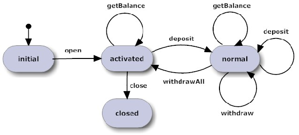
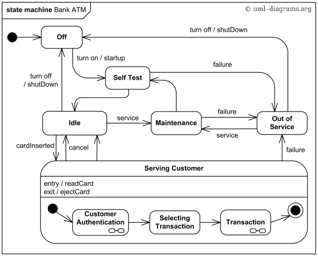
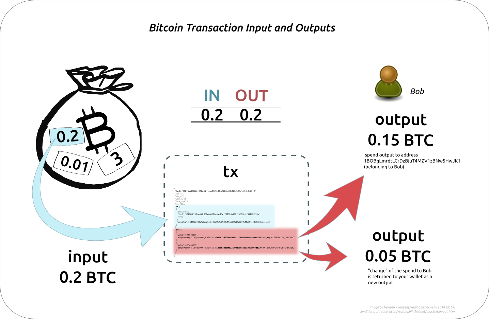
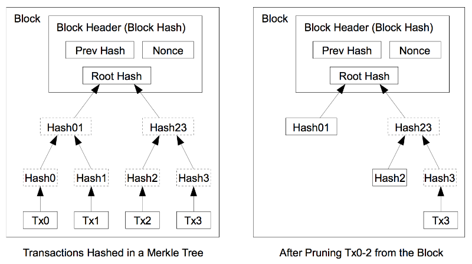
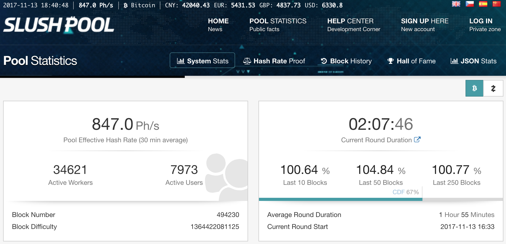
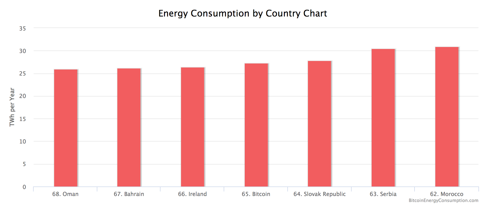
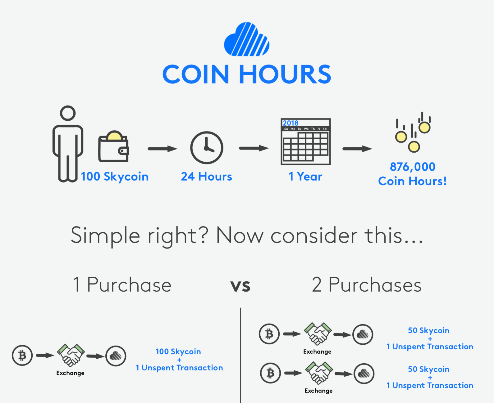

## Blockchain, DApps, and Skycoin
#### Basic concepts to get started

----------------

#### These slides: [slides.cuban.tech/skycoin.intro.html](http://slides.cuban.tech/skycoin.intro.html)

----------------

### Wifi Info

Network: cubantech

Password: meet-ups

---

## Outline

- Replicated state machines (a.k.a RSM)
- Infrastructure, management and admin tools
- Relation betwen RSM and Blockchain
- Execution rules and consensus
- General Theory of DApps
- Intro to Skycoin

<small> Notes about Skycoin, Bitcoin, and Ethereum in-between </small>

--

[](http://www.skycoin.net)

- Why Skycoin?
- Understanding Skycoin transactions
- Core values
- Five pillars of Skycoin
- Skycoin ecosystem
- What's next?

---

## Are you familiar with ... ?
##### Answer [here](http://forms.cuban.tech/skycoin.intro)

- Go programming language
- Blockchain
- Distributed applications
- Asymetric cryptography and cryptocurrencies
- Accounting and economics
- Bitcoin, Ethereum, Skycoin

---

## State Machines - States
##### Bank account : balance (credits, due amounts, ...)


---

## State Machines - Inputs
##### Bank account : transactions (etc ...)


---

## State Machines - Transition
##### Transition : changes in balance (debit, credit, ...)


--

## State Machines
##### Example : Bank account



--

## State Machines
##### Example : ATM



---

## The scalability problem


--

## Stats of the Bitcoin blockchain


---

## Distributed services as state machines

- Fault tolerance beyond single-node processors
- Replicas of a single server executed on separate processors 
- Protocols for client interactions with replicas
- Physical and electrical isolation for independent server failures

--

## Assumptions

- Let's assume deterministic state machine
  * ... even if Turing complete is possible

---

## The State Machine Approach

- <span style="color: yellow"> Deploy replicas of the software </span>
- Receive client requests (i.e. inputs)
- Order the inputs
- Execute SM transition over and over
- Monitor replicas for differences in State or Output

---

## The State Machine Approach

##### Deployment - Version Control

|          |         |        |
|----------|---------|--------|
| <small> [](https://github.com/skycoin) </small> | <small> [](https://github.com/bitcoin/) </small> | <small> [](https://https://github.com/ethereum) </small> |
| <small> go </small> | <small> C / C++ </small> | <small> go </small>   |
| <small>[Skycoin @ Github](https://github.com/skycoin)</small> | <small>[Bitcoin @ Github](https://github.com/bitcoin/)</small> | <small>[Ethereum @ Github](https://https://github.com/ethereum)</small> |
|  |  | <small>[Ethers.io @ Github](https://github.com/ethers-io)</small> |

--

## The State Machine Approach

##### Deployment - Software package repositories

|          |         |
|----------|---------|
| <small> [](https://packages.debian.org/bitcoind) </small> | <small> [](https://packages.blockstack.com) </small> |
| [bitcoind @ Debian](https://packages.debian.org/bitcoind) | [Blockstack apt repo](https://packages.blockstack.com) |

--

## The State Machine Approach

##### Deployment - Virtualization

<small> [](http://docker.cuban.tech) </small>

<small> [docker.cuban.tech](http://docker.cuban.tech) </small>

- Containers and registries
  * e.g. [Skycoin](https://hub.docker.com/u/skycoin/), [Lisk](https://hub.docker.com/u/lisk/), [Blockstack](https://hub.docker.com/u/blockstack), ... @ Docker Hub
- CM tools (Ansible, Puppet, Chef, Habitat, ...)

--

## State of CM - Q1 2017


---

## The State Machine Approach

- Deploy replicas of the software
- <span style="color: yellow">Receive client requests (i.e. inputs)</span>
- Order the inputs
- Execute SM transition over and over
- Monitor replicas for differences in State or Output

---

## The State Machine Approach

##### Receive client requests

- Multiple solutions
- e.g. Transactions

---

## Transaction models - Account
##### Ethereum, Ripple

- All transactions/objects belong to a single public key
- Complicates design
- Compromises privacy
  * Easily tracked and monitored account

---

## Transaction models - Bitcoin UXTO



--

## Bitcoin - Anatomy of transactions

##### Important meta-data (except [coinbase transactions](https://bitcoin.org/en/glossary/coinbase-transaction))

<small>  </small>

- Transaction (global) ID
- Version number (protocol evolution)
- Locktime
  * Earliest time TX can be added to the block chain
  * Time-locked transactions only valid in the future
  * Cancellations

--

## Bitcoin - Anatomy of transactions

##### Inputs and outputs

<small>  </small>

- Output(s) : Implicit array index
  * Amount (satoshis)
  * Pubkey script ( Unlock to spend )
- Input(s)
  * Spent output (Transaction ID + Output index)
  * Sequence number (related to locktime)
  * Signature script (params to unlock Pubkey script)

> **Bitcoin** is a public distributed ledger.

--

## Bitcoin - Sample transaction

<small> blocktrail.com </small>


--

## Bitcoin - Sending transactions

##### Pay-To-Public-Key-Hash (P2PKH) setup


- ECDSA secp256k1 (elliptic) curve
  * Deterministic public key (hash) generation

--

## Bitcoin - Sending transactions

##### Pay-To-Script-Hash (P2SH) setup


- Redeem script hash instead of public key hash
  * Supports [PubKey scripts opcodes](https://bitcoin.org/eb/developer-reference#opcodes)

--

## Bitcoin - Sending transactions

##### Finalize TX


- Sender creates UTXO with PubKey script
  * ... using the public key hash of the receiver
- Sender broadcasts transaction (P2P network)
- Miners add it to a block (... more details later ...)
- Wallet : UTXO amount as spendable balance

--

## Bitcoin - Spending P2PKH outputs


- Lookup transaction ID and index for UTXO
- Sender creates TX input and also add:
  * Sequence number
  * Signature & PubKey (script params)

--

## Bitcoin - Spending P2SH outputs


- Lookup transaction ID and index for UTXO
- Sender creates TX input and also add:
  * Sequence number
  * Signature & PubKey (script params)

--

## Bitcoin - Spending outputs

##### Last steps

- Sender prepares UTXO for recipient (as before)
- Sender broadcasts transaction (P2P network)
- Miners add it to a block
  * Script validation ! ( A-ha! )
- Wallet : Update balance

--

## Bitcoin - Standard P2PKH public script

##### Execution stack timeline


---

## What's wrong with Bitcoin transactions?

- Store UX objects as part of TX
  * referenced by index
  * Dust resource exhaustion attack
- Overcomplicated security & privacy
  * e.g. generate new address for each TX

---

## Transaction models - UXTX
##### Skycoin

- Separate hash IDs for UX and TX
- UX objects independent of TX objects
- Simplifies design
- No scripting

--

## UXTX explained


- UX/TX simple directed acyclic bipartite graph

---

# P2P network

A very peculiar monster

---

## Bitcoin Protocol Overview


--

## P2P network

##### Peer discovery - Bitcon seed DNS

```
;; QUESTION SECTION
;seed.bitcoin.sipa.be       IN  A

;; ANSWER SECTION
seed.bitcoin.sipa.be.   60  IN  A   192.0.2.113
seed.bitcoin.sipa.be.   60  IN  A   198.51.100.231
seed.bitcoin.sipa.be.   60  IN  A   203.0.113.183
```

- Connect to port `8333` (mainnet) or `18333` (testnet)
- Followed by `addr` messages announcing addresses of peers

--

## P2P network

##### Connecting to peers

- Send [`version` message](https://bitcoin.org/en/developer-reference#version)
  * local version number, block, and current time
- Peer responds with its own `version` message
- Send `getaddr` and receive `addr` of new peers (discovery)

--

## P2P network

##### Transaction broadcasting

- Send [`inv` message](https://bitcoin.org/en/developer-reference#inv) to a peer.
- Wait for `getdata` message
- Send transaction data in `tx` message
- Peer forwards transactions to other peers
- Full nodes keep track of unconfirmed transactions in [memory pool](https://bitcoin.org/en/developer-guide#memory-pool)

> ... to be continued ...

---

## Skycoin Protocol Overview

- No DNS during P2P discovery


---

## The State Machine Approach

- Deploy replicas of the software
- Receive client requests (i.e. inputs)
- <span style="color: yellow">Order the inputs</span>
- Execute SM transition over and over
- Monitor replicas for differences in State or Output

---

## The State Machine Approach

##### Ordering of inputs

- Mutiple solutions
- [Blockchain](https://en.wikipedia.org/wiki/Blockchain_database) ?
- Bitcoin transactions !

--

## Bitcoin - Transaction spending


Causal ordering : Chain of ownership

---

## The State Machine Approach

- Deploy replicas of the software 
- Receive client requests (i.e. inputs)
- Order the inputs
- <span style="color: yellow">Execute SM transition over and over</span>
- Monitor replicas for differences in State or Output

---

## The State Machine Approach

##### Execute the state machine


- Execute inputs in the chosen order on each replica

---

## Bitcoin - Transaction propagation


---

## Bitcoin blockchain

##### Design goals

- Public ledger
  * Ordered and timestamped transactions
- Storage distributed over Bitcoin [full nodes](https://bitcoin.org/en/glossary/node)
- Protect against
  * [double spending](https://bitcoin.org/en/glossary/double-spend)
  * modification of previous transaction records

--

## Bitcoin blockchain

##### Overview


--

## Bitcoin block header

- **Version** : 4 bytes
- **Previous block header hash** : 32 bytes
- **Merkle root hash** : 32 bytes
- **Time** : 4 bytes
- **nBits** : 4 bytes
- **nonce** : 4 bytes

--

## Bitcoin Block 493387

<small> blocktrail.com </small>

[](https://www.blocktrail.com/BTC/block/000000000000000000ad396808fdc05052655d8a80aee7ffc538b71828ea03d3)

--

## Bitcoin Block 493387 - Transactions

Coinbase transaction comes first

[](https://www.blocktrail.com/BTC/block/000000000000000000ad396808fdc05052655d8a80aee7ffc538b71828ea03d3)

---

## Proofs

- Metric
  * Prove legitimate interest, irreversibility
  * Make decisions about changes in a DApp
- Modifying past blocks harder than adding new ones
- Common examples
  * **Proof of work** (PoW) : BTC
  * **Proof of stake** (PoS)
  * **Proof of burn** : SKY
  * **Proof of collaboration** (PoC)
  * **Proof of space** (PoSpace), replication** (PoR)
- Can be used in parallel
  * e.g. [PeerCoin](http://peercoin.net) relies on PoW + PoS

--

## Proof of work

- *Driver* : Amount of computational work (CPU, GPU, NPU, ...) that contributed to the operation of the DApp.
- Resource intense (power, cooling, ...)
- The mechanism for establishing consensus through POW is commonly called mining.

> <small> *Bitcoin* uses that approach for its day-to-day operation. </small>

--

## Proof of stake

- *Driver* : new coins according to number of coins (stake) you hold
- May be abused by those who hold enough coins.
- Usually combined with other proof

> <small> *OmniLayer* is based on the POS mechanism. </small>

--

## Proof of capacity

- *Driver* : allocation of non-trivial amounts of memory or storage needed to solve a challenge (memory-hard functions).
- Greener alternative to PoW

> <small> PoStorage is used in PermaCoin, SpaceMint, [BurstCoin](https://en.wikipedia.org/wiki/Burstcoin) </small>

--

## Proof of collaboration

- Collaboratively Validating Nodes (in short CVNs)
  * [Decide](https://chain.fair-coin.org/download/FairCoin2-white-paper-V1.1.pdf) what node creates next block
  * Approve CVN by digitally signing a piece of data containing winner's ID
  * With required signatures gather TX and create new block
- No reward (new money) for block creation (small fee)
- Power consumption is low (CVNs on a Raspberry3)

> <small> FairCoin (fork of Bitcoin 0.12) implements PoC since July 18th 2017</small>

---

## Merkle tree - Prunning transactions



**Operating modes** : [SPV clients](https://bitcoin.org/en/glossary/simplified-payment-verification) vs [full node](https://bitcoin.org/en/glossary/node)

---

## P2P network (contd.)

##### Initial Block Download

- First run : Node only contains [block 0](https://bitcoin.org/en/glossary/genesis-block)
- Choose remote peer (a.k.a sync node)
- Download from block 1 to current tip of sync node's best block chain
  * Blocks-first (up until version 0.9.3)
  * Headers-first (from 0.10.0 onwards)

---

## Bitcoin mining

- Add new blocks to the block chain
- Make transation history hard to modify
- Strategies
  * Solo mining
  * Pooled mining

---

## Bitcoin mining - Solo mining


- Miner generates new blocks on his own
- Completely claims block reward and transaction fees
- Large payments
- Higher variance (longer time between them)

---

## Bitcoin mining - Pooled mining


- Group of miners pool resources with other miners
- Find bocks more often at easier bits targets
- Proceeds shared amongst miners
  * Correlated to relative hash power PoW
- Small payments
- Lower variance (i.e. shorter time between payments)

--

## SlushPool

<small> [slushpool.com/home/](https://slushpool.com/home/) </small>


<small> Minted coins : `+1M BTC` mined since Dec 2010. `ZCASH` since Apr 20th 2017</small>

--

## SlushPool

##### Hash rate



--

## SlushPool

##### Hash rate distribution


--

## Bitmain - AntMiner

<small> [bitmaintech.com](https://bitmaintech.com/) </small>


<small> Minted coins : `BTC` </small>

--

## Bitmain - AntPool

<small> [bitmaintech.com](https://bitmaintech.com/) </small>


--

## BTCC Pool

<small> [pool.btcc.com](https://pool.btcc.com/) </small>


<small> Minted coins : `BTC` </small>

---

## Bitcoin mining hardware

##### Installed capacity - 2017/11/13

<div style="width: 500px; display: inline-block; margin-left: auto; magin-right: auto">  </div>

- <small> 6.4 EHash/s , 80,704,290.84 PFLOPS </small>
- <small> 10,000 metric tonnes of hardware. Enough material to build another Eiffel tower. </small>

--

## Bitcoin mining hardware - Energy


Application specific integrated circuits, a.k.a. ASICs

--

## Energy consumption of Bitcoin PoW

<small> ... according to [BitcoinEnergyConsumption.com](https://BitcoinEnergyConsumption.com)</small>



- Projected to be comparable to Denmark's in 2020 

---

## P2P network (contd.)

##### Block broadcasting - Unsolicited Push

- Miner includes mined block in new [`block` message](https://bitcoin.org/en/developer-reference#block)
- Miner sends message to its full nodes peers

> <small> since version 0.12.0 </small>

--

## P2P network

##### Block broadcasting - Standard Block Relay

- Standard method
- Miner sends `inv` message to all (SPV and full node) peers
  * Includes inventory referring to the block
- **BF peer** &rArr; `getdata` requesting the full block
  * Miner &rArr; `block` message
- **HF peer** &rArr; `getheaders` (few headers in best block chain)
  * Miner &rArr; `headers` message
- **SPV clients** &rArr; `getdata` requesting a Merkle block
  * Miner &rArr; `merkleblock` followed by some `tx` messages

> <small> since version 0.12.0 </small>

--

## P2P network

##### Block broadcasting - Direct Headers Announcement

- Used if peer signals with `sendheaders` during handshake
- Miner sends `headers` message fror new block
- **HF peer** &rArr; Partial validation and sends `getdata`
- Miner &rArr; `block` or `merkleblock`

> <small> since version 0.12.0 </small>

---

## [Why we built Skycoin](https://www.skycoin.net/blog/statement/why-we-built-skycoin/)

- Issues with Proof of Work
- Proof of Stake: More Centralization Problems
- Technical improvements
  * Security problems associated with other blockchain networks
  * Decouple coin creation from the "mining" process
  * Fast confirmation of transaction
- Inflationary policies
  * The supply of Skycoin is fixed

--

## Issues with proof of work

- Control of the network => economic power
- Monopolization of mining
- Incentivized the purchase of hashing power
  * Disproportionate control over the network.
  * Bitcoin => SlushPool , Bitmain , BTCC
  * revert and falsify transactions 51% attack
- Economic and environmental cost

--

## Bitcoin inflation

- Transaction fees and inflation bleeding users dry.
  * Over $50, and go to centralized mining pools.
- More expensive than international bank transfer

---

## Bitcoin - Problems with UTXO

<small>

</small>

- Dust attack
  * Resource exhaustion
  * RAM and disk space

---

## Skycoin UXTX Spending


- Pruning spent UX is easy
- No mining, no fee (no mining, no fee ...)
  * Proof of burn - CoinHours

--

## Skycoin Coin Hours

##### The Fuel for the Skycoin ecosystem

- Holding Skycoin in a wallet
  * ... automatically generates Coin Hours
  * 1 SKY * 1 hour = 1 Coin Hour.
- Keep the Skywire network free of transaction fees.
- Virtual cat games can't skyrocket tx fees up 1600%
  * Recent issue in the Ethereum network.
- Users never pay to access and use the network

--

## Skycoin Coin Hours

### What if ... ?

- ... Coin Hours inflate dramatically
  * Max = 100 million Coin Hour per hour
  * Will be reached in decades
- ... no transactions ever took place on the network
  * max Coin Hours would not exceed `uint64` for centuries.

--

## Skycoin Spending transactions

##### Proof of burn


--

## Skycoin spend example

##### Comparison of number of purchases



--

## Skycoin spend example

##### After 1 hour


---

## The State Machine Approach

- Deploy replicas of the software 
- Receive client requests (i.e. inputs)
- Order the inputs
- Execute SM transition over and over
- <span style="color: yellow">Monitor replicas for differences in State or Output</span>

---

## The State Machine Approach

##### Sending outputs

- Each replica generates output
  * Non faulty replicas will always produce same output
- Faulty outputs filtered out
  * Consensus
- Correct output sent back to client

--

## Consensus

- Nakamoto consensus
- [Paxos](https://en.wikipedia.org/wiki/Paxos_%28computer_science%29)
- Quorum systems
- [Raft](https://raft.github.io/)
- [Obelisk](https://blog.skycoin.net/statement/obelisk-the-skycoin-consensus-algorithm/)

---

## Bitcoin - Nakamoto consensus

##### Occasional vs Extended Forking


- Simultaneous blocks mined, nodes choose winner
- Peers prefer forks with stronger PoW
  * longest fork
  * highest block height : distance to [block 0](https://bitcoin.org/en/glossary/genesis-block)

--

## Bitcoin - Nakamoto consensus

##### Soft fork


- When ?
  * Quite often e.g. concurrent miners
  * Upgraded consensus rules reject formerly valid blocks
    + [UASF](https://bitcoin.org/en/glossary/uasf) flag day vs [MASF](https://bitcoin.org/en/glossary/masf) hash rate majority signalling

--

## Bitcoin - Nakamoto consensus

##### Soft fork resolution

- Eliminate (stale and orphan) blocks in low PoW forks
- Iterate over transactions in stale and orphan blocks
  * discard it if TX belongs in another block of highest PoW fork
  * move it back to TX mempool otherwise
    + to be included in a future block by this miner
    + (optionally?) broadcast to the P2P network

--

## Bitcoin - Nakamoto consensus

##### Hard forks


- When?
  * Extend blockchain to prevent third-party 51% attack
  * Upgraded consensus accept formerly rejected blocks
  * Network partition

--

## Bitcoin - Corollaries of hard forks

- Warning in [`getnetworkinfo`](https://bitcoin.org/en/developer-reference#getnetworkinfo) and run `-alertnotify` command if set.
  * +6 blocks PoW than best valid chain
  * Repetition of block and TX with version numbers higher than expected consensus
- [Coinbase transaction](https://bitcoin.org/en/glossary/coinbase-transaction) may be spent only after 100 blocks
- [SPV clients](https://bitcoin.org/en/glossary/simplified-payment-verification) may contact different full nodes
  * discard chains with weaker PoW

---

## Bitcoin - Client balance


Wallet software : Add up UTXO to determine balance

---

## Fault tolerance (in theory)

- Tolerance for F random independent failures
  * memory errors, hard-drive crash, ...
  * Requires `2F + 1` replicas
- Failed replica can stop without generating outputs
  * Only `F + 1` replicas required
  * ... no existing systems achieve this limit
- [Byzantine failures](https://en.wikipedia.org/wiki/Byzantine_fault_tolerance)
  * random, spurious faults &rArr; `2F + 1`
  * malicious, intelligent attacks &rArr; `3F + 1`

--

## Bitcoin node 

##### Minimum requirements

- Desktop or laptop (Windows, Mac OS X, or Linux)
- 125 GB of HDD space, 2 GB RAM
- Broadband Internet with upload &ge; 400 Kbps (50 KB/s)
  * Unmetered connection, or high upload limits, respect upload limits
  * +100 GB IBD
  * &asymp; 20 gigabytes download a month
  * +200 GB upload a month
- +6 hours a day with full node running
- +8 connections and active sync peers

--

## Bitcoin node

> Most ordinary folks should **NOT** be running a full node.
> We need full nodes that are always on, have more than 8 connections
> *(if you have only 8 then you are part of the problem, not part of the solution)*,
> and have a high-bandwidth connection to the Internet.

Gavin Andresen, Bitcoin Foundation's Chief Scientist, in [Reddit post](http://www.reddit.com/r/Bitcoin/comments/1scd4z/im_running_a_full_node_and_so_should_you/cdw3lrh?context=3)

---

## Nakamoto consensus - Issues

- Important resource requirements
  * Bandwidth (mainly upload)
  * CPU, disk space (due to UXTO)
- Incentivates monopolization
  * Big players have more resources
  * More influence

---


---

## Obelisk

##### Skycoin consensus

- Based on distributed influence (web of trust)
- Node subscribes to a list of other nodes
  * Network density determines node's influence.
- Prevents the development of centralized power.
- If some node fails to comply,
  * ... its actions will be visible (public) 
  * Network can then sever connections with that node

---

## Benefits

- Immune to 51% attack (no mining)
- Transactions are significantly faster
  * Occur in seconds.
- Decisions made through community consensus
- Less bandwidth wrt BTC (≈1:25)
- Official support for DIY devices (RPi, Orange Pi, ...)

---

# General Theory of DApps

---

## Definition of a DApp - Open source

- It must operate autonomously
- No entity controlling the majority of its tokens
- Data and records in a public, decentralized block chain.

> <small> e.g. **Bitcoin** apps are open-source, no entity controls Bitcoin and its records are open and public. </small>

---

## Definition of a DApp - Generation of tokens

- The purpose of a token is to allow access to the DApp application.
- Must generate tokens according to a standard algorithm
  * Possibly distribute tokens at the beginning of operation
- Tokens must be necessary for the use of the application
- Contribution from users rewarded by payment in the application's tokens.

> <small> e.g. **Bitcoin** generates bitcoins (tokens) with a predetermined algorithm that cannot be changed. Tokens are necessary for Bitcoin to function. Bitcoin miners are rewarded with bitcoins for their contributions in securing the Bitcoin network. </small>

---

## Definition of a DApp - Consensus

- Protocol may be adapted in response to
  * proposed improvements
  * market feedback
- Changes decided by majority consensus of its users.

> <small> e.g. All changes to **Bitcoin** must be approved by a majority consensus of its users through the proof-of-work mechanism. </small>

---

## Classification of DApps - Type I

##### According to use of blockchain

- They have their own block chain.

> <small> *Bitcoin*, *Litecoin* and other [alt-coins](https://en.wikipedia.org/wiki/List_of_cryptocurrencies) </small>

---

## Classification of DApps - Type II

##### According to use of blockchain

- Use the block chain of a type I decentralized application.
- They are protocols
  * Tokens that are necessary for their function.

> <small> *OmniLayer* (formerly *Master Protocol*) and *Blockstack* are examples of type II decentralized application. </small>

--

## DApps type II

##### Bitcoin null data transactions

- Embed additional data in DApp type I transactions
- Bitcoin [OP_RETURN](https://bitcoin.org/en/developer-reference#term-op-return) code
  * Provably prune-able outputs
  * Bitcoin miners will have the option to prune those data

> Blockstack is a type II DApp

---

## Classification of DApps - Type III

##### According to use of blockchain

- They use the protocol of a type II decentralized application.
- They are protocols and have tokens that are necessary for their function.

> <small> *Omni* (formerly *Mastercoin*), and *Blockstack* apps are examples of type III decentralized applications. </small>

---

## Foundational steps of a DApp

- Publication of whitepaper
- Distribution of initial tokens
- Delegation of ownership

---

## Sections of the DApp whitepaper

- Intentions and goals of the DApp
- Plans for token distribution
- Mechanism for establishing consensus
- Oversight of the DApp
- Management of developer bounties
- Technical description of the DApp

---

## Distributing tokens - Mining

- Tokens are distributed to those who contribute most work to the operation of a DApp.

> <small> Taking *Bitcoin* as an example, bitcoins are distributed through a predetermined algorithm to the miners that verify transactions and maintain the Bitcoin block chain. </small>

---

## Distributing tokens - Fund raising

- Tokens are distributed to those who fund the initial development of the DApp.

> <small> Taking the *Master Protocol* as an example, Mastercoins were initially distributed to those who sent bitcoins to a given address at the rate of 100 Mastercoins per bitcoin sent. The bitcoins collected were then used to fund the development of applications that promoted the development of the Master Protocol. </small>

---

## Distributing tokens - Development

- Tokens are generated using a predefined mechanism and are only available for the development of the DApp.

> <small> In addition to its fund-raising mechanism, the Master Protocol used the collaboration mechanism to fund its future development. Some Mastercoins are distributed via a community-driven bounty system based on the PoS mechanism.

---

## What's next?

- Next meetup : Skycoin projects explained !!!
- Telegram community : [https://t.me/Skycoin](https://t.me/Skycoin)
- Website: [https://www.skycoin.net](https://www.skycoin.net)
- Development - [https://github.com/skycoin](https://github.com/skycoin)
- News Channel: [https://t.me/skycoinnews](https://t.me/skycoinnews)
- Twitter: [https://twitter.com/Skycoinproject](https://twitter.com/Skycoinproject)
- Support: [https://t.me/skycoinsupport](https://t.me/skycoinsupport)

---

# Thank you for coming!

#### Questions?


